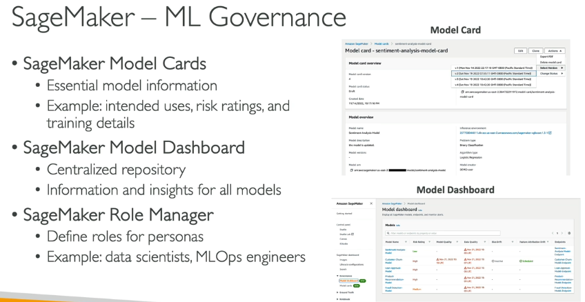
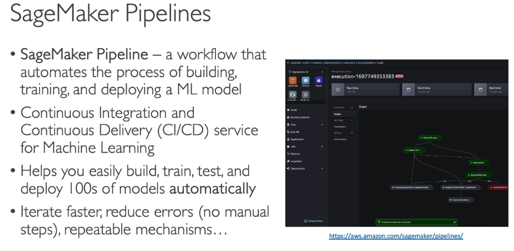
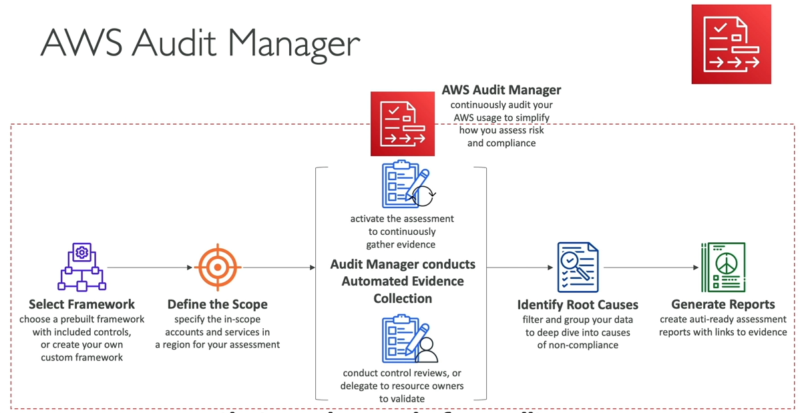

### Prompt Engineering:
- Improved Prompt techniques consists of:
  - **Instructions**: a task for the modle to do.
  - **Context**: external information to guie the model
  - **Input Data** the input for which you want a response
  - **Output Indicator** the output type or format.
- Negative Prompting:
  - 
- Prompt Performance Optimization:
  - 
- Prompt Latency:
  - it's impacted by a few parameters:
    - The Model Size
    - The Model type itself(architecture)
    - the #tokens in the input(the bigger is slower)
    - the #tokens in the output(the bigger is slower)
  - Latency is not impacted by Top P, Top K, Temperature.
- Prompt Engineering Techniques:
  - Zero-Shot Prompting:
    - No examples are provided in the prompt.
    - You fully rely on the model's general knowledge.
    - The larger and more capable the FM, the more likely you'll get good results.
  - Few-Shots Prompting:
    - Provide a few examples ("few shots") in the prompt.
    - The model uses the examples to understand the task and generate a response.
    - The more examples you provide, the better the model can understand the task.
    - if you provide one example, it's called "one-shot, single-shot prompting".
  - Chain of Thought Prompting:
    - The model is asked to think step by step.
    - It breaks down the task into smaller steps and provides a more detailed response.
    - This technique is useful for complex tasks that require reasoning or multi-step processes.
    - 
  - RAG (it's not a prompting technique. But it's often compared to prompt techniques in the exam):
    - RAG is a technique that combines retrieval and generation.
    - It retrieves relevant information from a knowledge base and then generates a response based on that information.
    - This technique is useful for tasks that require specific knowledge or data.
- Prompt Engineering Template:
  - 
  - Attacks:
    - 
    - 
---
## Amazon Q:
### Amazon Q Business:
- Description:
  - 
- Integration (connectors & plugins):
  - 
- Identity
  - 
- Admin Control:
  - 
### Amazon Q App(part of Amazon Q Business):
- create Gen AI-Powered apps without coding by using natural language.
- Leverage your company's internal data.
- possibility to leverage plugins.
### Amazon Q Developer:
- Answer questions about the AWS docs and AWS services selection
- Answer questions about resources in your AWS account.
- Suggest CLI commands to run to make changes to your account.
- Help you do bills analysis, resolve errors and troubleshoot issues.
- AI Code Comapnion(like copilot and copilot chat) & IDE Extensions.
- Software Agent to implement feaures, generate docs, bootstrapping new project.
### Amazon Q for AWS:
- for EC2
  - give suggestions for instance type based on your requirements in natural langauge.
- for Glue
  - 
- for QuickSight
  - 
- for chatbot
  - 
---
- PartyRock:
  - GenAI app-building playground (powered by Amazon Bedrock)
  - Allow you experiment creating GenAI apps with various FMs (no coding or AWS account required)
  - UI is similar to Amazon Q Apps (with less setup and no AWS account required)
---
# Concepts:
- 
- Binary Evaluation:
  - Confusion Metric
    - 
    - 
  - Regression Metric
    - 
    - 
- Inferencing:
  -   
- ML project phases:
  - 
- Hyperparameters:
  - 
- overfitting
  -   
---
### SageMaker:
- Fully managed service for developers/ data scientists to build, train, and deploy ML models.
  - Collect and prepare data
  - Build and train models
  - Deploy and monitor the performance of the predictions
- SageMaker Model Deployment Comparison:
  - 
  - 
- SageMaker - Automatic Model Tuning:
  - 
- SageMaker Jumpstart
  - 
  - 
- SageMaker Canvas:
  - 
  - 
- MLFlow on Sagemaker
  -  
- Governance:
  - 
  - Dashboard:
    - 
  - Monitoring:
    -  
  - Model Registry
    - 
  - Pipeline
    - 
    - Supported Step Types:
      - `Processing`, for data processing (e.g., data wrangling, feature engineering)
      - `Training`, for training models
      - `Tuning`, for hyperparameter tuning (e.g., Hyperparameter Optimization)
      - `AutoML`, to automatically train models
      - `Model`, to create or register models
      - `ClarifyCheck`, perform drift checks against a baseline(e.g., data bias, model bias, model explainability)
      - `QualityCheck`, perform data quality checks
- Data Wrangler:
  - Prepare tabular and image data for ML
  - Data preparation, transformation, and feature engineering
  - Single interface for data selection(import&preview data), cleaning, exploring, visualizing, and processing
  - SQL support, Data quality tool
  - Feature Store
    - 
- SageMaker Clarify:
  -  
  - Model Explainability
    - 
  - Bias Detection
    - 
- Ground Truth:
  - 
- Summary
  -   
  - 
- Extra
  -  
---
# Services:
### Comprehend:
- 
- 
- 
- 
### Transcribe:
- 
- 
- 

---
# Bedrock
- 
- 
- Foundation Models
  - 
- Fine Tuning
  - 
  - Instruction based fine tuning
    - 
  - Continued Pre-training
    - 
  - Single-Turn messaging 
    - 
  - Multi-Turn messaging
    - 
- FM Evaluation
  - human evaluation and Automatic evaluation
  - 
  - Some benchmark datasets allow you to very quickly detect any kind of bias and potential discrimination against group of people. 
  - Metrics:
    - 
    - 
- LLM
  - 
  - Non deterministic: 
    - the generated text may be different for every user that uses the same prompt.
- Image from a text (Diffusion Model, ex: Stable Diffusion)
  - 
- Bedrock makes a copy of the FM, available only to you, which you can further fine-tune with your own data.

### Audit Manager
- 
- 
