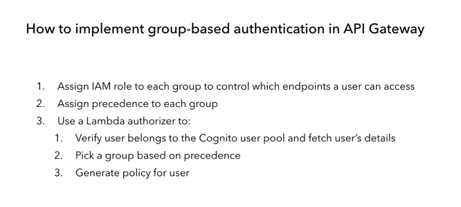

## What is graphql ?
- A query language for the APIs, describe what data u have and what u can do with them
  - and Runtime for fulfiling those queries with ur existing data.
- Schema
  - a contract which define our data and the operations
- pro
  - avoid overfetching
  - avoid doing multiple requests to fulfill use case (multiple RTT)
    - underfetching
  - strongly typed contract between client and server which also double request&response validation   the client cannot ask for data that aren't exposed in the schema.
  - with appsync and dynamodb u don't worry about impl join in ur code. they take care of that.
  - enable rapid product iterations on the frontend.
  
## AppSync
- fully managed graphql service let u build a scalable graphql api without running any servers.
- support 5 data sources
  - HTTP
    - put GraphQL in front of existing REST APIs
    - if the api provide a basic crud operations backed by dynamodb for example.   u can remove them and go straight from appsync to Dynamodb.
    - 
  - DynamoDB
  - RDS(Aurora Serverless)
  - ElasticSearch
  - Lambda
- Limits : https://amzn.to/2SPwKOb
- cost: 4$ per million requests.
  - if the request require to run multiple resolvers it will be counted as one operation.
- caching: u can cache the request or the result of the resolver.
- monitoring : on the API level not on the resolver level.

## Api Gateway
- features not in AppSync :  Resource policies, private endpoint. 
- The why, when and how of AWS API Gateway service proxies
  - https://lumigo.io/blog/the-why-when-and-how-of-api-gateway-service-proxies/
- Group based authentication is supported by default when using cognito with appsync which is not applied automatically using api gateway.
  - u can select preceding rule to select which to apply if the user in multiple group.
  - to implement in api gateway
  - 
- support request validation but no response validation, appsync support request&response validation.
  - response validation is often overload but it can to prevent data leak in some scenario.
  
## CFN
- GetAtt vs Ref
  - https://theburningmonk.com/cloudformation-ref-and-getatt-cheatsheet/

### BFF
- a pattern was used to solve the problem of overfetching and underfetching but it end with   more code to maintain and test.
