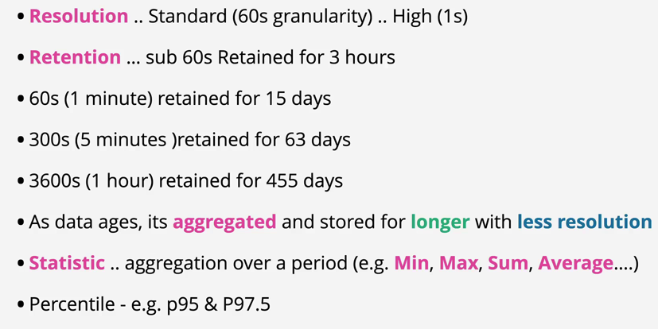
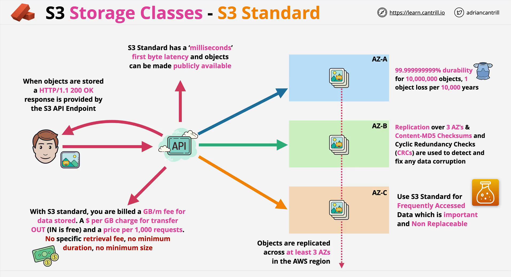
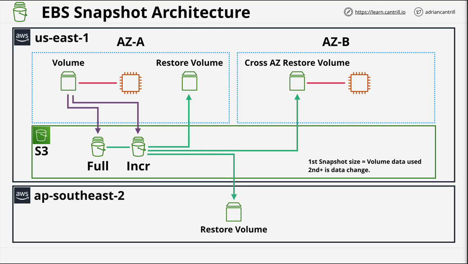
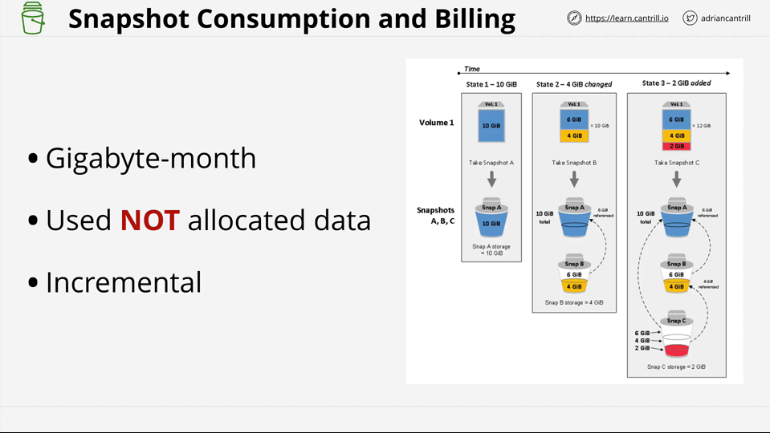
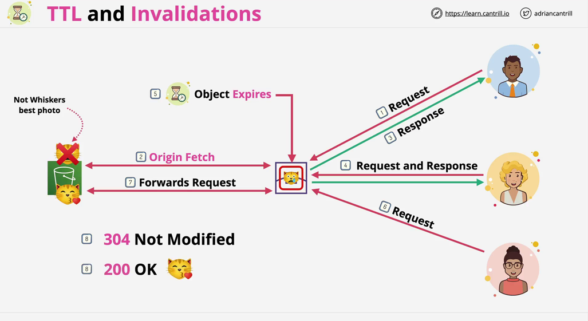
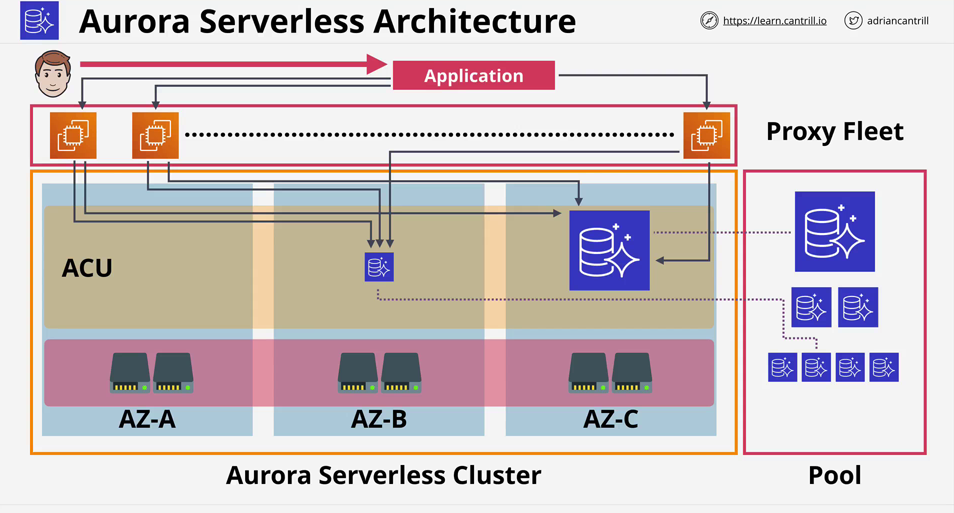
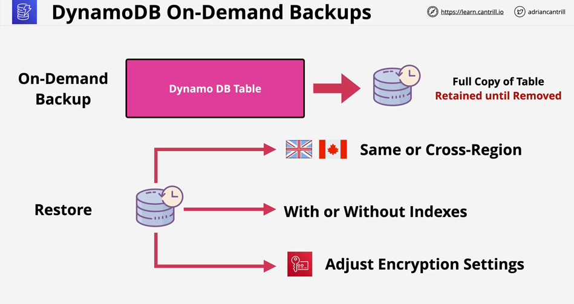
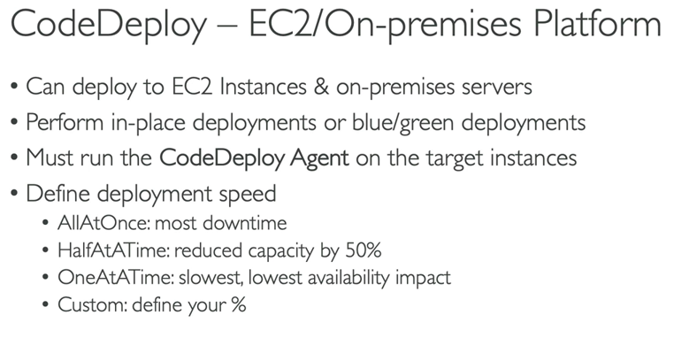
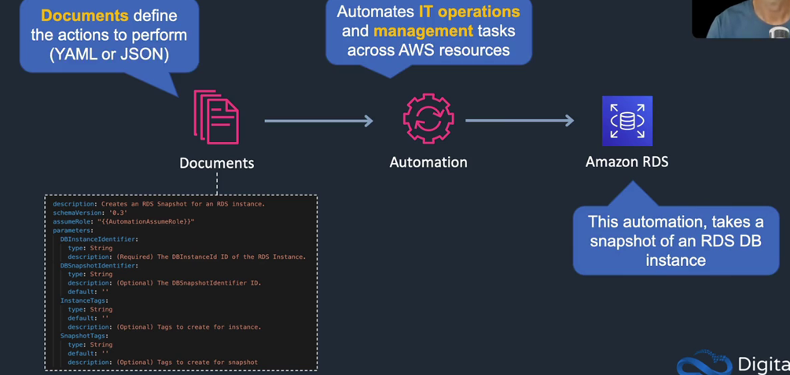

# cloud computing

- On-Demand Self-Service:
  - ...can provision capabilities as needed without requiring human interaction.
- Broad Network Access
  - Capabilities are available over the network and accessed through standard mechanisms...[http, https,ssh,vpn..]. no need to visit datacenter.
  - if u need to go to datacenter to provision a new server, then it's not cloud computing.
- Resource Pooling
  - There is a sense of "location independence" ... no "control" or "knowledge: over the exact "location" of the resources
  - Resources are "pooled" to serve multiple consumers using a "multi-tenant model"
  - Moved from thinking of hardware as value (instead of thinking about hw and servers, it thinks about it as the host) to thinking of applications and services as things of value that a business offers.
- Rapid Elasticity
  - capabilities can be elastically "provisioned" and "released" to scale "rapidly" outward(horizontal) and inward with demand.
  - To the consumer, the capabilities available for provisioning often "appear" to be "unlimited"
  - Elasticity -> system automatically system size increases as the load increases, and automatically decreases when the demand decreases.
    - (vendor provide monitoring and auto-scaling)
- Measured Service

  - before cloud: u buy a server, and u pay for it even if u don't use it. u pay in advance
  - Resource usage can be "monitored," "controlled," "reported." AND "billed."

  - through the course, keep them in your mind and for every svc evaluate how that service matches with one of these characteristics.
    - it helps u in exam if the answer makes sense or not, help u to design a system.

---

# Public vs Private vs Hybrid vs Multi:

- Multi (cloud provider resilience)->
  - deploy ur app in multiple cloud provider this means that u have got cloud provider level resilience.
    - stay away from a single management window to manage multi-cloud because it adds abstraction that makes only the common services between each platform are availables and can not use the rest. and that doesn't make use of each one.
- Private ->
  - private cloud on-premises [aws outposts, azure stack, google anthos] provide services dedicated to ur business and run on your-permises.
  - they must meet the 5 characteristics of cloud computing. but dedicated to you as a business.
- Hybrid ->
  - use public and private in the same time. with true hyper cloud. you use the same tooling the same interface to interact with both private and public component.
  - Hybrid Cloud is NOT public cloud + legacy on-premises -> it is called hybrid environment or hybrid network.

---

Cloud Service model

- Infrastructure Stack -> collection of things which the application needs all stacked onto each other[Facilities -> infra -> servers -> virtualizations -> os -> container -> Runtime -> Data -> Application].
- Parts "You" manage, Parts managed by the "vendor".
  Unit of consumption.[what you pay for, what you consume]

- on-premises vs data-center hosting
  data-center: provide racks, building and security. you manage the rest.
- IaaS: manage [Facilities, Infra, Servers, Virtualization] you consume the OS and mange the above layers. you pay per min ,secs, hours or virtual machine.
  EC2 uses the IaaS service model.
- PAAS: u consume the Runtime and manage the above layers[Data, Application]
  if java app, u pay for a java runtime. Developers mainly use PAAS.
- SAAS: u consume the application. Netflix, Dropbox, Email.

# SECTION 2

- aws accounts and users inside those accounts.

  - AWS Accounts is a container for identities (users) and Resources.
    - users -> log into that account and provision services in that account.
    - a unique root user for each account.
    - root user cannot be restricted.
  - AWS ROOT USER' using Identity and Access Management(IAM) Users, groups, Roles can also be created and given full or limited permission.
    - u can create one AWS account for each stage of the development lifecycle or for each product/team.
      - to eliminte the damge that can be done by a bad actor or a mistake.
  - AWS Accounts can contain the impact of of admin errors, or exploits by bad actors,
    Use separate accounts for separate things(DEV, TEST, PROD) or teams or products or client.

  - activate iam user access to billing information:
    - to allow IAM Identity to access billing information.

---

# Multifactor Authentication:(MFA)

- Factor: different pieces of evidence which prove identity.
  - Knowledge: Something you know, username & password.
  - Possession: Something you have, bank card, MFA device/app. [ATM use possession and knowledge]
  - Inherent: Something you are...fingerprint, face, voice, iris.
  - Location: A Location (physical), which network (corp or Wi-Fi)
  - More Factors mean more security & harder to fake.
- we try to balance between convenience and security.
  - configuring MFA for aws, aws generates a secret key and other associated info (username & service name).
  - aws give u a QR code to scan with your MFA app (generated from the key & associated info).
  - the secret key is used to generate a six-digit code which is valid for 30 seconds.

---

- IDentity provider
  - Authenticate Identity
  - Authorize based on policies associated with the identity I authenticated to.
  - NO COST
  - there are limits
- Global service / global resilience
- IAM of your account is trusted fully by your account, can do anything.

  - if IAM allows one identity to do something, the account automatically trusts the identity in the same way it trust IAM.
  - No direct control on external accounts or users. control only local identities in your account.
  - make use of identity federation -->[take identities u have[fb account] and use it indirectly to use aws] and MFA

  - every aws account comes with its own running copy of IAM, its own db
  - IAM is a global resilience service, any data is always secure in any
    aws regions.
    - IAM u see in each of your AWS accounts is your own-dedicated instance of IAM separate from another account and from any one else account.
    - my AWS account trusts my instance of IAM.
    - IAM is trusted fully by the account, IAM as a service can do as much as the root user.
    - inside IAM, we can create other identities, IAM can allow those identities to   do certain things. because a single aws account trust IAM, if IAM allows one of identity that it manages to do something, the account automatically trust the identity in the same way it trust IAM.

- IAM : has all authorization the account and account root user has.

  - User --> Identities which represent humans or applications that need access to your account.
  - Group --> Collections of related users e.g., development team, finance or HR
  - Role ---> Can be used by aws services, or for granting external access to your account. [when you want to grant access to services in your account to an uncertain number of entities].
    - Example for IAM ROLE -> if you want all EC2 instances in your account to be able to access the simple storage service, then you can create a role which grants access to the simple storage service, and then allow instances to use that role.

- In Brief:

  - you pick IAM users when you can identify the individual thing that will log in to that user.
  - Roles tend to get used when the number of things is uncertain.

- IAM policy(iam let u create it) [object or document]:

  - used to allow or deny access to aws services when and only when they're attached to IAM USERS, GROUPS OR ROLES.
  - policy on their own do nothing they simply define, allow or deny rights to certain services when you attach  the policies to other identities. so users, groups and roles do they have any effect.
  -

- IAM has 3 main jobs:
  - 1- Manage Identities- And ID Provider(IDP)
    - allow to create, modify, and delete identity such as users and roles.
  - 2- Authenticate those identities
    - anyone attempt to make a request to aws(a principal) need to be authenticate, attached to
      a known identity.
  - 3- Authorize: allow or deny access to resource based on policies associated
    with the identity that I authenticate with

### IAM

- NO COST
- Global service/Global resilience
- No direct control external accounts or users. only control local identities in your account.
- allow or deny its identities on it AWS account
- Identity federation and MFA
  - take identities that u're already have, and use this indirectly to access aws
    resources.

### IAM Access Keys:

- Long-Term Credentials ...[don't change regularly or automatically](for IAM user only)
- IAM USER
  - has 1 username and 1 password[u can create Iam user to used only in cli or api access and those don't need a password] password on IAM user is optional.
  - two access keys [can be created, deleted, made inactive or made active]
    - Access key id + Secert Access Key --> generated by aws and show to only only once
      - so you need to store them securly. used to sign your request that sent to aws.
    - can not be change. but you can delete it and create new one.
- root user can has access ky but it's not recommended.
  - iam user can has access key, but iam role don't.
- Rotating Access Key. create new one and remove the old one that is why they allow two.
  - IAM USERS and ROOT user can use access key. it's not recommended to the root user.
- IAM ROLE don't use access keys.

- in cli to run command from specific profile
  - aws [cmd] param (flages) --profile name
- to configure a new profile:

  - aws configure --profile name
    - enter aws access key id & secret.

- u can create it under My security credential tab in IAM console.
- any one with that access key id and secret, they can utilize the iam identity u've configure  
  together with any permissions that identity has over this aws account.

-------------------SECTION 4-------------------------------

### Yaml

- Yaml ain't markup lang [identation matters]

  - human readable data serialization language
    - list: [] or <- inline format.
    - list:
      - item1
      - item2
  - supporting val types:
    - numbers, floating point, boolean, null.
  - vals can be enclosed in "", ``, or not. but enclosing are more precise.

  - we can have value formed by multiple attrs[key/vals pairs]:
    - adrianscats:
      - name: nn
      - color: white

- generally, YAML is only used for CloudFormation.
  - Json is used for both CloudFormation and other things(identity policy doc..)
  

### JSON

- vals types: [string, object, number, array, boolean, null]

# Encryption

- Encryption At Rest:
  - to protect aganist physical theft and physical tampering. [user with encrepted laptop]
  - common when only one party is involved. one person ;one encryption and decreption key
  - common when one entity involoved.
- Encryption In Transit:

  - protecting data while it's being transferred between two places.
  - used when multiple system is involved.

- Concepts:

  - plaintext: data[image, file, app] u can immediately load into an application and read that data.
  - Algorithms: Blowfish, aes, rc4, RSA..
  - Key: password to encrypt
  - Ciphertext: encrypted data.

- Symmetric Encryption: the same key used in both encryption and decryption process.
  - limitation -> how we will transfer the key between two peer [getting complex very quickly]?
    - because of that limitation, symmetric encryption is great in local file encryption or disk encryption. but not so useful when data is moved between 2 parties.
- Asymmetric Encryption:

  - u have public and private key, when someone need to send me a data, he will encrypt it with my pub key and send it. then I use the private key to decrypt it. used by[SSL, TLS, SSH]

  - Asymmetric encryption is computationally much more diffcult to do than symmetric. so, many processes use asymmentric to initially agree and exchange a symmetric key and then use it in the communication, use symmetric encryption.

  - Another way for using asymmetric keys is [signing]: for ID verification: u sign using your Private key and send the request the receiver can verify that is you by using the public key to validate the signed request.

  

- Steganography: hiding that you are encrypt a data, by hiding the encrypted data in another file. - using a certain key, a number or a pattern[hide data in an image, by changing some pixels' val].

# Digital Signatures:

- in public key cryptography, public encrypt with your public key and u decrypt with your private key. in Digital Signatures, u encrypt with your private key and the receiver decrypt with your public key.
- verifies integrity (what) & Authenticity(who)
- HASH of the data is token, original data remains unaltered (integrity)
- this allows normal use without worrying about hashing/keys.
  - send the data, hash it and Digitally sign the hash with a private key (Authenticity)
  - receiver decrypts the hash with the public key and compares it to the hash he generated from the data.
- public key can be widely distributed and trusted.
  - if u distribute it in many places, it's easy to spot if one of them is modified.
- .. hash cannot be changed as nobody has the private key.
- document cannot be changed as this invalidates the hash.
- the wider the distribution of the public key, the easier to spot if any is modified ,the more trusted it is.
- Trust public key => trust private key => trust entiry => trust data.
- u can take it step further and encrypt the hash and data with the public
  key of the recipient. so, only the receiver can decrypt it.

---

# Networking:

## Layer 1 - Physical

- specifications define the transmission and reception of RAW BIT STREAMS between a device and a SHARED PHYSICAL MEDIUM.
  it defines things like VOLTAGES LEVELS, TIMING, RATES, DISTANCES, MODULATION,
  and CONNECTORS. Copper(electrical), Fiber(light) or WIFI(Radio Frequency)
- to connect two devices you need only a link(point to point) between them.
- but when we need to connect multiple one. we need a hub[anything recieved on any port, is
  transmitted on every other port] including errors & collisions.
- At the stage of layer one networking:
  - No INDIVIDUAK ADDRESSES, At layer 1, one laptop can not address traffic directly at another.
    it's a broadcast medium.
    If multiple devices transmit at once. a collision occurs.
    L1 has No media access control and no collision detection.[which devices can transmit]
    cannot detect collision it just transmiting in voltage change.
    No device => device communication. it just broadcast to all connected devices.

## Layer 2 - Data Link Layer

- every thing above this layer rely on device to device communication which the data link layer provides.
- Devices at L2 have a unique hardware (MAC 2 part OUI of the company + network interface controller = unique MAC) address.   48 bits, in hex, 24 bits for manufacturer.

  - Frames can be addressed to a dest or broadcast(ALL F's)
  - FRAME

    - 

  - To avoid collision L2 checks for any sign of a carrier signal
    - 
    - jam signal is sent by all of the devices, and random backoff occurs(a period of time during which no device will attempt a transmission.) after that period which picked randomly a transimission is retried.
  - L1 & L2
    - to connect more than two devices and use benefit of L2. a hub won't work because it doesn't understand L2. So we use a SWITCH.
  - SWITCH:
    - understand frames and MAC. they maintain a MAC ADDRESS TABLE which starts off EMPTY.
    - As the switch recieves frames on its ports, it learns which devices are connected and populates the Mac address table.
    - <b>STORE and FORWARD</b> ..they don't repeat blindly like hubs. it means that ONLY VALID FRAMES are FORWARDED
      - collisions is isolated on the port they occurred.
        - Every X port switch has X collision domains. It allows switches to scale and be connected together.

- L2
  - identifiable devices
  - Mac
  - Collision Detection
  - Unicast 1:1
  - Broadcast 1:All
  -

### L3 Network

- LAN1 and LAN2 are isolated LOCAL AREA NETWORKS.
  - Using only layer 2, only those networks joined by a direct point to point linnk using the SAME layer 2 protocol could communication.
- Ethernet is a L2 used generally for local networks.
  - Long distance point to point links will use other more suitable protocols such as ...PPP/MPLS/ATM[satellite..]
- IP is a L3 protocol which adds cross-network IP addressing and routing to move data between LAN without direct P2P links.
- Routers(L3) devices remove frame encapsulation and add new frame encapsulation at every hop.

- protocol field in IPv4: 1 -> TCP , ICMP -> 6, UDP -> 17.
- TTL in IPv4 -> Hop Limit in IPv6

- IP divided into network part and host part.
- IP Addresses are assigned by machine(DHCP) or Humans.

- Subnet Mask
  - It's the Subnet Mask which allows a HOST to determine if an IP address it needs to communicate with is local or remote
    - which influences if it needs to use a GATEWAY or can communicate locally.
- L3
  - Route Tables & ROuters
    - Router compares packet dest Ip ^ route table for matching destinations.
      - The more specific prefixes are preferred (0 lowest, 32 heights).
      - Packet is forwarded on to Next Hop/Target.
    - Route Tables can be statically populated, or there are protocols such as BGP(Border Gateway Protocol),  which allow routers to communicate with each other,to exchange which networks they know about.
  - ARP used in L3 when u encapsulate the packet and then send it to a MAC address, u don't know now the MAC address.   so we need a protocol which can find the MAC address for a given IP address.

### L4 Transport Layer

- L3 problems: - L3 provides no ordering mechansim. - L3 is not guaranteed to be reliable. - L3 diff packets can experience diff delays.

  - L3 has no communication channels - packets have a Source and Destination IP but no mthod of splitting by APP or CHANNEL.
    - No flow control if src is faster than dest. dest can be overwhelmed.

- TCP segments:

  - segments don't have SRC or DEST IP's
  - Options - Padding
  - SRC PORT
  - DEST PORT : provides the ability of having multiple streams of data at the same time between 2 devices
  - SEQUENCE NUMBER: increment after sending each segment. unique, can be used for error correction. used in reordering.
  - ACKNOWLEDGEMENT:
  - FLAGS 'N' things: used to control over the connection[[flags]FIN: finish the connection, ACK: acknowledgement, SYN: sync seq numbers].
    - 1 -close the connection.
    - 2-synchronize sequence numbers.
    - data-offset. reserved space.
  - WINDOW: #of bytes u are willing to recieve between acknowledgements. [flow-control use it]
  - CHECKSUM: detect error
  - URGENT POINTER: to detect segments of controlling the traffic to take priority of processing. separate between app segments and traffic segments.
  - 

  - TCP is a connection based protocol.

    - A connection is established between 2 devices using random port on client[EPHEMERAL PORT] and a [WELL-KNOWN PORT] on the server.
    - Once esablished the connection is bi-directional.
    - reliable, provided via the segments encapsulated in IP packet.

  - 3-way handshake:
    - to esablish the connection between client and server.
    - they need to agree on the sequence number the client choose one randomly and then increment it for the next packets.
    - the server also choose one to start with it for the packet will be sent to the client.

#### SESSSION & STATE:

- 
- A Stateless firewall would see two things.
  - Outbound .. client to server
  - Response ..
  - TWO RULES will be required... OUT & IN
  - Networ ACL(AWS): access control list - need 2 rules for each TCP connection.
- A Stateful firewall views sees one thing [aware of tcp protocol]
  - Outbound .. Allowing the outbound implicitly allows the inbound response.
  - In AWS this is how a security groups works.
  - stateful firewall understand layer four and the state the traffic.

---

### Elastic Beanstalk [ ur code, app service, http service, os, interpreter, host]

- Paas
- allows quick deployment of ur app.
- Keeps control in ur hands:
  - choose ur instance type
  - choose ur database
  - set and adjust auto scaling
  - update ur app
  - access server log files
  - Enable Https on load balancer.
- support a large range of platform.

---

### TLS ...asymmetric and then symmetric.

- TLS start when that a TCP connection is active between the client & server..
  - so this is layer 4 and ath the end of the 3 phases.
  - 
- 1- Cipher suites : is a set of protocols used by tls[

  - a key exchange algorithm,
  - a bulk encryption algorithm,
  - a message authentication code algorithm
    ]
  - begin with established Tcp connection. client send ssl/tls version, list of supported cipher suites, session id, extensions.
  - server respond with its ssl/tls version, a selected cipher suite from the client list, server certificate[contain a 'public key'].

- 2 - Authentication: the client trust the public CA
  - it makes sure that the certificate
    is valid (date, annd hasn't revoked) and that the DNS name matches the name/names on the cert.
  - the client verfies the server has the private key.
- 3 - Key Exchange:
  - the client generate the pre-master key, encrypt it with the servers public key and sends it to the server.
  - the server decrypt the pre-master key using its private key.

  - both sides use the same pre-master-key to generate the master secret  
    which is used to generate the ongoing session keys which encrypt and
    decrypr data.
  - Both sides confirm the handshake and from them on,
    communications between client <=> server are encrypted

---

### DDoS Attacks

- Attacks designed to overload websites
- compete against 'legitimate connections' and overload hardware & software provide the svc
- Distributed - hard to block individual IPs/Ranges
  - Application Layer - HTTP Flood
    - 
    - take advantage of the imbalance of processing between client & server.
      it's easy for the client to request a web page but it's often very complex for a server to deliver the same page. if u multiply that by a large #of clients, u can easily overwhelm the server.
  - Protocol Attack - SYN Flood
    - A Botnets generate a huge #of spoofed SYN's (connection initiations) the server sees these as normal and sends SYN-ACK's back to the spoofed IPs.
    - the servers will wait for an ACK ..which will never happens as the remote IPs will never respond.
    - servers will consume available network resources attempting to establish
      connections and won't be able to service legitimate connections.
    - 
  - Volumetric
    - DNS Amplification
      - 
      - An attackers controls network of compromised devices(botnet) via a control location(often using vpn to digest real location)
      - A botnet exploits a protocol where a response is significantly larger than the request. in this case making a spoofed request(setting the source ip to the target server) to DNS.
      - The DNS servers respond to the `spoofed IP`, the frontend servers for our application, which is overwhelmed by the amount of data. this prevents legimate customers accessing services.
  - ..often involve large armies of compromised machines(botnets) affected by malware.

---

### Network Address Translation(NAT):

- designed to address the growing shortage of IPv4 addresses.
  - IPv4 addresses:
    - publicly routable: assigned by central agency & regional agencies, which in turn
      assign them to ISPs, ISP allocate them to business or consumer end-users
    - private address space:
      in range 10.0.0.0 can be used in different places, but can't be routed over the internet.
      - to give internet access to private devices, we need to use NAT.
- provide some securitiy benefits
- Translate private IPv4 addresses to public
- Static Nat - 1 private to 1 (fixed) pubic address (IGW) [in NAT table 1:1 private:public]
  - translate from 1 specific private ip address to 1 specific public address[this how IGW within aws works]
  - used when 1 public ip need to be consistent.
- Dynamic NAT - 1 private to 1st available public[from address pool]
  - same as static but a public ip is not permnent for a device, it's allocated temporarly from a pool.
  - if a device from a private network attempt to access the internet and no available public ip,
    this access will fail
  - when we have large #of private ip address and want them all to have internet access via public IPs.
    but when we have less public ip addresses than private ip addresses.
- Port Address Translation(PAT) - many private to 1 public (NATGW)
  - allow a large #of private devices to share one public address, it's how the AWS gateway functions\
    within AWS environment, it has a many to one mapping architecture.
  - THe NAT Device record the src(private) and src Port. it replaces the src IP with the
    single public IP and a public source port allocated from a pool which allows IP overloading(many to one)
    PAT record the mapping in the NAT table, to translate the incoming packet from the internet to its
    proper ip & port.
- IPv4 only ..make no sense with IPv6

---

- IPV4
- originally managed by IANA
  -.. parts now delegated to regional autorities
- All public IPv4 addressing is allocated
- Part of the address space is private, can be used/reused freely.

Class A: - 000.000.000.000 -> 127.255.255.255 128 Networks, 16_777_216 IPs each
Class B:

- 128.000.000.000 -> 191.255.255.255 16_384 , 65_536 first 2 octat for network
  Class C:
- 192.000.000.000 -> 223.225.225.255 2_097_152 , 256 first 3 octats for network
  Class D: multicast

---

Private IP
[10].0.0.0 - -> [10].255.255.255 01x class A
[127.16].0.0 - > [172.31].255.255 16x class B 16*65536 172.31 is used for default VPC
[19.168.0].0 - > [192.168.255].255 256x class C 256*256 home & office network

---

subnetting - CIDR Classless Inter-Domain Routing - let us take networks and break them down - it define a wat of expressing the size of a network -> prefix[newtork bits]

---

# DNS

- why not ONE Server?
  - 
  - even if we replicate it, it's still a huge data volume. we need a Hierarchical Design.
- a discovery service.
- a huage distributed DB.
- DNS Client = > ur laptop, phone, tablet, pc.
- Resolver: swf on ur device or a server which queries DNS on ur behalf.
- DNS zone(\*.netflix . com) => A part of DNS DB, Point at TLD authoritative servers where is
  {.com} {.uk} [what data is]
  - gTLD => generic top level domain(.com .org)
  - ccTLD => country-code top level domain(.uk .eg)
  - ZONEFILE(the 'file' storing the zone on disk) => contain the records for a specific zone{ex: amazon.com} hosted by a nameserver. {physical database for a zone}. how zone physically stored.
  - NAMESERVER => where zonefiles are hosted, host (1 or more)zonefile.
  - we need to find the ns which host the zonefile we query for
  - Authoritative - contains real/genuine records(authoritative who manage (netflix.com)) (boss) [one or more nameserver that can give answer for one or more domain] contain records for that domain ex (www . netflix. com, mail. netflix. com ...)
  - non-authoritative - contains cached records (worker) .. copies of zones stored elsewhere to speed up things.
  ***
  - last invisible dot in a domain name is the root zone
- DNS Root Server (hosts the DNS root Zone)
  - DND Root Servers(13) managed by 13 different companies.
    - they manage the root servers themselves not root zone database.
      - {Root hints files} stored inside the resolver point to the list of Root servers IPs.
      - Resolver communicate with 1 or more root servers to access Root Zone.
  - Root zone managed by IANA which delegate each root to another organization to manage.
  - first, u only trust the root servers, then u trust the root servers to tell u who
    manage the TLDs(where is netflix.com, google.com), then u trust the TLDs to tell u who manage the domains.
    - delegation of trust.
  - hierarchical design
    - 
  - dns walking the tree:
    - part1 : 
    - part2 : 
  ***
  Client
   --> resolver -using root hint files
   --> Dns root servers root servers send the address of the server manage the top level root u search for (.com)
   --> then u ask for (amazon) . the authoritative server for amazon.com
   --> resolver query amazon.com for www and send the result to the client
   --> client go to www.amazon.com
  - 
  - Root hints => provided by os vendor, stored in resolver, list of root servers IPs.
  - Root servers => managed by 13 different companies, host the dns root zone.
  - Root zone => managed by IANA, delegate TLDs {authoritative servers}.
  - TLDs => managed by different companies, host the TLDs zone.
- host files : static file of ips that override DNS resolution, used for testing.

---

##### Registering a domain

- first list define 4 entities involved in registering a domain.
  - 1- Registrant: the person or entity who is registering the domain.
  - 2- domain Registrar: the company which is registering the domain on behalf of the registrant.
    - let you buy a domain for that it have a relationship with multiple TLD registries. .com .org .net
    - we have here two options:
      - 1- company whcih work as registrar and dns hosting provider.
      - 2- company which work as registrar only and u can choose any dns hosting provider.
    - dns hosting provider : operate dns name servers.
  - 3- TLD Registry: the company which manages the TLD.
  - 4- Registrant: the company which manages the TLD.
- 

---

# Route53 Fundamentals:

- AWS manged DNS product.
- Global Service .. single database, globally resilient
  - Register Domains
  - Host Zones.. managed nameserver
  - services provided:
    - 1-Register Domains:
      - it has relationships with all the major domain registries[.com .net .io .org]
      - when a domain is registered a few things happen:
      - R53 checks with the registry for that top level domain if the domain is available
      - R53 create a Zonefile for the domain being registered and allocates name service
        for this zone, and these are servers which R53 create and manages which are
        distributed globally and are generally 4 of these for one individual zone[hosted zone]
      - as part of registering the domain it communicates with the .org|com registry  
         and liaisng with that registry, it add these name server records into zone file
        for .org|com top level domain. using name server records which they after that
        delegate to host zone[authoritative for the domain] in the future
    - 2-Hosted Zone[4 servers for one individual]
      - 
      - create and manage Zone files in AWS
      - Hosted on four managed name servers
      - can be public
      - Or private .. linked to VPC(s)
      - ..Store records (recordsets)

---

# Records Type

- Nameserver (NS) => allow delegation to occur in DNS, point to the name server
   authoritative for a domain. {the next node in the tree}
  - 
- A and AAA records => map host to IP address, A map to ipv4, AAA map to ipv6.
  - generally, as an admin u normally create 2 records with the same name, one for ipv4
    and one for ipv6.
  - 
- CNAME => canonical name, map one name to another name.
  - ex: www.amazon.com => www.amazon.co.uk
  - if server perform several task . CNAME ftp, CNAME mail, CNAME www all point to the same server.
  - 
  - cannot point to ip address, only to another name.
- MX
  - mx-record is for how server can find mail server for a specific domain.
  - when sending email to hi@google.com - send mx query to google.com.
    => mx record has a priority{smaller is highest} and value
  - value :

    - it can be just a host, if it just a host no dot on right, it assume to be part of the same zone.
      - ex: if value in google.com zone is mail, then it is mail.google.com
    - if it contain a dot on the right, it is a fully qualified domain name.

      - ex: if value in google.com zone is mail.other.domain.

    - 
- TXT Records

  - allow u to add arbitrary text to a domain .
  - one usage is to prove domain ownership.
    - 
  - it can be used for spam protection.
    - add certain information to domain indicating which entities are authorized to send email on ur behalf and if any email server receiving mail from any other servers that is a good indication this is a spam.

- TTL . u can set on DNS record.
  - if u may change ur dns record u should lower TTL value to low value before changing the record,
    to make sure that the change is propagated quickly. no machine will cache the old record for long time.
  - 

---

# public Vs Private Service

- 
- public & private services term are referring to networking only.
  A public service is something is accessed using public endpoints such as the Simple Storage
  Service(S3), S3 can be accessed from anywhere which has an internet connection.
- private aws service is something which runs within VPC. only things that are connected to
  that VPC can access the service.
- for both of these, there are a permissions as well as networking. even S3 is public
  service. by default an identity other than the account root user has no authorization
  to access that resource.

  - Permissions & Networking are two different considerations when talking about
    access to a service.

- "Public Internet Zone" where Internet services lay[gmail, online game..]  
  "AWS PRIVATE zone" are called Vitual Private Clouds or VPCs, there are isolated.
  VPCs can't communicate with each other unless u allow it. and nothing from the internet
  can reach these private networks unless u configure it. service can be placed into
  these private zones such as EC2 instances and just like the home private network it
  can access the internet and the internet can access it iff u allow it and configure it .
- "AWS Public Zone" between public internet and "AWS private Zone", it's not on the public
  internet and it's not part of public internet, it's a network which is connected to the
  public internet.
  It's where aws public services operate from, Services with public endpoints(S3).
  - u can access AWS public services from anywhere with an internet connection because
    the internet is used to carry package from u to the aws public zone and back again.
  - we can also configure virtual or physical connections between on-premises network and AWS
    VPCs.
  - u can also create and attach Internet gateway to a VPC. this provide a few additional
    pieces of functionality:
    - allow private zone resources to access the public internet as long as EC2
      has an allocated IP address0
    - allow access to public AWS services, without touching the public interne

---

AWS Global Infrastructure:

- AWS region

  - creation of AWS, an area of the world that they have selected,
    and inside this region is a full deployment of AWS infrastructure.

  - Geographic Separation - Isolated Fault Domain.

  - Geopolitical Separation - Different governance. u'll affects by the laws
    of the country where the region is located.
  - Location control - performance.

  .Region has CODE & NAME: console UI using name, CLI use code

- AWS edge location
  - smaller than regions, and only have content distribution services,
    as well as some type of edge computing, but they are located in many
    more places than regions.
  - useful for company such as Netflix, who need to store TV shows and movies
    as clos to their customers as possible. because this allow low latency and
    high speed distribution.
- AWS Availabilty Zone : is a logical thing inside AWS

  - some think about it as it's a data center, but it's not. it may formed by multiple data centers, or it may be a single data center.
  - each AZ is isolated from other AZs, and they are connected by high speed
    low latency network.

  - inside every region AWS provide multiple availability zones,
    isolated infrastructure inside a region.
    - u can distribute ur compnents across multible zones.
    - services can be placed across multiple availability zones
      to make them resilient[VPC a way to create a private network
      can work across multiple availabilty zones to provide resilience]

- globally resilient service
  - there are relatively few of those inside AWS, the service operate globally with
    a single database, it's one product, and its data is replicated. across multiple
    regions inside AWS. this mean a region can fail and the service continues running.
    - it would take the world to fail for a globally resilient service
      to experience a full outage.
      - the service is global means there isn't a concept of picking a region
        for globally resilience service [IAM , ROUTE 53]
- regionally resilient service
  - operate in a single region, with one set of data per region
- zone resilient service
  - AZ, services run from a single availabilty zone if if the AZ that service is
    provisioned into fails, then that service will fail.
    - it's possible for hardware to fail in an availability zone and for AZ
      itself continue working because AWS do have resilient storage systems
      for example inside AZ. But generally, AZ resilience services are very prone
      to failure if u have any problem inside that AZ
      into fails.
- at a global level aws have created their infrastructure platform to
  be a collection of individual infrastructure located worldwide.

---

VPC virtual private cloud= A virtual network inside AWS {regional service}:

- VPC is a service u 'll use to create private networks inside AWS, that other
  private services will run from.
- also used to connect ur AWS private networks to ur on-premises networks when creating a hybrid environment.
- or it's the service which lets u connect to other cloud platforms, when u're creating a multi-cloud deployment
- A VPC is within 1 account & 1 region.
- private and Isolated unless you decide otherwise, SVCs in a VPC can communicate but svcs in different vpc cannot unless u decide otherwise.
- TWO types - Default VPC[1 per region] and Custom VPCs[many per region]
  custom vpcs need u to configure everything e2e in details, 100% private

  - used in almost all serious AWS deployments.
    default vpc created by AWS, they can pre-configured in a very specific way
    and all of the network configuration is handled on ur behalf by AWS. less flexiable.

- Every VPC is allocated a range of IP addresses called the VPC CIDR.
  - every thing inside the VPC will have an IP address from this range.
    define the start and end range of IP addresses that a vpc can use.
- Custom VPCs can have multiple CIDR ranges, but the default VPC can gets one.
  and it's always the same: 172.31.0.0/16
- VPC is regionally resilient, Aws sub-divide the VPC network into subnets,
  one for each availability zone. set on creation and never be changed.

---

Default VPC facts

- One per region - can be removed & recreated.
  some SVCs inside AWS assume that the default VPC will be present.
- Default VPC CIDR is always 172.31.0.0/16
- /20 Subnet in each AZ in the region
- pre-configured (IGW), security groups(SG),
  NACL: security feature to limit incoming & outgoing data transfer.
- Subnets assign public IPv4
- it's best practice to use custom VPCs not to use default VPC.

---

Elastic Compute Cloud (EC2)[IAAS]:

- provide access to a virtual machine (instance)
- Private service by-default - uses VPC networking. EC2 instance is configured
  to launch into a single VPC subnet. u set it when u launch the instance.
  in the launch u configure any public access should u want that because it is by
  default a private service. the VPC u run in need to support that public access
- AZ resilient
- Different instance sizes and capabilities[GPU, networking, special cpu]
- On-Demand Biling - Per second.
  - charge for running the instance, cpu memory
  - charge for storage and then extras for any commercial software.
- Storage type: Local ob-host storage or ELastic BLock Store(EBS) ->
  network storage made available for the instance.
- Instance Lifecycle [States]:  
   Running - Stopped[cost storage] - Terminated - Stopping(u'll charge for ebs storage) - Pendding - shutting down
  Terminating an instance[terminated] : is a non-reversible action.
- AMI Amzon machine Image \*\*
  - Permissions: control which accounts can/cannot use the ami
  - public
    - everyone allowed [linux/win]
  - Owner Implicit allow
  - Explicit
    - specific AWS accounts allowed
  - Root Volume: can contain other volume but at least one<b>(boot volume)</b>
    - <b>Block Device Mapping:</b>
      - configuration which links the volumes that the AMI has and how they're presented
        to the OS. it determines which volume is the boot volume and which is data volume.
  - the OS expects to receive volumes presented to it as well as an ID, a device ID
    And the block mapping links the volume to the device ID that the OS expects.
    - Connecting to EC2 :
      - connect to win instances using RDP remote desktop protocol. 3389 port. - to linux instance using ssh port 22.
  - ssh key pairs: u download the private once and keep it safe.
  - public part aws place it on the instanc. u use the private part for authentication.
  - for win instances using private key to gaining access to the local admin pass of the instance and u connect to it using rdp using local admin user and its password.
- ssh client will prevent u from connecting to an instance if the key is too open.
  - u need to change the permissions on the key file to 400.

---

S3:

- Global [public service] Storage Platform - regional based/resilient.
  because bucket name is unique, u don't need to select a region when
  using a console. u specify the region in creation.
- Public service, unlimited data & multi-user.
- ...Movies, Audio, Photos, Text, Large Data sets.
- Economical & accessed via UI/CLI/API/HTTP.
- Objects & Buckets
  - Objects:
    - u can think of it as a file, it made up of two main compnents
      and some associated meta-data. objectKey: objectVal.
      size 0 to 5 tb.
      if u know the object key and buket u can access data.
      object also has: Version ID, Metadata, Access Control, Subresources.
  - Bucket:
    - created in specific region. never leave unless u configure it.
    - bucket name is globally unique.
    - flat storage. all data on the same level. all in the root. folder is prefix for the name not a real folder.
    - 3 - 63 chars, all lower case, no underscore
    - start with num or lower case
    - can't be ip formatted.
    - Buckets - 100 soft limits, 1000{can get it by support request} hard limits per acount.
    - unlimited object in bucket, 0 bytes to 5 tb.
    - Key = name, Value = data.
- Anti-pattern & pattern.
  - S3 is an object store - not file or block. {prefered for images.. data accessed as a whole}
    if u want to access the whole object[image, video..] then it's candidate for object storage.
    if u have a server need to access a network file system. it's not S3. u need file-based stor
  - u can't mount an S3 bucket as (K:\ or /images
  - great for large scale data storage, distribution or upload.
  - great for 'offload' blog with many posts and images.
  - should be ur defaut for Input / Output from /to AWS products
  - if u will use it for static hosting, u need to name the bucket as the domain name.

---

CloudFormation:

- let u create, delete, and update aws resources in a cnosistent and predictable way using templates.
- written in yaml or json.
- resource section of a template is the only mandatory part of a cloudFormation template.
  - conain logical resources labelled as Instance: need a Type
  - properties to configure the instance in a certain way
- if u have AWSTemplateFormatVersion and Description then the description
  need to follow the template format version.
  - AWSTemplateFormatVersion is not mandatory but if u have it and Description
    then the description need to follow the template format version. {trick Q in aws exams}
- Metadata section control the UI
- Parameters section
  - u can add field prompt users for information.
  - u can restrict allowed value
- Mappings section
  - allow to create lookup table
  - 
- Conditions section
  - based on some condition do->
- outputs:
  -set of outputs.  
  -cloudFormation take a template create what specified in resource in a [Stack]  
  -stack is a living representation of the template.
  -one template can create 1 to many stacks
  -for any logical instance in the stack aws create a physical one match it.
  -it's cfn job to keep logical and physical in sync.
  - 

---

# CloudWatch<Metrics, Logs, Events>:

- Collect and manages operational data generated by an env to inform how it perform  how it nominally runs, or any logging data that it generate.
  - Metrics .Aws Products, Apps, on-premises. [cpu utilization of ec2, #of visits]
- if u have internet connection and permission u can use it from anywhere
- some metrics are gathered natively by the product, anything running in AWS,
  (cpu utilitzation, network, disk I/O, and status checks) by ec2 gathered by default
- some type of metric collection need an extra piece of software called the CLoudWatch Agent
   ex: to collect metrics outside of aws in other cloud env or within on-premise.
- monitoring certain things inside products which aren't exposed to AWS need the Agent.
   ex: os metrics in ec2;
  - monitor which process run on ec2
  - ec2 memory utilization
  - amount of free disk
  - cpu idle time
- CloudWatch Logs - AWS products, Apps, on-premises
- CloudWatch Events - AWS services & Schedules.
  - ec2Termination event .. - u can configure listeners to it can configure action based on events
    --
- data generated from aws products & custom data feeded to CloudWatch Metrics
- generate statistics consumed by API & console
- Alarm & events to SNS / autoscaling
- CW architecture:
  - 

---

#### Namespace

- container for related metrics
- aws data go to AWS namespace AWS/name-of-the-service AWS/EC2
  - you cannot use this style of naming AWS/\*
- namespcae contain data of related metrics

  - metric : a collection of related datapoints in time ordered structure.
    - a metric can receive data from different instances of the same service so we need to differentiate between them->(dimension).
  - instance generate data to metric as Datapoint[timestamp, value]
    Dimension separate datapoints for different things or perspective within
    the same metric. {multiple ec2 send data to the same cpu utilization metric but with different dimension}
    when EC2 sending datapoint to cloudwatch. AWS send also the instance id and type.
    and this allow us to see metric for a particular instance id.

- Alarm can be configured to take action based on metrics state .
  - Alarm states ->
    - OK
    - Alarm -> SNS or action.
    - insufficient data[initial state].

---

#### Metric Frequency

- EC2 by defaults, send metric data to CW in 5-minute interval

  - detailed monitoring with additional charge send every 1 minute intervals.
  - for custom metrics, the default is 1-minute intervals and you can configure high-resloution
     metrics that are sent at 1-second intervals

- 154-
  - provide services to digest, store metrics and provide access to them.
  - public services.
  - AWS Service integration - management plane
  - ..Agent integration.. EC - richer metrics
  - ..On-Premisises integration via Agent/API (custom metrics)
  - ..Application integration via Agent/APi (custom metrics)
  - view data via console UI, CLI, API, dashboard & anomaly detection.
  - 
  - 
    - using dimension u can aggregate metrics data in different ways.[per region, ASG..]
  ### Resolutions: the frequency at which datapoints are published
  - when u pub datapoints into cw u do so with certain resolution. Standard(60s granularity).. High(1s)
    - 42% / 60s will appear 42 for the entire 60s duration.
    - Resolution determines the minimum period u can get one datapoint for.
    - percentile : indicate the relative standing for a value in a dataset. 95p of data that lower than a specific value and 5% is higher.
      - get a better understanding of distrubutaion of ur metrics data, eliminate outliers.
    - 
    - 
  #### Alarms
  - 
  - metrics resolution affect the alarm resolution.

# VPC FLOW LOGs

- provide details of traffic flow in private subnets.
- capture packet metadata - not contents
  - if u need to capture contents u need a packet sniffer - u might insall on ec2.
  - metadata: src,dest ip... packet size, src and dest port.
- attach virtual monitor within a vpc which can be applied at 3 levels:
  - VPC LEVEL - ALL ENIs in that VPC.
  - subnet - ALL ENIs in that subnet
  - ENIs directly
- Flow Logs are <b> NOT realtime </b>
  - they are delivered to a log group in cloudwatch
  - u can't use them for real time monitoring.
- can be configured to go to multiple destinations
  - cloudwatch logs
    - u can integrate that with other aws products
  - S3 bucket
    - u able to access log file directly and can integrate that with a 3rd party monitoring solutions or something u design urself.
    - or query them using Athena
      - adhoc query engine , only pay for the data u read.
- 
- 

---

# CloudWatch Logs

- public service
  - usable from AWS or on-premise. -> assuming u have permission and network connectivity.
- store, monitor and access logging data [information + timestamp]
- AWS Integrations with
  - EC2, VPC FLow logs, Lambda, CloudTrail, R53 ....
  - any services which integrate with cloud logs can store data directly inside the product.
  - integrate with outside application by setup an agent, development kit.
- Centralized Logs:
  - Application Logs, e.g. Apache Logs
  - System logs, e.g. EC2
  - AWS Services, e.g. CloudTrail, R53, Lambda
- You can View, Search Filter
  - You can generate metrics based on logs
    - <b>metric filter</b>.
    - then use it to make an alarm based on it.
- YOu can monitor your logs in near real-time for specific phrases, value, or patterns using cw agent.

- regional service.
- logging source inject data(message and timestamp) as log events. -> stored in log stream
- log stream : sequence of log events from the same source.
  - each log stream is ordered set of log events for specific instance/source for specific thing.
- Log group: container of multiple log stream from the same type.
  - store configuration settings: Retention & Permissions.
    - retention settings, by default logs are kept indefinitely
      - u can set ur retention period from 1 day - 10 years.
    - apply on all log stream in the group.
  - metric filters are defined at the log group level.
    - store metric filter{constantly reviewing any log event for any log stream in that log group looking for certain pattern . ex: app error code} --> metric --> fire an alarm based on the value.
  - 

---

# CloudWatch Events and EventBridge

- deliver a near real time stream of system events and these events describe change in aws products and services.
- superset of cw events it can accept events from 3rd party as well as custom application.
- a default event bus for the account, stream of events which occur from any supported services inside aws accounts.
  - in cw events this is only one bys(implicit)
  - in EventBridge you can have additional event busses.
- <b>Rules</b> match incoming events ... send it to a target.
  - there are also a schedules rules which can be used to trigger events at a specific time.
  - rule send events to 1+ target.

---

# Service Catalog

- Document or Database created by an IT team.
- Organized collection of products offered by the IT team.
- often used when different teams within the business use service style model.
  - each tean define the services they offer and the cost of those services.,
    Requirements, Support information, dependencies.
- Defines approval of provisioning from IT and Customer side.
- Manage costs and scale service delivery because everything about the service is defined within this documented.

### AWS Service Catalog

- Self-Service Portal for AWS Services for `End-Users`
  - ..Launch predefined (by admin) products
- End user permissions can be controlled
  - admin can define the end users permission for who can launch the product using service catalog
- products built into protfolios which is visible to the end users
- in exam choose it if u see end user or customer require to deploy infrastructure with tight control in self-service way.
- 

---

# AWS Config

- Record Configuration changes over time on resources.
- Auditing of changes, compliance with standards.
- <b>Does not prevent changes happening</b> ... no protection.
  - but it can help with remediation.
- Regional Service .. support cross-region and account aggregation.
- Changes can generate SNS notifications and near-realtime event via EventBridge & Lambda.
- all configuration data change stored in S3 and you can access it using aws config api.
- 
  - in remediation process you can also use ssm in case of config change on ec2 instance.

---

# CloudTrail [regional]

- log api actions which affect AWS Account.
  - those actions can be performed by a user, role, or service.
  - terminating EC2 instance, create / delete S3 bucket ...
- log actions as CloudTrail event.
- by default store Event of last 90 days.
- To customize the service .. create 1 or more Trails.
- we have two type
  - Management Events[log of action on aws resource (control-plane){create instance}, ].
  - Data Events(usage of the resource. upload/access object in S3).
  - insight events
- by default store Management Events only.
- 

- CloudTrail trail : unit of configuration within CloudTrail, it's a way u provide configuration to cloudtrail on how to operate, CloudTrail log   events belonging to its region{the regin the trail is created in}. u can configure trail to operate on its region, or to operate on all regions[think of it as trail for each region but working as one]. if aws add a new region while u have a trail for all regions, it will automatically start logging events for that region.
  - global service log its event to trail for all regions. [IAM, STS, CLoudFront]
    - enabled in created trail by default. always log to us-east-1.
  - u can configure a trail to be stored in a specific S3 to persist it forever.
    - stored in json u can parse a specific information u want.
      - who, when, what action, where, srcIP, request params, response.
    - can integrate with (cloudwatch log) and store/monitor data there.
  - u can create a trail for all accounts in the organization. [organizational trail]
- use cases:
  - Incident Investigation
  - Security Analysis
    - (not real time)near real-time security analysis of user activity
      - 15~20 mins,
        - 15 mins for the call to appear in CloudTrail.
        - cloudTrail publishes logs to S3 approximately every 5 minutes.
  - Compliance
    - can be used to help you meet idustry, regulatory compliance, and audit requirements.
- Trail is Encrypted using SSE. <mark>Log integrity validation</mark> means logs are digitally signed, so you can detect if a log was changed or deleted.

 

- Exam powerup:
  - cloud trail enabled by default for 90 days for free.
  - trails are how u configure S3 and CWLogs.
  - Management events only by default.
  - IAM, CLoudFront, STS => global services events [us-east-1]
  - NOT REALTIME
    - There is a delay[~15mins].

---

# Shared Responsibility Model:

- AWS responsibility for security of the cloud
  [Hardware/AWS global infra + services + software run on those svc by aws ]
- Customer responsibility for security in the cloud
  [client-side data encryption, Integrity & authentication,
  server-side encryption (file system And/or data), Networking traffic protection,
  os, network & firewall configuration,
  platform - applications - identity & Access management,
  Customer Data]
- 

---

# HA[high availability] vs FT[fault tolerance] vs DR[disaster recovery]

### HA:

- aims to ensure an agreed level of operational performance,
  usually uptime, for a higher than normal period.
  - ha isn't aiming to stop failure , ha system is designed to be online and providing services as often as possible. replacing failed component by automated process as fast as possible.
    maximizing system up time.
  - system availability is expressed in form of percentage of uptime.
    fixing crashed server quickly can be done by swapping out
    the compute resource, probably a virtual server. Rather using
    time to diagnose the issue, if u have a process ready to replace it,
    it can be fixed quickly and probably in an automated way.
  - u can also have two servers one active, and one stand by. and
    when failure happen redirect the traffic to the stand by server.
    - when migrate to the standby server, they might have to re-login
      or might have small disruption. fo HA, user diruption is not ideal
      but, is okay. it can happen because main goal of HA is minimizing the outage.
- ha is about keeping a system operational. it's about fast or automatic recovery
  of issues. it's not about preventing user disruption. while that's a bouns, a ha system
  can still have disruption to ur user base when there is a failure.
- ha has costs required to implement it. it needs some design decisions to be made
  in advance. and it requires certain level of automation.
- needs redundant servers or infra to be in place ready to switch

### FT:

- is the property that enables a system to [continue operating properly] in
  the event of the [failure of some] (one or more faults within) of its components.
- it means is has to continue operating through a failure without impacting customers.
- HA isn't enough for life threaten app, FT system are designed to work through failure
  with no disruption.{active standby architecture} we might have have the system interacting with 2 servers at the
  same time in active, active configuration. if a server failed, it would drop down
  to just communicating with the server. we can also take it further by replicating
  the client end. so if one server fail or one client fail the system still functional
  correctly and the service would continue uninterrupted.
  \*HA is for increasing up-time, FT to still work through failure
  FT is more expensive and complex to implement.
  plane vs car
  plane replicate the engines and system compnents to tolerate any fault
  car: it's possible to stop until recoverying from failure.
- implementing FT when we only need HA is wasting money and time.
  implementing HA when u need FT, u're putting life at risk.
  ***
  DR:
  disaster recovery: a set of policies, tools and procedures to enable the recovery or
  continuation of vital technology infrastructure and systems following a natural
  or human-induced disaster.
  plan in advance if ur HA & FT don't work.
  backup unreplaceable data in different sites.

---

# Identity policies(also know as policy documents)[json]

- (Sid : statement id, effect: Allow|Deny, resource, action: READ|WRITE):

- get attached to identities inside AWS
- set of security statements to AWS,

  - it grants access or deny access to AWS products and features to any identitiy which use that policy.

- rules:
  - explicit deny
  - explicit allow
  - Default Deny(implicit)
- [deny, allow, deny]

- except the root account, aws identity start off with no access to any AWS resources. if they're not allowed access, they have no access.

- inline policy vs managed policy[reusable, low management overhead]:
  - instead of given each member identity it's own policy(inline), we create one managed policy and attach that policy to any identity. managed policy fit when u have set of common access right to different identities. use it for normal default operation in the business.
- inline policy used in exceptional allow or deny.

---

- IAM Users are an identity used for anything requiring long-term AWS access e.g. Humans, Application or service accounts.

- Principal: represents an entity trying to access an AWS account. [initially unidentified]
  - need to authenticate against an identity within IAM. prove to IAM that it is an identity that it claims to be.
    - principal goes through the auth process --> authenticated identity

# ARN amazon resource name:

- uniquely identify single resources within any AWS accounts.

  - arn:partition:service:region:account-id:resource-id
  - arn:partition:service:region:account-id:resource-type/resourc-id
  - arn:partition:service:region:account-id:resource-type:resource-id

- ex:
  - arn:aws:s3:::cargifs <-- identify bucket {access & action}
  - arn:aws:s3:::cargifs/\* <-- identify objects in the bucket
  - s3 names don't need to specify region and account-id because the names are globally unique.

some field can be ignored bec

---

# IAM USERS [EXAM POWERUP]:

- 5000 IAM Users per account
- IAM user can be member of 10 groups.
- This has a system design impact.
- IAM Roles & Identity Federation fix this
- Internet-scale application
  - use federation or user Roles.

---

# IAM groups:

- IAM Groups are containers for Users, they exist to make organizing large sets of IAM users easier.
  - u cannot log into a group.
  - iam group have no credentials on their own.
- no limit on how many members can be in the groups.. but there is a limit for:
  - #of IAM users in the account -> 5000 .
- No Nesting : no groups within groups.
- limit 300 groups per account. but this can be increased with a support ticket.
- IAM user can be a member of multiple group.
- groups can have policy attached to them: Inline, Managed.
  - aws merge all policies that atttached to the user or group the user in. remeber : deny, allow, deny.
- there is a built in all-user-group inside aws iam: <- check google

- resources policy can reference identities. so for example, a bucket could have
  - a policy associated with that bucket and that policy could allow [user] access to that bucket. it controls access to a specific resource and allows or denies identities to access that bucket.
  - it does this by referencing these identities, and it reference these identities using ARN
    - Users and IAM roles can be referenced in this way.
  - so a policy on a resource can reference IAM Users and IAM roles by using the ARN. so bucket could give access to one or more users or it could give access to one or more roles.
  - <b> But, Groups are not a true identity. they can't be referenced as a principal in a policy. </b>
    - a resource policy cannot grant access to an iam group..
  - iam groups allow permission to be assigned to them and users in these groups inherit those permissions.

---

# IAM Roles:

- assigned to multiple aws users, services
- can be assumed by principals inside or outside the aws account [unknown number]

  - if u cannot determine the #of principles who will use the identity then IAM ROLE is a good candidate.
  - or we have mor than 5000 principles[limit for IAM USERs], IAM ROLE is a also a candidate.

- IAM ROLES are assumed.. u become that role for a period of time then stop.
- IAM ROLE don't identify a specific user, it just provide a certain level of permission inside the AWS account for a short period of time.

- roles are real identity and can be refrenced within the resource policies any thing assume the role can access what the role can access.

- IAM ROLE has 2 policy:

  - Trust policy and permission policy.

    - Trust Policy
      - specify identities can assume that role. \* can specify users or service inside the account or outside.   and even can allow an anonymous usage of that role and other type of identity such as fb, google, and twitter.
        - if a role get assumed for entity in the trust policy, AWS generate temporary security credentials by STS[secure token service] sts:AsumeRole,  and these are made available to the identity which assumed the role. [ temporary security credentials] are like access keys[time limited].
        - after expiration of the credentials. the identity need to renew them by assuming the role.
    - Permissions Policy:
      - every time temporary credentials is used , the access is checked against this permission policy.
      - what is allowed to be accessd by the (IAM ROLE) in the trust policy.

  - roles are being used within aws organization to allow us to log into other accounts in the organization without having to log in again.

- when to use:

  - aws services run on your behalf and they need access rights to perform certain actions.

- AWS Lambda[start/stop EC2, do real-time data processing].
  - so function invokation need to have the permissions to perform.
  - rather than hardcoded aws access key in the code we can a role known as (Lambda Execution Role) which has a trust policy   which trust aws lambda.
    - lambda can assume that role.
    - permission policy: grant access to the needed services.
  - when execute:
    - 1- assume role [sts:AssumeRole] generate credentials
    - 2- access the resources using the temp credentials
  - if u don't use the role u will hardcode aws access key instead, it's a security risk,   u will need to change them if u rotate the access key.
  - u don't know the #lambda so it's a good candidate for AWS ROLE.

---

- Break Glass For Key

  - when the default conditions require a certain level of permissions,   and u want to provide more in emergency situation. u can define role for   that. and the role is assumed when it is required for that situation.
    - the access to that role will be logged.
      - so u'll know if it misused.

---

- we have co-operate with existing identities and we need to offer SSO,   or we have more 5000 identities.
  - external identities cannot be used directly in aws.
    - we need to allow IAM Role inside aws account to be assumed by one of the external identities, after sts:assumeRole they can now access the resources defined in the permission policy. [ID federation].
      - u manage small #accounts|Identities{iam role} and many account can access.
    - it's one of a major use cases to IAM ROLE.

---

- developing mobile app with many users.

  - when the app need to store or retrieve data from aws service [DynamoDB],  we cannot create IAM USER for each app user. we can fix it using process ,  called (web identity federation).

    - use IAM ROLE.

  - if u use web identities [google, fb, twitter] we can allow these identities
    to assume an IAM ROLE based on ROLE TRUST POLICY.
    - advantages:
      - no aws credential on the app, can scale, using existing customer login.
      - u can scale to 100kk's of accounts

---

- Cross Accounts Access:
  - if u want users from other AWS account to access service from ur account,   u can create IAM ROle for that. and the accounts from other account can assume it.

---

# Service-linked roles:

- special tye of iam role
- IAM ROLE linked to a specific AWS service
  - provide set of predefined permission by a service.
    - providing permission that a service needs to interact with other Aws service on ur behalf.
  - service might create/delete the role or allow u to create/delete during the setup or within IAM
- You can't delete the role until it's no longer required.
- provide role separation
  - instead giving the user ability to create the stack and create the resouces. we only give him the ability to create the stack and pass the required permissions to the stack to create the resources. iam:PassRole iam:ListRole .
  - 
  - 

---

# AWS organization:

- without it, each account will have its own IAM users, and its own payment method.
- how to manage many aws accounts.
  - each one will have its own pool of IAM users, separate payment method.
- u take standard AWS account[not in organization], u create AWS organization.
- the standard account. become now the management account(previously Master).
- using the management account. u'll invite other AWS accounts to join the organization those standard accounts if they accept the invite become members account.
  - organization has one and only one management account. and 0 or more member accounts.
  - u can group accounts inside the organization [organization units]
  - so u can build a complex hierarchy of accounts.
  - organization root -> container of accounts not in ou.
  - if u exceed #accounts in the organization, u can ask AWS support to increase the limit.
- individual billing information for each member accounts is removed
  and sent to the management account. [Consolidated Billing].
  - remove financial admin overhead, certain services get cheaper when u use it
    more. and for certain services when u pay in advance u get a cheaper rate.
- servic control policy: specify what each member account can do. restrict the
  service that can be used by the member account.
- using management account u can directly create new member AWS account
  instead of inviting existing AWS account.

- best practice: u don't have to have iamuser in each member accounts, instead
  IAMROLE can be used to allow IAM USER to access other aws memeber account.
  u have a single account to log into, and use IAM ROLE to access the others.

  - we log in to this account and using ROLE Switch to access the others.

- if u create an account from the organization it will have be default a role to be assumed by the management account to be logged in as the created one(you only provide the role name during the creation). but, if u invite an existing account to the organization, u need to create a role in the invited account to be assumed by the management account to be logged in as the invited one.

 
 

- Service Control Policies

  - accounts permissions boundaries
  - they limit the account (including account root user) can do.
    - u can never afffect the account root user, but if u restrict the account itself u also affect the root user.
  - feature of organization to restrict members account
  -
  - they don't grant any permissions, only restrict.
  - json document can attach to :
    - the root to affect all acc in the organization or
    - can attach to a specific OU or to individual account.
  - <b> management account cannot be restricted by SCP. </b>

  - u can use it in 2 ways : {block by default and allow certain services or allow by default and block certain services}
  - scp don't grant permession if u enable it you will have an implicit deny.

  - Allow list vs Deny list

    - Allow list :

      - FullAWSAccess: allow access to all svc by default and u deny what u want.

    - deny all
      - remove FullAWSAccess
      - 
    - must go for deny all because aws will add new services. deny all[]
      - explicit allow services.
    - to reduce admin overhead of allowing each required service u can allow all and deny
      what u want.

  - only allowed service in both Identity policies in account and SCP will be allowed.
    - 

---

# SAML2.0 Identity Federation:

- Id federation: it's using identities from another id provider to access aws access aws resources.
- SAML (Security Assertion Markup Language) is an open standard for exchanging authentication and authorization data between parties, in particular, between an identity provider and a service provider.
  - used by many IdP's(e.g. MS ADFS)
  - allow you to <b>indirectly</b> use on-premises IDs with AWS (console&CLI).
    - usage:
      - you use it with Enterprise IdP's ... SAML2.0 Compatible.
      - Existing identity management team and you want maintain that functionality to allow them manage the access to aws
      - you want to maintain a single source of truth in the business with more than 5000 users
    - Uses IAM Roles & AWS Temporary Credentials (12 hours validity)
  - the process require some upfront configurations that need to be a bidirectional trust created between iam and identity provider that being used and when this trust is established AWS will respect the SAML assertion and use them as proof of authentication and allow the exchange with AWS credentials by STS.
    - flow to access API for internal application:
    - 
    - flow to access AWS console for internal users:
      - 

---

# AWS SSO

- allow you to centrally manage single sign on access to multiple AWS accounts as well as external business application.
  - replace the historical use cases for SAML2.0 federation.
  - aws recommend any new deployment of workforce style idf requirement using AWS SSO.
- Flexible Identity Source
  - AWS SSO - Built-in identity Store
  - AWS Managed Microsoft AD
  - On-premises Microsoft AD (Two way trust or AD Connector)
  - External Identity Provider - SAML2.0
    - with mannual idp federation each federation is implemented slightly differently.
    - with SSO you define an identity store and from this point onward the exact implementation is abstracted is all handled in the same way . you canfigure an identity store and which ever store is utilized the functionalities of SSO is the same.
    - in addition of handling identities federation the product also handle permissions across all the accounts inside your organization and also external business applications.
- Preferred by AWS vs traditional 'workforce' identity federation.

---

# AWS Control Tower

- allow quick and easy setup of multi-account AWS environment.
- Orchestrates other AWS services to provide this functionality.
  - Organizations, IAM Identity Center(SSO), CFN, Config and more.
- you can think of it as another evolution of AWS organization. adding more features, intelligent and automation.
- <b>Landing Zone</b> - multi-account environment.

  - Provide SSO/ID Federation, Centralised Logging & Auditing(CW, CloudTrail, COnfig, SNS).
  - designed to allow anyone to implement a well architected multi account environmetn and it has the concept of the home region, region which u initial deploy into.
  - Home region is the region where the control tower is deployed.

- Guard Rails - Detect/Mandate rules/standards across all accounts within landing zone.

  - rules for multi-account governanace
    - Mandatory, Strongly Recommended or Elective
      - Mandatory: must be applied to all accounts.
      - Strongly Recommended: recommended by aws
  - it function in 2 different way:
    - Preventive: Stop you doing things (implemented by AWS ORG SCP)
      - enforced or not enabled
        - ..i.e allow or deny regions or disallow bucket policy changes.
    - Detective (only identify): compliance checks (AWS CONFIG Rules)
      - clear, in violation or not enabled
        - detect CloudTrail enabled or EC2 public IPv4

- Account Factory - provide automation and standardization of creating new accounts. (goes byond what aws organization can do) (by admin or end users)
  - can be interacted with both control tower console and service catalog.
  - Account & network standard configuration will passed to the account
    - like ip ranges used by vpc which can prevent addressing overlap .
  - Accounts can be closed or repurposed and can be fully integrated with a business SDLC.
- Dashboard - single page oversight of the entire environment.
- flow
  - when control tower is enabled, it create 2 ou, u can create other ou :
    -
    - 1- foundational organization unit(security)
      - inside it create 2 accounts
        - 1-Audit Account
          - sns
          - cw
        - 2- Log Archive Account
          - aws config
          - cloudtrail..
    - 2- custom organization unit(sandbox)(test/less rigid security operations)
      - account factory will create aws accounts in fully automated way as many as you need and configurations of those accounts handled by the factory
  - use aws config and scp to enforce guardrails.
  - you can allow end user to provision new account within landing zone using service catalog
  - 

---

# AWS Inspector

- SCANS ec2 INSTANCES & THE INSTANCE OS also containers workload for vulnerabilities and deviations against best practices.
- run assessments in vary length of time ..15mins, 1 hour, 8/12 hours or 1 day. and identify any unusual traffic or configurations.
- Provides a <b> report of findings</b> orderd by priority.
- 1- Network Assessment (Agentless)
  - adding agent provide reacher information
- 2- Network & Host Assessment(os level vulnerabilities) (Agent)
  - agent is installed on the ec2 instance.

#### Rules packages determine what is checked

- 1-(package 1) Network Rechability (no agent required)
  - agent can provide more information. OS visibility.
  - check e2e reachability. EC2, ALB, DX. ELB, ENI, IGW, ACLs, RT's, SG's, SUbnets, VPCs, VGWs & VPC peering.
  - return following types of findings: RecognizedPortWithListener(), RecognizedPortNoListener(expose to internet but no one listening), RecognizedPortNoAgent(exposed port but no agent to check if os listen)
    - UnrecognizedPortWithListener
- 2-(package 2) (.. Host Assessments, Agent Required)
- 3-(package ) for common vulnerabilities and exposures (CVE)
  - report will include any cve id found
- 4-(package ) Ccheck for Center for Internet Security (CIS) Benchmarks
  - provide well-defined un biased and consensus-based industry best practices to help organizations assess and improve their security.
- 5-(pacakge ) Security Best Practices for amazon inspector
  - check for best practices for security, disabling root login over ssh using only key based authentication, password complexity checks, permissions on certain folder.

---

# Amazon GuardDuty

- continous security monitoring service, trying to protect your account and resources from any security issues.
- Analyses supported data sources +continously reviewing those sources for any things ocurring within your account + AI/ML. + threat intelligence feeds.
- Identifies unexpected and potentially unauthorized and malicious activity within your aws account.
- it learns what happen normally from any your managed account and then it can detect any deviation from that normal behavior. (finding)
  - notify or event-driven protection/remediation.
- supports multiple accounts (MASTER and MEMBER) (master invite other accounts)
- 

---

# AWS Trusted Advisor

- provide realtime guidence to help you provision your resources aganist aws best practices. compare what u have with what you should have.
- Account level - no agent to install, it just works
- 5 categories:
  - Cost Optimization
  - Performance
  - Security
  - Fault Tolerance
  - Service Limits
- service is not free if you wnat to get most of it.
- green if everything is good, yellow (investigations recommended) if there is a warning, red(action recommended) if there is a problem.
- #### 7 core checks with basic & developer support plans.
  - anythings beyond that u need business or enterprise support plan.
- free 7 core checks
  - S3 Bucket Permissions - NOT OBJEXT.
    - chcek for any S3 bucket with public access.
  - SG - Specific Ports Unrestricted
    - check for any port with unrestricted access(0.0.0.0/0)
  - IAM Use
    - u have at least 1 IAM User in the account
  - MFA on Root Account
    - check that root account has MFA enabled
  - EBS Public Snapshots
    - check for any public snapshots
  - RDS Public Snapshots
    - check for any public snapshots
  - 50 Service Limits checks
    - check for any service limits that are close to being reached.
- #### Business and Enterprise Support ..
  - core 7 + ..
  - 115 Further checks
    - (14 cost, 17 security, 24 fault tolerance, 10 performance and 50 service limit)
  - u also get accesst via <b> the AWS Support API </b>
    - allow u to integrate trusted advisor into ur own application.
    - allow u to initiate checks and get the results back whenever required.
    - allow u to get summary and detailed info as required.
    - support cases.. u can create support cases using the api.
  - cw integration - react to changes

---

# AWS WAF (Web Application Firewall)

- actual configuration unit in waf is called <b>web acl</b>.
  - can be associated with multiple services.
  - within it we have rules within rules groups.
  - u can update the rules manually or by using event that trigger lambda by creating a feedback loop by analysing waf log and trigger lambda to update the rules.
- waf logging can be directed to s3(5mins), cw logs, and firehose.

  - if you want to react to log quickly you shouldn't directly use s3 as it take about 5 mins.
  - by processing logs u can can use lambda event driven processing of logs or event subscription to automatically update the rules.
  - 

- Web Access Control Lists (WEBACL)
  - main unit of configuration within waf, control whether traffic is allowed or blocked. the starting point is the default which will either allow or block. - non matching
  - Resource Type - can be created to global service (cloudfront) or regional service.
    - ALB, API GW, AppSync; you have to define the region for them.
  - Rules group or rule ... processed in order .
    - rules have a certain compute requirement based on their complexity, WACL have a limit of how much compute requirements rules contained within them can use.
    - WCU - Web ACL Capacity Units (WCU) - Default 1500; can be increased via support ticket.
  - adjusting a WEBACL takes less time than associating one.
  - a resource can have one WEBACL but a WEBACL can be associated with multiple resources.
    - u cannot associate a cloudfront WEBACL with a regional resource or vice versa.
- Rule groups
  -

---

# AWS Shield

- protect any internet conncected environment from DDoS Attack
- AWS shield Standard & Advanced
  - Standard: free, always on, protect against most common attacks.
  - Advanced: paid, additional protection against more sophisticated attacks.
- Protect Aganist
  - Network Volumetric Attack (L3) - Saturate Capacity (overwhelm the system)
  - Network Protocol Attacks (L4) - TCP Syn Flood
    - generate huge #of TCP connection requests, but never complete them. leave them open.
  - Application Layer Attacks (L7) - HTTP Flood
    - generate huge #of HTTP requests, Web Request Flood.
    - ex : query.php?search=all_the_cat_image_ever

### Standard

- Free for AWS customers.
  - protection at the perimeter of your network. (region/VPC or the AWS Edge)
- protect aganist common Network (L3) or Transport (L4) layer attacks.
- you will get best protect if you are using R53, CloudFront, AWS Global Accelerator.

### Advanced

- cost 3000$ per month (per ORG), 1 year lock-in + charge for data (out)/m
- Protects CF, R53, Global Accelerator, Anything Associated with EIPs (i.e EC2), ALBs, CLBs, NLBs. -<b> Not Automatic</b> - must be explicitly enabled in Shield Advanced or AWS FireWall Manager Shield Advanced Policy.
- Cost protection (i.e EC2 scaling) for unmitigated attacks that should have been mitigated.
  - ex: EC2 scaling event caused by excessive load.
- Proactive Engagement & AWS Shield Response Team(SRT)
  - SRT will contact you directly when availability or performance of your application is impacted by possible attack. which provide quickest level of response SRT start troubleshooting before contacting you.
- WAF Integration - includes basic AWS WAF fees for Web ACL, rules, and web requests
  - implement protect aganist L7 Attacks
- provide Realtime metrics , reports of DDOS events and attacks.
- Health-based detection (required to be able to use PET )- application specific health check, used by practive engagement team to detect attacks.
  - help you to reduce any false positive detected by AWS Shield.
- Protection groups :
  - allow u to group resources together and apply the same protection to them.
  - decrease admin overhead.

---

# S3 -- S3 is private by default

- the only identity which has any initial access to an S3 bucket is
  the account 'Root User' of the account which own that bucket.
  S3 Bucket Policies:
  - Bucket policies are a type of AWS resource policy.
  - like identity policy, but instead they attached to a resource
    instead of identities, u control who can access that resource.
  - idenetity perspective : u can only attach identities inside ur aws account.
  - Resource perspective permissions
    - Allow/DENY same or different account, anonymous principals.
      we can reference all principals in the world.
      --see examples of bucket policies---
      main keys in the statement. ["Sid", "Effect[Allow|Deny]",
      "Principla" not exist in identity policy, "Action", "Resource[arn]"]
    - another keys "Condition" <-- policy apply if cond is true.
  - on bucket policy on a bucket, but it can have multiple statements.
  - access right for identities in the account is the combination of the resource
    polices and any identity policies attached to the account.
    - for anonymous principle, resource police only apply. [because no identity]
    - for cross acount access, [identity policy in their account must allow
      access to the bucket in ur account and the bucket policy must also allow them]
- ACL access control list -- [legacy]
  - can apply on objects & bucket -- cannot select a group of them
  - a subresource , legacy
  - inflexible & simple permission [READ|WRITE|READ_ACP|WRITE_ACP|FULL_CONTROL]
  - 
- Block Public Access:
  - added in respone to lots of public PR disaster, where buckets were being configured
    incorrectly and being set open to the world. this resulted in a lot of data leaks.
  - ex: bucket with resouece permissions granting public access, until block access
    was introduced, if u have public access configured the public could logically
    access a bucket.
    Block public access added a further level of security. apply to pervent
    the public access no matter what the resource policy say. [4-options]
    not apply on any aws identities

Key points[identity, resource policy]:

- identity: controlling different resources, u have a preference for IAM, same account.
- bucket: just controlling S3, anonymous or Cross-account

---

S3 Static Hosting:

- normal access[CLI, UI] is via AWS APIs.
- this feature allows access via HTTP - e.g Blogs
- enable it, set Index and Error documents.
  - website endpoint is created. influenced by the bucket name
    and the region that the bucket is in
- to use custome domain name via R53
  - bucketname matters. u can use it it the name of the bucket match the custom domain.
- two use cases:
- Offloading
  - server run on compute service [ec2], delivers a dynamic HTML page and
    it deliver static media.
    dynamic may need access to DB so that's not suitable for static s3 hosting.
    but the static media are sitting there waiting to be delivered. [make over 95%
    of the data volume]
    we can move all the static media from the ec2[which is expensive] to static S3.
    when ec2 deliver the dynamic generated html which point at the
    media that hosted on the S3 bucket to customer browser.
    so the media is retrieved from S3, not the compute service.
- Out-of-band pages
  - accessing something that is outside of the main way.
  - store error page/static on it, so when the compute service face an issuse.
    we redirect customer to it{change where the domain is pointing to} .
- Pricing on [put, get, copy]requests, storage, data out.
  -beaware if u have large base of customers {because u will recieve a lot of requests}
  move data from internet to s3 is free.

- DEMO
  - unblock public access
  - if u have a domain name, u can use it.
    - {bucketName}.{yourDomainName}
  - properties -> static website hosting -> enable
  - upload index.html, error.html, and other assets.
  - add bucket policy to allow public access.
    - GetObject action on the website objects{index.html, error.html, assets..} / or all /\*
  - error.html will be displayed if the object is not found.
  - to customize the url
    - go to r53 -> hosted zones -> choose the domain u write in the bucket name
    - create record -> simple routing -> choose the bucket name, set the other options to match the bucket info.

# Object Versioning

- controlled at a bucket level.

  - start at disable.
  - once enabled cannot be disabled.
  - 
  - we can suspend the bucket but we can enable it back.
  - without versioning modifying object will replace the object.
  - lets us store [multiple versions] of objects within a bucket.
    operation which would modify objects generate a new version.
  - attribute id=null, when versioning is disabled.
  - when enabled for each object aws allocate id to objects.
  - when u access object without specifying its id, u will get the latest version.
  - when delete, S3 add delete marker to hide all versions of specific object.
    - if u delete the latest version, the previous version will be the latest.
  - but u can undo the operation.
  - if u want to fully delete, specify the object id and this version will be fully deleted.
  - u will be charged for all versions size of the object even u suspend object versioning.

---

MFA delete

- enabled in [versioing configuration]
- MFA is required to change bucket [versioning state].
- MFA is required to delete any version of an object.
- to fully delete any versions, u need MFA token.
- Serial number (MFA) + code to delete version or change bucket version
  is concating with any api call.

# S3 Performance Optimization{it's often about performance and reliability}:

- Single PUT Upload[default]:

  - Single data stream to S3 , if stream fails - upload fails, require full restart.
  - Speed & reliability = limit of 1 stream.
  - single put upload limit to 5GB of data as maximum.

- Multipart Upload
  - Data is broken up
  - Min data size 100MB for multipart
  - broken to 10k max parts, 5MB -> 5GB. last piece can be smaller
  - Parts can fail, and be restarted.
  - transfer rate = speed of all parts.
- S3 Accelerated Transfer(OFF by default)
  - use network of aws Edge Location
  - restrictions to enable it:
    - the bucket name cannot contain periods, and it needs to be DNS compatible
      in its naming.
  - when upload data to S3, instead going to it directly, it immediately enters
    the closest best performing AWS edge location
    - reaching edge location occur over public internet, but geogeraphically its really close.
      - Edge location transit the data over AWS global network which is directly under the
        control of AWS. tends to have a direct link between these lcoations and other areas
        of the AWS global network, in this case, the S3 bucket.
    - public internet is not designed for speed, it is designed for flexiaility and resiliance.

---

# presigned url

- a way to give another person or app an access to s3 obj using ur credentials in a safe and secure way{encoded in the url}.

  - iam identity create a presigned url, which is a url that contains a signature. it has a time limit. and it indicate the operations that can be performed on the object.
  - presigned url can be used to upload or download an object in a private s3 bucket.
  - 

- exam powerup:
  - 

---

kms key precviously called CMK
Key Management Service(KMS)

- Regional & public service.
- occupies AZ public zone and it can be connected to from anywhere with access to
  this public zone. [if u have permissions to access it]
- Create, Store and manage Keys.
- handle [Symmetric ] and [Asymmetric Keys]
- perform Cryptographic operations(encrypt, decrypt...)
- [Keys never leave KMS]
- Provide FIPS 140-2(Level 2) {try-to-remember}
- KMS can create keys, keys can be imported, it manages keys, it can use these keys
  to perform operations, but keys are locked inside KMS.
  Customer Master Key(KMS key)
- used KMS within cryptoghraphic ops, u can use them, applications can use them
  and other AWS services can use them.
- KMSs are logical - containers of the actual physical master key.
  contains [ID, date, key policy, desc & state]
  ..backed by physical key materials.
  these physical material can be generated by KMS or imported into KMS.

- when u ask kms to decrypt data, u don't need to specify the key to use, kms
  will use the correct key to decrypt the data. that info is encoded in the ciphertext.

  - 
  - permission for encryption and decryption are different.
  - this material contained inside a kms can be used by the KMS product to directly
    encrypt or decrypt data - KMS keys can be used for up to 4kb of data.
    --
    KMS encrypt the KMS key [CreateKey] before it's stored persistently on disk.  
     when we wanto encrypt data we send it to KMS, which decrypt the KMS key and use it to
    encrypt data and return it. in decrypt operation KMS can use the correct KMS key because
    that information is encoded into the ciphertext of the encrypted data by kms.

    to get around limit of 4kbs in KMS key

# Data encryption keys(DEKs)

- aother type of key which KMS can generate, and generate it using KMS key.
- GenerateDataKey - works on > 4kb
- links to specific KMS which create them
- KMS does not store the DEK in anyway:
  - it provide it to who use it and then discards it. because KMS doesn't
    - perform encryption or decryption of data using the DEK. the user do that.
      - because kms doesn't use dek in encryption or decryption, u do.
    - KMS doesn't use DEK for anything beyond generating them .
- after KMS create it, it provide to u 2 versions of the key:
  - plaintext version
  - ciphertext version[encrypted be the kms].
- Discard it.
- 

-user of the service use the plaintext of KMS key encrypt the data and
store the encrypted data and encrypted version of the key. - when user want to decrypt data- > send the encrypted DEK) to kms to
decrypt it and return the plaintext of the key to use it.

S3 use KMS: - generate DEK for every single object, encrypt the object and discard the plaintext
version .

- Key points for KMS in the exam:
  - KMS keys are stored within KMS specific to a region & never leave.
  - 
- u can't directly deal with KMS keys, u must use APIs available from KMS.
- Aws managed KMS key or customer managed KMS keys
- AWS managed KMS keys are created automatically by aws when use a service such as S3
  which use KMS for encryption.
- Customer managed key are created explictly by the customer.

  - much more configurable :
  - u can edit key policy, allow other AWS accounts access the KMS key to perform ops
  - KMS key support key rotation .. physical backing material
  - data that's used to actually do the cryptographic operations is changed. with AWS KMS key managed key it always enabled for every 1095 days. if u enable it for customer KMS key it will happen
    every one year.
  - KMS key itself contains the current backing key, and previous backing keys [the physical material] - caused by rotating that material.
  - u can use Aliases[per region] to KMS keys. u can point to the KMS key alias and change
    the KMS key beneath it as required.

- kms and permissions:
  - most service in aws trust the aws account root user except kms need to explicitly add the account to the key resource policy.

--
Key Polices and security

- key policy (resource)
- every KMS key has one! --> need to explicitly set who can access the key
- Key policies + IAM policies.
- 

---

# S3 encryption:

- Bucket aren't encrypted .. objects are.. ..bucket default encryption is different.
- each object inside the bucket could use a different encryption settings.
- S3 support [Client]-side Encryption and [Server]-Side Encryption.
  - both of these refer to encrption at rest.
- method of determining how objects are encrypted, when they're persistently stored on disk
- it doesn't refer to encryption in transit. [ encryption in transit] come standard with s3.
- 
- customer-side
  - u are responsible for managing and performing the encryption and decryption of data.
- Server-Side Encryption:

  - Server-Side Encryption with Customer-Provided Keys(SSE-C)
    - customer is responsible for encryption key.
    - s3 manage the encryption and decryption process.
    - s3 store the encrypted object and the hash of the key.
    - so u need to provide the object and the encryption key to s3 .
    - a hash of the key is attached to the object to check the key when u want to decrypt it.
    - s3 store the encrypted object and the hash of the key. and discard the key.
    - u offloading the encryption and decryption process to s3.
  - Server-Side Encryption with Amazon S3-Managed Keys(SSE-S3 AES256)
    - aws s3 and the operation and the key management.
    - u send data, s3 generate root Key to use[key for each object]. it's invisible to u.
    - s3 generate key for every single object. and then encrypt the object with that key.
      - then s3 encrypt the key with the root key and store it with the object. and the key is discarded.
    - not suitable option for role separation. when u need some to manage the infrastructure and some to manage/access the data.
  - Server-Side Encryption with KMS keys stored in AWS KMS (SSE-KMS)

    - generating key by KMS, DEK
    - default master key KMS key
    - this KMS key used to generate a unique DEK for each object/
    - u can use customer managed KMS key
    - benefits[separation of roles]
    - if u have permission on S3 to manage it, and u don't have access to KMS
    - u cannot decrypt the data inside S3.

- summary:
  - 
  # Bucket default encryption:
  - data ---PUT---> S3
  - u specify header [ x-amz-server-side-encryption ] if u don't the object isn't
    be encrypted.
  - if u don't set the header the default for bucket will be used.
  - if u configure the bucket with default val it will be used.
  - if u set it to AES256 SSE-S3 will be used, aws:kms -> SSE-KMS
  - u can use bucket policy to restrict the possible encryption options.
  ***

# S3 Object Storage class

# S3 standard

- object store across at least 3 AZs in the aws region.
  return HTTP/1.1 200 OK
- provide 11 9s durability for 10m objects, 1 object loss per 10k years.
- Replication over 3AZ's & Content-MD5 Checksums and Cyclic Redundancy Checks (CRCs)
  are used to detect and fix any data corruption.
- billed GB/m fee for data stored. No specific retrieval fee, no minimum duration, no
  minimum size.
- S3 standard has a 'milliseconds' first byte latency and objects can be made publicly
  available.
- used for frequently accessed data which is important and Non replaceable.
- 

# S3 standard-IA infrequent access.

- same as S3 standard but,
  a new cost component, which a retrieval fee for each GB of data retrieved from
  the product there is the cost + transfer fee.
  objects can be stored for less, but the minimum biling always applies.
- minimum duration charge of 30 days - object can be stored for less, but minimum
  biling always applies
- standard-IA has a minimum charge of 128kb per object. not prefered class if u have
  lots of tiny objects.
- cost effect as long as u don't access the data very often, or u don't need
  to store it short term, u don't need to store lots of tiny objects.
- 

# S3 One zone-IA

- data replicated but inside on Az
- used for long-lived data, which is Non-critical & replaceable and where access
  is infrequent -> replica copies if u're using same or cross-region replication,
  then u can use this class for your replicated copy. or if u're generating intermediate
  data that u can afford to lose,
- 

# S3 Glacier - Instant

- 3AZ
- minimum duration charge of 90 days.
- a minimum capacity charge of 128kb
- instance access as S3 standard but cost increase in frequent access.
- 

# S3 Glacier - flexiable

- 3AZ
- 11 9s durability.
- 1/6 cost of s3 standard retrieval.
- Objects cannot be made publicly accessible .. any access of data
  (beyond object Metadata) require a [retrieval process].
  - retrieval process: a job u need to run, u pay for it.
    when u retrieve the object is stored in S3 IA on a temporarly basis
    u access it then object will be dropped.
  - Data in [glacier flexiable] is retrieved to s3-ia temporarily
    - Expedited (1-5mins)
    - standard (3-5hrs)
    - bulk (5-12hrs)
      ** faster = More expensive
      **first byte latency = mins or hrs!!
- 40kb min size, 90 day min duration.

* suitable for archival data where frequent or realtime access
  isn't needed (e.g. yearly) mins-hours retrieval.

- 

# S3 glacier Deep Archieve

same as [flexible] but:

- standard (12hrs)
- bulk (up to 48 hrs)
  \*\*first byte latency = hours or days!!

- 40kb min size, 180 days min duration.

- not suitable for backup
- suitable for archival data that rarely if ever needs to be accessed -
  hours or days for retrieval. e.g. Legal or Regulation data storage
  in term of Retention length.
- 

# S3 Intelligent-tiering

- contain 5 different storage tier:

  - frequent access tier. _like_ s3 standard
  - IA tier.
  - Archieve instanc access tier. [up to 90 days]
  - Archieve access tier. [90 -> 270]
  - Deep archieve tier. _glacier deep archieve_ [180 or 730]
    u don't have to worry about moving data between tiers, AWS
    handle that according to how many the object accessed.

  - cost: Intelligent Tiering has a monitoring and automation cost per {1000
    objects}. the frequent access tier costs the same as S3 standard, the
    infrequent the same as Standard-IA. Archieve Instant, Archieve and Deep
    Archieve are comparable to their S3 glacier equivlents.

  - As objects are accessed, they are moved back to the frequent access tier.
    there are no retrieval fees for accessing objects.

  - S3 Intelligent-Tiering should be used for long-lived data, with
    changing or unknown patterns.
  - 

# S3 Lifecycle configuration

- u can create Lifecycle rule on s3 bucket which can automatically
  expire object in the bucket. great way to optimize the cost of S3.
- set of rules, consist of [actions] do x if y is true.
- can be applied on a Bucket or groups of objects.
  - Transition Actions: change object class [S3 standard -> S3-IA]
  - Expiration Actions: Delete object or a specific version.
    - actions on version is more complex.

S3 Standard
S3 Standard-IA
S3 Intelligent-Tiering
S3 one AZ
S3 Glacier - Instant retrieval
S3 Glacier - Flexible Retrieval
S3 Glacier Deep Archieve

- lifecycle rules can move object downward not upward.
- all can move data down to any lower class, but S3 one AZ
  cannot move objects to S3 glacier - Instant retrieval {be aware of that exception}.

- A single rule cannot transition to Standard-IA or One Zone-IA. and then
  to glacier classes ... within 30 days (duration minimums)

  - u can have 2 rules without 30 days gap.

- in single rule to move from s3 to [s3-ia or S3-1-AZ-IA] rule applied after 30 days,
  and to move with the same rule to galcier class u need to wait another 30 days.

- smaller objects can cost more on classes under standard because (minimum size).
- 

---

# S3 Replication

- a feature that allow u to configure a replication of obj between a source and destination.
- CRR (Cross-Regin Replication) : replicate obj between 2 buckets in different regions.
- SRR (Same-Region Replication) : replicate obj between 2 buckets in the same region.

- to replicate between two different accounts u need to add a bucket policy to the destination bucket,
  to allow the source account to replicate to it. beacuse the s3 in destination account don't trust the source account{role}.

- 

- options

  - All objects or a subset of objects.
  - Storage class of the destination. default is same as source.
  - Ownership of the object. default is same as source.
  - Replication Time Control (RTC)
    - add gurantee that the object will be replicated within the 15 mins.

- consideration for exams

  - Not retroactive. only new objects. & versioning needs to be enabled.
  - One-way replication. src to dest
  - it can handle Unencrypted, SSE-S3, SSE-KMS(with extra config)
  - src bucket owner needs permissions to obj.
  - NO system events, Glacier or Glacier Deep Archieve.
  - DELETES are not replicated.

- why use replication...?
  - SRR - Log Aggregation
  - SRR - PROD and TEST Sync
  - SRR - Resilience with strict sovereignty requirements.
  - CRR - Global Resilience improvements
  - CRR - Latency Reduction

---

# S3 Select and Glacier Select

- 
- comparing retrieving the whole object vs retrieving a subset of the object.
- 

---

# cors

- 

---

# S3 EVENTS

- allow u to create event notification configuration on bucket.
- s3 events u can listen to
  - 
  - example
    - 

---

# S3 Access log

- we have a src bucket and target bucket.
  - target bucket is where we want to store the access logs.
  - src bucket is where we want to enable access logs.
- we need to enable access logs on the src bucket.
  - using console ui, or via PUT bucket logging API.
- logging is managed by s3 log delivery group which read the log config u set on src bucket.
- it's a best effort feature
  - any change in config take hours to take effect.
- u need to get s3 log delivery group the permission to write to the target bucket.
- logs delivered as log file, each file consist of log records.
- u need to personally manage the deletion of the log files.
- 

---

# S3 Requester Pay

- shift the responsibility for paying for data transfer charges out of aws tp the requester.
  - 

---

# S3 Object Lock

- Object Lock enabled on `new` buckets\*(support req for existing)
- Versioning is also enabled on that bucket. once enabled it cannot be disabled.
- write once read many (WORM) model. No Delete, No Overwrite.
- 2 modes
  - Governance Mode : users can't overwrite or delete an object version or alter its lock settings unless they have special permissions.
  - Compliance Mode : a protected object version can't be overwritten or deleted by any user, including the root user in your aws account.
- 1 Retention Period

  - specify DAYS & YEARS - A Retention Period
    - COMPLIANCE - can't be adjusted, deleted, overwritten. no change to obj ver or retention period settings. even by root user.
      - medical or financial records.
    - GOVERNANCE - can be adjusted, deleted, overwritten. but only by users with special permissions.
      - legal or business records.
      - s3:BypassGovernanceRetention
      - x-amz-bypass-governance-retention:true (console default) header provided in the request. to chabge the retention period.

- 2 - Legal Hold
  - u can place a legal hold on an object version to protect it from deletion indefinitely.
  - u can't place a legal hold on an object version that is already locked in governance mode.
  - 
- 
- it can be used in conjunction with each other legal hold and retention period.

---

# STS

- generate temporary credentials for identities whenever (sts:AssumeRole) is used.
  - similar to access keys; they expire and don't belong to the identity.
  - temporary credentials are Requested by another Identity (AWS & External(federation))
  - 

---

# Policy Interpretation

- start with $.Statement
  - Effect{Allow, Deny}
    - remember that explicit Deny always wins.
  - Resource
    - is the policy applied to the resource or a sub resource. {bucket, bucket's objects}
  - NotAction
    - any action other than the included ones.
    - ['cloudfront:*', 'iam:*', 'route53:*', 'support:*'] <- global services generally u interact with as they in us-east-1 from logging prespective.
    - deny any action from any region other than {'eu-west-1','ap-southeast-2'} excepting the global service because they operate from us-east-1.
      - 
  - condition
    - policy only apply if the it's evaluated to true.
- identify any Not before considering a solution
- if u have single statement with deny. then generally it will be used in conjunction with another policy.
  - because in it's own it does nothing because the default is implicit deny.
- Be careful with Not.
- there are a few action which require to specify '\*' in the Resource
  - s3:ListAllMyBuckets
  - s3:CreateBucket
  - s3:GetBucketLocation

---

# Permission Evaluation

- what to consider
  - u need to consider Organization SCPs impact what identities inside the account can do.
    - if the resource in other account, we consider the scp in the account which the identity in.
  - Resource Policies
  - IAM identity Boundaries
  - Session Polices -
  - Identity Policies
- same account
- - 
  - any explicit deny the process is stopped.

  - scp check for the account which is containing the identity.
    - scp in the account which the identity in. in case of cross account scp .
  - session policy -> if u assuming a role.
  - Session Policies: when u assume a role u might have the full permissions of that role or a session with a subset.
  - 
    - cross acount u need allow from both
      - allow from A to access B
      - allow from B to be accessed by A

# CloudHSM

- create, manage and secure cryptographic keys.
- 
- cloudhsm is not actually deployed inside a vpc u control.
  - deployed in aws managed cloudhsm vpc.
- for HA u need to deploy multiple hsm and configure them as a cluster.

  - once they are configured as acluster they replicate keys ad policies or any other important configuration{u don't need to configure it}
  - hsm by default is not a high available device.

- HSM is injected to ur custom managed VPC via Elastic Network Interface. one for each device.
- 
- 

---

# VPC :

- how to design a scalabe network inside VPC.
- Considerations:

  - What size should the VPC be ...
  - Are there any Networks [we can't use] ...
    - overlapping or duplicate ranges will make network communitcating diffcult
    - networks
      - VPC's, CLoud, On-premises, Partners & Vendors
  - try to avoid ranges which other parts use, which u might need to interact with.
  - Try to predict the future...
    - try to think about how many regions ur business will operate in, think about the highest possible number and buffer to it.
      - 
  - VPC Structure
  - Tiers & Resiliency (Availability) Zones.
    - Tier : separate application components and allow different security to be applied{web-tier, db-tier}
  - Networks are often split and part of that network are assigned to each of this AZ.

- custom vpc: a private network in aws.

  - u need to know the range of ip addresses u want to use in advance.
    - it's a critical point because it cannot be change later.
    - ranges we cannot use in our A4L scenario
      - 
  - Regional Service
  - IGW
    - give resources in VPC public access.
  - NGW
    - give private instances only outgoing access.
  - All AZs in the region.
  - Isolated network
  - Nothing <mark>IN</mark> or <mark>Out</mark> without explicit configuration.
  - if u have one resource or multiple are exploited, the impact is limited to the current VPC and only anything connected to it.
  - Flexible configuration
  - Hybrid Networking -
    - let u to connect to other cloud & on-premises network.
  - Default or Dedicated Tenancy!
    - control whether the resource is created inside the VPC are provisioned on shared hardware or dedicated hardware.
    - if u choose dedicated hardware on VPC level, any resource created on that VPC will be on dedicated hardware. increase cost. be careful, don't select it only if u know what u doing.
  - IPv4 private CIDR Blocks & [public IP] (when u want to make a svc available for public access).

  - 1 Primary Private IPv4 CIDR block, allocated in creation.
    - Min /28 (16 IP) Max /16 (65536 IP)
    - optional secondary IPv4 Blocks. {after creation}
    - optional single assigned IPv6 /56 CIDR Block.
      - the range is either allocated by aws, or u can select to use your own IPv6 addresses which u own. u cannot pick a block.
      - IPv6s are publicly routable by default, but u need to allow it explicitly .
  - 

# DNS in a VPC

- Provided by R53
- VPC `Base IP +2` Address
- {enableDnsHostnames} :
  - give instances DNS Names .
  - indicate whether public instances inside VPC are given dns public hostname.
    - if it set to true they get dns hostname.
- {enableDnsSupport}
  - enables DNS resolution in VPC
  - whether DNS resolution inside VPC enable or disable. if e [VPC +2 is available]
  - enableDnsSupport first setting to check if u have dns issue

 
 

- recommandation for structuring your VPC.
  - 3-subnet + 1 for future
  - 3-tier + 1 spare
    - 16 subnet in /16 network will result in 16 /20 network{4091 IPS}.
  - 

 
 

# Subnets:

- vpc services run from subnet to directly from vpc.
- blue means private subnets, green means public.
- located in one AZ.
- AZ resilient.
  - created in on AZ and it can never be changed
- A subnetwork of a VPC
  - a part of VPC within a particular AZ.
- 1 Subnet => 1 AZ, 1 AZ => 0+ Subnets.
- IPv4 CIDR is a subset of the VPC CIDR. must be inside the VPC CIDR.
  - Cannot overlap with other subnets.
- Optional IPv6 CIDR (/64 subset of the /56 VPC - space for 256)
- Subnets can communicate with other subnets in the VPC.

# Subnet IP Addressing:

- Reserved IP addresses (5 in total).
- 10.16.16.0/20 (10.16.16.0=> 10.16.31.255)
- first address is a Network address (10.16.16.0)
- Network +1 (10.16.16.1)
  - VPC Router, logical network device which move data between subnets and in/out VPC if it configured to allow that
- `Network +2` (10.16.16.2) - Reserved (DNS\*) <- reserved in every subnet.
- `Network +3` (10.16.16.3) - Reserved Future Use
- Broadcast address 10.16.31.255 (Last IP in subnet)
  - NOT SUPPORTED INSIDE VPC, BUT IT RESERVED

# DHCP Options Set

- VPC has a configuration object apply to it called a DHCP option set.
  - how computing device recieve ip address automatically.
  - 1 DHCP option set apply to VPC at one time.
    - this configuration flows through to subnets .
    - it control things like DNS service, Ntp services...
- cannot be updated
- u can create new one and change VPC allocation to this new one.
- 2 options u [Auto assign public IPv4, IPv6 ]

---

# bASTION hOST[JumpBox]

- an instacne in a public subnet.
- used to manage incoming management connection.
- access internal VPC resource.
- used as management point or entry point for private only VPC.
- often the only way IN to a highly secure VPC.
- can be configured to only accept connection from certain IP addresses.   to authenticate with ssh. or to integrate with our own on premises identity server.

---

# VPC Router

- Every VPC has a VPC Router
- highly available.
- [move traffic from somewhere to somewhere else]
- Runs in all AZs the VPC uses, - In every subnet .. `network+1` address.
- the default config : Routes traffic between subnets in that VPC.
- Controlled by `route table` each subnet has one.
- specify what to do with traffic when it leave the subnet.
- A VPC has a Main route table
  - subnet default.
  - VPC can only have one Route table, but Route table can associated with many VPC
  - Target #local means the dest in the VPC itself
  - local routes have higher priority

# IGW

- Region Resilient gateway attached to a VPC.
- 1 VPC = 0{private} or 1 IGW, 1 IGW = 0 or 1 VPC.
- Runs from within the AWS public Zone.
- IGW traffic between the VPC and the Internet or AWS public Zone (S3..SQS...SNS..etc)
- Managed
- Aws handles performance. it simply works!
- when attached to VPC we use it as a target in the route table.
- <ol>
  <li> Create IGW </li>
  <li> Attach IGW to VPC </li>
  <li> Create Custom RT </li>
  <li> Associate RT </li>
  <li> Default Routes [0.0.0.0/0 & ::/0] IGW </li>
  <li> Subnet allocate IPv4 </li>
  </ol>

- ## if there is no security limitation any services in subnet with public ip can communicate with internet and vice versa.

- IPv4 Addresses with a IGW
  - IGW maintain a recorde mapping [private:public]
  - os configured with the private ipv4 in the EC2.
    - OS don't know about the public ip
    - public ip never touch the instance
    - 
  - \*\*\*\* ipv6 is natively public
  - IGW manage the translation of the ip dest/src private <-> public.

---

- Every `connection` has two parts

  - Request(initiation) and Response.
  - 
    <ol> 
    <li> The client picks a temporary(ephemeral) source port, 1024-65535(Depends On Os) </li>
    <li> The Client 'Bobs Labptop' initiates a connection to the server on a well-know Destination port HTTPS tcp/443 </li>
    <li> The server responds using source port of tcp/443 and the Destination ephemeral port picked by the client. </li>
    </ol>

- Directionality
  - Inbound or outbound depends on perspective.
  - 

# Stateful and Stateless firewall.

- stateless firewalls:

  - it doesn't understand the state of the connection.
    - req & resp for the same are different.
  - see the two part of the connection [Request/Response]
    - each as a separate connection. allowing or denying them need 2 RULES.
  - one for each [INBOUND/OUTBOUND]
  - with stateless firewalls remember the RESPONSE EPHEMERAL PORTS .. so u allow the whole range.
    it's NOT THE WELL KNOWN APP PORT. so we have to allow the full
    range of ephemeral ports to any destinations.

- stateful firewalls:
  - stateful means lower admin overhead.
  - A Stateful firewall is Intelligent enough to identitfy the REQUEST and RESPONSE components of a connection as being related.
  - ALLOWING the REQUEST (INBOUND or OUTBOUND), means the RESPONSE is AUTOMATICALLY allowed.
  - no need to allow the full range of ephemeral ports.

---

# NETWORK ACCESS CONTROL LISTs (NACL)

- can be though of as a traditional firewall available within AWS VPC.
- Every subnet has an associated NACL, filter traffic crossing the subnet boundary INBOUND or OUTBOUND.
- connections within a subnet aren't impacted by NACLs.
- contain a #of rules [Inbound/Outbound] rules.

  - Inbound rules match traffic
    - ENTERING the subnet,
  - Outbound rules
    - match traffic LEAVING the subnet.

- NACLs are stateless doesn't matter if it's req/res. what is important is the direction.
- Rules are proccessed in order, lowest rule number first. Once a match occurs, Processing stops. \* is an implicit DENY if nothing else matches.

- Because NACLs are stateless each communication needs 1 REQUEST rule and 1 RESPONSE rule.
  - These rule-pairs (app port & ephemeral ports) are needed on each NACL for each communication type which occurs
    - 1. within a VPC,
    - 2. TO a VPC
    - 3. FROM a VPC

# Default NACL

- A VPC is created with a Default NACL
- INBOUND and OUTBOUND rules have the implicit deny(\*) and an ALLOW ALL rules. <- reduce admin overhead.

# Custom NACLs

- can be created for a specific VPC and are initially associated with NO subnets.
- They only have 1 INBOUND rule the implicit (\*) DENY.
- They only have 1 OUTBOUND rule the implicit (\*) DENY.
  - ALL traffic is DENIED.

# RECAP

- [NACL] stateless
  - REQUEST and RESPONSE seen as different.
- Only impacts DATA CROSSING SUBNET BOUNDARY.
- NACLs can EXPLICTLY ALLOW and DENY.
- Deals with IPs/CIDR, Ports & Protocols
  - no logical resources.
- NACLs cannot be assigned to AWS resources
  - only subnet.
- Use together with Security Group[allow] to add explicit DENY (Bad IPs/Nets)
- Each subnet have one NACL (Default or Custom).
- A NACL can be associated with MANY Subnets.

---

# VPC Security Groups (SG)

- STATEFUL
  - detect response traffic automatically.
  - u don't need to allow ephemeral ports.
- Allowed (IN or OUT) request = allowed respone.
- LIMITATION:
  - NO EXPLICIT DENY .. Only ALLOW or implicit DENY.
    - cannot block specific bad actors.
      - so if u need to deny a specific ip in allowed range u need to use NACLs in conjunction with SGs.
    - Supports IP/CIDR ... and logical resources.
- including other security groups AND ITESELF.
  - not attached to instances or subnet.
  - Attached to ENI's[Elastic netowrk interface] not instacnes (even if UI shows it this way).
- (SG) Logical Reference:
  - we have WEB[instances] and APP[instances].
  - we allow all inbound traffic in SG of WEB.
  - WEB need to access APP in [tcp:1337] to allow that in SG of APP?
    - add the ip of web instances ? add the whole subnet ? both are not

 

- taking advantages of (SG) Logical References.

  - we can reference sg{u now refrence any instances in this sg} to allow inbound traffic on port 1337 from any resources the WEB-SG assigned to it.
  - 

- and even when we scale WEB instances the new one can access.
- Self-References:
  - // private subnet in VPC with changing number of resources.
  - 

---

## NAT and NAT gateway[giving a private resource an outgoing access to internet]:

- A set of processes , remapping SRC or DST IPs.
- AZ resilient.
- (IP Masquerading)
  - hiding CIDR Blocks behind one IP [many private to one public]
  - Give private CIDR range [outgoing] internet\* access.
  - don't support security groups. only nacls.
- historical u can use ec2 instance and configure it as NAT.

  - u need to Disable src/dest checks in ec2 instance. to not to drop the traffic.
  - 

- 
  - charge per hour Duration & Data Volume.

- IPV6
  - 

---

# AWS System Manager Parameter Store - SSM Parameter Store{public service}

- storage for system and app configurations. and secrets.
- String, StringList, SecureString.
  - u can store
    - License codes, db connection strings, passwords, config values.
  - allow Hierachies & Versions
- store in PlainText or Cipher.
- <b>Public Parameters</b> - Latest AMIs per region.
  - parameters that are publicly available and created by AWS.
- 
- any parameter changes can fire an event..

# Secret Manager

- it does share responsibilities with SSM Parameter Store.
- store, rotate, manage secrets.
- secrets are encrypted using KMS. (API KEY, PASSWORD)
- rotation happens automatically using lambda; a lambda function is invoked periodically to rotate the secret.
- directly integrated with RDS, Redshift, DocumentDB, Aurora.
- for exam search for rotation, integration, and specific mention of secret.

# FSx for Windows File Server

- fully managed native windows file servers/shares
  - file shares as a unit of consumption
- Designed for integration with windows environments.
- Integrate with Directory services or Self-managed AD
  - running inside AWS or on-permises
- Single or Multi-AZ within a VPC
- On-Deman and Scheduled Backups.
- Accessible using VPC, Peering, VPN, Direct Connect.

---

# EC2

====

- AWS NITRO

---

# Virtualization 101:

- Running more than one OS on one physical machine.

  - TYPES:

    - Emulated Virtualization[SWF]:
      - host OS/Hypervisor manage the [unmodified]guest OS.
      - each privilage call from guest kernel using Binary Translation (on the fly)translated to be made by the Hypervisor.
      - inefficient because hardware doesn't aware of it.
    - Para-Virtualization:

      - each vm run a modified OS for a specific Hypervisor.
      - these modified part instead of making a privilaged call, make a [hyper-call]: calling the hypervisor rather than the hardware.
      - more efficient than Emulated OS because now the host OS aware of it.

    - Hardware assisted V:

      - hardware aware Virtualization, cpu provide a special intructions for Hypervisor to manage VM.
      - need to manage access to the devices, not effiecient in case of I/O intensive workload. unless u have physical nic for each VM u'll get some level of delay.

      - <b>SR-IOV virtualization</b> aware on the devices level [Network interfaces..], now, even in intensive I/O the VM will perform well. - EC2 enhanced networking.

---

# Horizontal Scaling:

- 

# Vertical Scaling:

- 

# EC2 Architecture:

- EC2s are VM (OS+Resources)
- EC2 instances run on EC2 Hosts.

  - [Shared Host] or [Dedicated Host], u don't pay for instances on Dedicated. u pay for entire host.

- AZ Resilience, AZ Fails, Host Fails, Instance fails.

  - can connect to EBS [elastic block store] in the same AZ
  - No cross sharing to instances in different AZ.

- EC2 [Store, Storage Network, Data Network]:

  - when an instance are provisioned into a specific subnet within a VPC, it's primary elastic network interface is provisioned in that subnet which map to physical hardware on EC2 host.
    - instances can have multiple network interfaces, even in different subnets. but the subnets must be in the same AZ.
  - Storage :
    - ebs, run inside AZ, can be attached to one instance at a time.

- EC2 instance run on the same host unless, host fails [maintainance/failure..]

  - instance stopped the started again. --> will started in the same AZ but in different host.

- What's EC2 Good for ?
  - traditional OS+Application compute need.
  - Long Running Compute.
  - Monolithic Application Stack.
  - Server Style Applciation.
  - Migirated app workload or Disaster Recovery.
  - either [burst] or [steady-state] load.
- general advice : pick ec2 by default and only move away if u have a specific requirements.

 

# TYPES

- considerations
  - 
- categories

  - 
  - T ->
  - C -> compute
  - R -> RAM
  - I -> I/O {}
  - D -> dense Storage
  - P -> parallel processing
  - 

- Decoding EC2 Types:
  - 
  - Additional Capabilities:
    - may be no letter
    - a -> amd cpu
    - d -> nvme ssd
      ..
- it's cost effective to scale ur app using multiple smaller instances than one large instance.

# EC2 Network & DNS Architecture

- EC2 start with one Elastic Network Interface, u can add secondry one or more.
  - secondary ENI can be detached and attached to another instance.
  - both must be in the same AZ where the EC2 instance is running.
  - ip & dns name appeared if they attached to the ec2 instance but they actually properties for the primary network interface.
    - SGs are on the ENI not on EC2 instance.
  - if u stop&start the instance, the public ip will change.
    - if u restart the instance, the public ip will not change.
  - 
    - src/dst checks need to be disabled in case u will use the instance as NAT gateway.
  - ENI has a MAC address and it's visible to the OS.
    - can be used for licensing.
  - exam power up:
    - 

# AMI

- AMI's can be used to launch EC2 instances.
- AWS or Community Provided.
- Marketplace (can include commercial software)
  - u pay additional fee for the software.
- Regional..UNIQUE ID e.g. ami-0a313d6098716f372
- Permissions:
  - Your Account
  - Public
  - Specific AWS Accounts
- You can create an AMI from an EC2 instance u want to templatize.
- lifecycle of an AMI:
  - 
    - 3- create image: when u create an AMI for any EBS volume which attached to that ec2 instance we have ebs snapshot created for those volumes.
    - snapshots are refrenced inside the AMI using block device maping
      - link snapshot id with and a device id linked to the ec2 instance.
- exam power up:
  - 

 

 

# EC2 Purchasing Options (Launch Types)

- On-Demand:
  - u don't receive any capacity reservation. if AWS face a major failure, and capacity is limited, u may not be able to launch the instance. RESERVE Purachase option receive higher priority.
    - not recommended to use for critical components of ur system.
  - 
- Spot
  - u bid for the instance capacity. if the price is higher than ur bid, the instance will be terminated.
  - 
- Reserved
  - particular type and locked to an AZ specifically or a region.
  - 
- Dedicated Hosts
  - u pay for a host itself which is designed for a particular family of instances.
  - reason to use :
    - u may have a swf which is licensing based on Sockets/Cores.
  - 

- Reserved Instance
  - Scheduled Reserved Instances
    - if u don't need full time period.
    - specific time in day/week/month.
    - 
- Capacity Reservations (AWS priority in case of capacity issues)
  - 1- reserved
  - 2- on-demand
  - 3- spot
  - situation when u need to reserve capacity but u cannot satisfy long-term commitment as in reserved instances.
  - 

##### Savings Plans

- 

## System and Application Logging on EC2

- CW and CW LOGs cannot capture data inside an instance.
  - to provide visiability u need CW Agent and configs + permissions.
- 
- one log group for each log file we want to inject into CW.
  - one log group for each metric and one log stream for each instance.
- u can use cfn to configure the agent.

## EC2 Placement Groups

- allow u to influence placement of ec2 instances. {physically close together or not}
- used when u want to achieve the absolute highest level of performance possible within ec2.

- Cluster:

  - Pack instances close together inside a single AZ.
  - u create a group, best practice to launch all instances at the same time with the same type.

    - generally the instances use the same rack sometimes the same host.

  - cons: if hw fails it will impact all instances in the group.
  - 
  - 

- Spread:
  - Spread instances across underlying hardware. {keep them separated}
  - ensure maximum amount of resiliency and availability.
  - span across multiple AZs.
  - each instance is located on isloated rack.
  - 7 instances per AZ.
  - use cases: mirrors of file server.
  - 
  - all handled for u by aws.
- Partition:
  - for distributed and replicated workloads which have infrastructure awarness.
  - when have more than 7 instances per AZs but u want to keep them separated across AZs.
  - 7 partitions per AZ.
  - huge scale parallel processing system.
  - u choose #instances per partition.
    - u can share which instances in which partition to pass this info to the topology aware app. {HDFS, HBASE, CASSANDRA} to make intelligent data replication decision.
  - u and ur app adminsiter the partition placement.
  - 
  - 

### Enhanced Networking & EBS Optimized

- Enhanced Networking: improve the overall performance of ec2 networking .
  - required for placement groups.
  - Uses SR-IOV - NIC is virtualization aware.
  - 
- EBS Optimized
  - 
  - Dedicated Network Capacity: EBS-optimized instances have a dedicated network channel for communication with EBS volumes, ensuring that the I/O operations do not compete with other network traffic.

## Instance Status Checks and Auto Recovery

- 2 Instance checks in launch time:
  - System Status Checks
    - check the underlying hardware of the instance.
      - System Power
      - network connectivity
      - software issues
      - hardware issues
    - in fail u can create status check alarm:
      - some action{recover} is to move it to other host.
  - Instance Status Checks
    - check the instance itself.
      - Corrupted file system
      - Incorrect networking or startup configuration
      - OS kernel Issues

---

---

# Regional and Global AWS Architecture

- Global Service Location & Discovery
  - domain resolution
  - CDN
  - Global health checks & Failover
  - 
- Regional entry point
  - scaling & resilience
  - App services and compnenets
  - 

# Evolution of Elastic Load Balancers(ELB)

- 3 Types of LB available within AWS
- v1(avoid/migrate) and v2
- Classic LB(CLB v1) - introduced in 2009
  - not really L7, lacking feature, 1 ssl per CLB - big deployment will require huge #CLB.
- ALB - v2 -HTTP/s and Websocket
- NLP L4 - v2 - TCP, TLS & UDP
- V2 = faster, cheaper, support target group and rules.

---

# Elastic Load Balancer (ELB)

- it's job is to accept incoming traffic and distribute it to a group of targets.
- user is abstracted away from the underlying targets.
  - the amount of targets can be changed without impacting the user.
- configurations:
  - ip
    - v4 only
    - dualstack
  - pick AZs which the LB will use
    - specificly u pick subnets within those AZs.
    - 
  - internet facing or internal
    - internal LB can only be accessed from within the VPC.
    - internal is generally used to separate different tiers of an app.
  - need minimum /28 subnet| preferres /27 for each subnet the node is in.
- 
  - without LB each instance need to be aware of the other instances.
  - u cannot scale up/down without impacting the user./ changing config/code in other instances.
- CROSS-ZONE LB
  - originally the LB is restricted on how to distribute traffic they have received.
    - each node will distribute traffic to the instances in the same AZ.
  - it's a feature allow LB node to distribute traffic to instances in other AZs.
  - 
- exam-notes
  - 

---

## LB Consolodation

- 

## ALB

- alb:
  - 
- alb -rules - theory:
- 
- alb - rules - diagram:
  - 

## NLB

- 

## ALB vs NLB

- 

## ASG Life Cycle Hooks

- 
- 

## ASG Health Checks

- grace period : time to wait before the health check start. [choose based on the time it takes to configure the machine and to start the app]
- 

# Launch Configurations[LC] & Launch Templates[LT] Recommanded.:

- AutoScaling group utilize them .
- perform the same task
- allow the configurations of ec2 instance to be defined in ADVANCE
- documents let us configure : AMI, Instance Type, Storage & KeyPair
  - Networking configuration and SG the instances use.
  - Userdata & IAM ROLE
- Both are not editable

  - defined once. LT has versions.
  - LT provide newer features
  - including T2/T3 Unlimited cpu options, Placement Groups, Capacity Reservations, lastice Graphics.

- LC has one use as part of autoscaling groups. LC provide configurations of ec2 instances.
- LT can do the same and can use the same configs to launch ec2 instacnes from cli/console.
  - LT can be used to save time when Provisioning ec2 instances from cli/UI
  - 

---

# AutoScaling group

- used with ELB, LT to deliver elastic architecture
- automatic scaling & self-healing {as part of that scaling or in isolation} for EC2.
- Use configs defined in LT or LC to know what to provision.
- Has a [MINIMUM], [DESIRED] and [MAXIMUM] size e.g 1:2:4.
- one foundational job: Keep running instances at the DESIRED capacity by provisioning or terminating instances.
  - Desired capacity is always has to be more than minimum capacity and less than maximum capacity.
- ASG : define where the instances are launched. they are linked to a VPC and subnet within that VPC are configured on ASG.
- there are tempt to keep #instances in each AZ even.
- SCALING POLICIES automate based on metrics.
- Scaling Policies:
- MANUAL scaling
  - based on minimum, desired, maximum capacity.
  - Manually adjust the desired capacity.
  - in testing & urgent env. or in more cost control env.
- SCHEDULED scaling
  - Time based adjustment
  - e.g. Sales.. [known high traffic time]
- scaling out means adding more instances, scaling in means removing instances.
- Dynamic Scaling
  - SIMPLE {pair of values{one to provision, one to terminte}}
    - "Cpu above 50%+1", "CPU blow 50-1" <- may need cloudwatch agent.
    - Scaling Based on SQS - ApproximateNumberOfMessagesVisible.
    - u may require to install CW agent to get the metrics.
  - STEPPED Scaling
    - Bigger +/- based on instant change in traffic.
    - from 50%:60% do a specific action from 60:70 another ..etc
    - take more control than simple scaling.
    - adjust different load changing
    - allow u to act quickly on sudden changes.
  - TARGET TRACKING
    - desired aggregate CPU = 40% .. ASG handle it. [#of req for ELB, IN/OUt NEtwork]
    - average network in/out..
- Cooldown Period in seconds.. how long to wait for scaling action before doing the next one.. remember there is a minimum billable time for each instance.
- use ec2 status health check -> self healing.

#### Trick [ec2 ASG]

- if u create a LT which can automatically build an instacne then create ASG using this LT.
  - set ASG to use multiple subnets in different AZs.
  - then set ASG 1:1:1
  - then u have a simple instance recovery.
    - cheap, simple, effective HA

---

## ASG + LBs

- ASG can use LB healthchecks rather than EC2 status checks [Applciation AWARENESS]
  - Be careful when u setting the HealthCheck of the app. don't depend on DB or static content.
  - 

## Scaling Process[functions performed by asg]:

- <mark>LANUCH</mark> and <mark>TERMINATE</mark>
  - [SUSPEND: asg cannot launch/terminate and RESUME].
- AddToLoadBalancer - add to LB on Launch
- AlarmNotification - accept notification from CW alarms.
- AZRebalance - balances instances evenly across all of the AZs.
- HealthCheck - instance health checks on/off
- ReplaceUnhealthy - Terminate unhealthy and replace.
- ScheduledActions - Scheduled on/off.
- StandBy - use this for instances `Inservice vs StandBy`
  - allow to suspend any of activities of ASG on a specific instance, useful when u want to perform a maintainance on a specific EC2 instacne [set TO standBY]

## Final Points:

- ASGs are free.
- Only the resources created are billed.
- use cooldown to avoid rapid scaling
- THink about more, smaller instances - granularity.
  - may 2 large instance to scale to 3 will cost more than 20 small instacnes to 21.
- Use with ALB's for elasticity - abstraction.
- ASG defines WHEN and WHERE, LT define WHAT.

- ASG Scaling Policies:
  - ASGs don't need scaling policies - they can have none

---

#### adding automation to the solution we design.

# User Data:

- a script or other configurations run when the instance is launched.

- bootstraping is a process exist outside EC2, general term -> allowing system to self configure or perform self configuration steps.
- EC2 Bootstraping
  - 
  - Bootstraping allows ec2 build automation.
  - User data - Accessed via the meta-data IP.
  - http://169.254.169.254/latest/user-data
  - anything in USer Data executed by the instance OS.
  - ONLY one time on LAUNCH.
  - EC2 doesn't interpret, the OS needs to understand the User Data.
    - run as root.
  - if user data executed incorrectly we now have a Bad configured Instance.
- USer Data Key Points
  - It's OPAQUE to EC2 ..its just a block of data.
  - It's Not secure - don't use it for password or long term credentials.
  - user data is limited to 16KB in size.
  - Can be modified when instance stopped.
  - But only executed once at launch. [post launch configuration].
- Boot-Time-To-Service-Time (the time required to launch an instance and make it available for use )
  - 
  - how long it takes from allocating the instance, and setup configurations.
  - u can bake the bootstraping with AMI to reduce post launch time.
    - after aws provision the instance it will be able to be used immediately.
      - /var/log/cloud-init.log /var/log/cloud-init-output.log
      - log for execution of user-data.

## EC2 Instance Roles

- IAM ROLE allows EC2 Service to assume it. but we need to make the app inside the instacne  to assume that ROLE as well.
- InstanceProfile : wrapper around IAM ROLE, allow permissions to get inside the instance.
- when u create an instance role in the console an instanceProfile will be created with the   same name. but if u create it using cfn/cli u need to create them separately.
- inside ec2, Temp Credentials delivered instance via meta-data.
  - credentials available inside the meta-data will be always valid. sts & ec2 work together to renew it before its expiration.
- any commands run on CLI tool into the instance will make use of ROLE credentials automatically.
- 

---

# Storage Refresher

- Direct(lcoal) attached storage - Storage on the EC2 host.
  - called instance store.
    - super fast
    - lost in case:
      - disk fail
      - hw failure
      - migrate ec2 to another host
- Network attached Storage - Volume delivered over the network (EBS)
  - on-permise env use protocols like NFS, iSCSI, SMB.
  - on ec2 use EBS.
  - highly resilient
  - separate from the EC2 host.
    - can survive issues which impact ec2 host.
- Ephemeral Storage - Temporary
  - instance store
- Persistent Storage - Permanent - lives on past the lifetime of the instance.

 

- Key terms:

  - Block Storage - u create volume for ex : inside EBS

    - <b>volume of block storage have #addressable blocks.</b>
      - presented logically as a volume or as blank physical hard drive.
        - no structure byond that.
    - when u present a unit of block storage to a server, on top of this the Os will create a file system.

      - ex: ext4, ntfs, xfs, zfs, btrfs, apfs, hfs+.

    - come in form of spinning disks or SSDs.
      - phsical media : block storage
      - logical volume : backed by different types of physical storage.
    - Bootable and Mountable.
    - preferred if u want to install an OS or run a database.

  - File Storage - Presented as a file share ... has a structure

    - Mountable
    - Not Bootable
    - preferred if u want to share data between multiple instances.

  - Object Storage
    - collection of objects & metadata, flat.
      - Not bootable, Not mountable.
      - super scalable.
    - preferred if u want to store data for web apps, mobile apps, backups, analytics, etc.

# Storage Performance

- IO (block) size - how much data can be read/written at once.
  - ex: 4KB, 8KB, 16KB, 32KB, 64KB, 1MEG.
- IOPS:
  - Input/Output Operations Per Second.
  - how many IO operations can be performed in a second.
  - ex: 1000 IOPS, 2000 IOPS, 5000 IOPS, 10000 IOPS.
- Throughput : amount of data that can be transferred in a given second MB/s.
- IO size \* IOPS = Throughput.
  - ex: 4KB \* 1000 IOPS = 4MB/s.

# EBS

- Block storage

  - raw disk allocations(volume)
  - can be encrypted using KMS.
  - instances see block device and create file system on this device (exr3/4,xfs)

- Storage is provisioned in <b>ONE AZ</b> (Resilient in that AZ)
- Attachhed to \*one{one or more}Ec2 instance or other service over a storage network.
  - multi attached feature allow u to attach the same volume to multiple instances in the same AZ.
    - ex: for clustering.
  - u can detach the volume from one instance and attach it to another.
    - the lifecycle of the volume is independent of the lifecycle of the instance.
      - if the instance moved to another host, the volume will be moved with it.
- snapshot (backup) into s3. Create volume from snapshot (migrate between AZs).
- Different physical storage types, different sizes, different performance characteristics.
  - ex: gp2, io1, st1, sc1, standard.
- Billed based on GB-month (and in some cases performance)

  - price of 1GB in month = 2 Gb for 15 days = 0.5 GB for 60 days.

- u cannot communicate cross AZs using EBS{EBS in AZ-a cannot be attched to EC2 in AZ-b}.
- EBS replicates within an AZ. Failure of an AZ means failure of a volume.
- Architecture of EBS
  - 

---

# EBS Volume Types

- gp2
  - default general purpose ssd
  - created with IO created allocation
    - IO is one input/output operation
    - IO Credit is 16KB chunck of data
      - 1 IOPS is 1 IO in 1 second
  - if u have no credits in this IO bucket u cannot perform any IO on the disk
  - IO 'credit' bucket capacity is 5.4 million credits. Fills at rate of Baseline Performance.
    - 3 IOPS per GB of storage.
      - 3 IO credit per sec per GB.
        - 100GB volume get 300 IO credits per second refilling the bucket.
          - anything blow 33.33 GB get 100 IO credit minimum
          - anything above 33.33 GB get 3 IO credit per second per GB.
          - by default gp2 can burst up to 3000 IOPS.
        - IO credit start full capacity 5.4 million IO credit.
    - every volume has baseline performance base on its size with a minimum of 100 IOPS.
    - Bucket fills with min 100 IO Credits per second --> regardless of volume size.
      - regardless of any thing else u can consume 100 IO Credits per second which 100 IOPS.
  - 
- gp3
  - 

# HDD

- 

- important for performance questions in the exam:

  - 
  - 

- EBS snapshots:
  - backup to s3
    - u protecting the data aganist AZ issues. data become regionally resilient.
    - migrate data between AZs.
    - the first snapshot is a full copy of `data` on the volume.
    - Future snaps are incremental.
      - in incremental u have the risk of losting an incremental backup any next one will not work.
      - EBS is smart enough if u remove an incremental snap it make sure data will move so the next snaps will function. [snap is self-sufficient]
    - volume can be created(restored) from snaps
    - snaps can be copied to another region.
    - 
    - 
      - to avoid cost of FSR but with additional admin overhead u can force the restoring by using  dd{is a versatile command-line utility that can be used to read and write data at the block level}   `dd if=<input_file> of=/dev/null bs=<block_size>`   by reading each block so it will be restored immediately.
    - 

# EBS Provisioned IOPS SSD(io1/2)

- IOPS are configurable independent of storage size.
- 

### EBS Encryption

- when u created an encrypted ebs volume initially, ebs uses KMS and KMS key.

  - ebs default aws managed key aws/ebs. or
  - customer managed key.

- that key is used by ebs when encrypted volume is created. specifically it's used to generate encrypted data encryption key known as dek.
  - snapshot of encrypted volume is encrypted using the same dek.
  - the dek in plaintext only in memory of the ec2 instance.
- 
  - OS see only plaintext data because the encryption/decryption is done between the ec2 host & ebs volume.

# instance store

- Block storage Devices : volume attached to the instance presented to OS and used as basis for file system which can be used by the applciations.
- each ec2 host has its own instance store .
- highest storage performance because it's directly attached to the host.
- included in instance price..
- Attached at launch time only.
- if instance move to another host, the instance store will be lost.

  - stopped and started.
  - changing instance type.
  - hardware failure.

- size and #instance store volumes depends on instance type.
- 
- 

---

# ECS

- aws fully/partially manage the underlying infrastructure(container-host).
- ECS uses clusters which run in 2 modes:

  - EC2 mode: use Ec2 instances as container hosts.
  - Fargate mode: use serverless compute to run containers.

- Container definitation tells ECS where ur image is>
  - ports & images
- Task definition represents self-contained application. has 1 or more container definition. it doesn't scale on its own and it is not by itself is HA.
  - resources.
  - modes.
  - <b>task roles</b> the role the task assume which the app will use to interact with aws.
- when u create task def in console ui u actually create container def with it.
- Service definition:
  - how many tasks to run.
  - how to scale.
  - how to load balance.
  - how to update.
  - how to monitor.
  - how to interact with other aws services.
- 
- 

### ECS Cluster Types:

- Management Component{exist in the two mode}:
  - handle schedulingandOrchestration, ClusterManager, PlacementEngine{where to run container}.
- EC2 Mode
  - 
  - u can use dedicated host or spot instances but u need to configure the cluster to use them.
- Fargate Mode
  - Fargate Shared Infrastructure:
    - aws maintain a shared infrastructure for fargate. offer to all users for fargate.
  - each service has it's own ENI.
  - injected to ur VPC via ENI.
  - 
- 
  - Large workload - Price conscious - EC2 mode
    - u can use spot instances. or dedicated host.

---

---

# CloudFormation

- Physical and Logical Resources:

  - begin with a template [JSON|YAML].
  - .. contains logical resources - the "what" [declarative definiation].
    - u focus on what, and cfn deals with how.
  - Templates are used to creae Stacks.
    - .. 1 stack, 100 stacks, 20 .. stacks in each region.
  - template work in any account and any region can be reffered to as portable template.
  - .. stack create [phuysical resources] from the (logical).
  - if a stacks template is changed
    - physical resources are changed.
  - if a stack is deleted, normally, the physical resources are deleted.

- Resources.Instance.Type

  - .Properties[ImageId, KeyName, InstanceType...]
  - properties are different for each resource type.

  - once logical resource moves to (create_complete) meaning the physical resource is active   it can be queried for attributes of the physical resource within the template [!Ref physical machine id for ec2].
  - cfn aimed to keep the logical and physical resources in sync.
    - 
  - any change in the template will cause the stack to be updated.
    - the stack will update the logical resource then the update will reflect on the physical resource.

# Template and Pseudo Parameters

- (Template Parameters) accept input
  - console/CLI/API
  - .. when stack is created or updated (ex: size or env[test|dev|prod])
- (Parameters) defined inside the template.
  - their values can be refrenced inside the template which allow them to influence the configs of the phyiscal   resoures when the template is used to create a stack to provision the resources.
- can be configured with Defaults, AllowedValues, Min and Max length & AllowedPatterns,

  - NoEcho[make the value when be typed not visible (password)] &
  - Type(String|Int| aws specific which allow u to select vpc from a list or subnet from a list).

- Parameters.Name.[TYPE, Default, AllowedValue, Description..]
  - 

# Pesudo Prameters injected by aws to the stack.

- they are exist even you don't define them in the parameter section. injected by aws in the stack.
- AWS::Region region the stack created in.
- AWS::StackName
- AWS::StackId
- AWS::AccountId
- populated by AWS based on the environment when creating the stack.

- Pseudo and Parameters
  - there are useful and ensuring the tempate is portable and can adjust based on the person or the process that creating the stack.

# Intrinsic Function:

- allow us to gain access to data at the runtime, ur template can take actions based on how things are when the template is used to create the stack.

- Ref & Fn::GetAtt

  - reference a value from one logical resource or Parameter on another one.
    - if u create a VPC in a template and u want to make sure another resource such as subnet goes inside that VPC then u can reference the VPC within other logical resources.
  - !Ref return The physical ID of the resource or the value of the parameter.
  - !GetAtt logicalNameOfResource.attributeName
    - return The attribute value.
    - access logical resource attributes.

- Fn::Join & Fn::Split

  - WordpressURL.Value: !Join ['', ['http://', !GetAtt Instance.DNSName]]

- Fn:GetAZs & Fn::Select

  - GetAzs is environmental awareness function
    - !GetAZs region
      - return list of AZs in the explicit region, or the current.
        - az which has a subnet in the default VPC.
        - 
  - get a list of az in a given region.
    - select allow us to select element from that list.
      ecample : Instance.Properties.AvailabilityZone: !Select [0, !GetAZs '']

- Conditions(Fn::IF, And, Equals, Not & Or)

  - create resources based on conditions.

- Fn::Base64 & Fn::Sub
  - sub allow us to substitue thing within text based on runtime information.
  - 
    - ${Instance.InstanceId} is wrong because it's a self reference.
  - ${parameter} ${LogicalResource} ${LogicalResource.AttributeName}
  - cannot reference itself
- Fn::Cidr
  - build cidr blocks automatically
  - 
  - limitations:
    - based on parent VPC cidr range.
    - cannot allocate or unallocate ranges.
- Later .. Fn::ImportValue, FnLLFindInMap, Fn::Transform

- Mappings:
  - template can contain a Mapping object.  
    .. which can contain many Mapping.  
    .. which map keys to values, allowing lookup.
  - can have one key, or Top & Second Level.
    - ex: mapping of ami id based on top level key of region and second level key of architecture.
  - Mappings use the !FindMap intrinsic Function
  - Common use ... retrieve AMI for given region & architecture.
  - improve template portability. {exam powerup}
    - let u store some data which can be used to influence how template behave for given input.
  - 

- outputs{optional}
  - optional, useful for providing status information or showing how to access svcs which created by the cloudformation stack.
  - values can be declared in this section:
    - visible as output when using CLI/console UI
    - accessible from a parent stack when using nesting.{exam}
    - can be exported, allowing cross-stack references.{exam}
  - 

### Conditions [optional ]

- allows the stack to react to a certain conditions, and change infrastructure which is deployed or specific configuration for that infrastructure based on those conditions.
- created in the optional `Conditions` section of a template.
  - <b>..Processed before resoueces are created.</b>
- Use other intrinsic functions AND, EQUALS, IF, NOT, OR.
  - ..associated with logical resources to control if they are created or not.
- e.g.. based on parameters: ONEAZ,TWOAZ,THREEAZ
  - how many AZs to create resource in.
- e.g.. PROD,DEV
  - control the size of instances created within a stack.
- 

### DependOn

- allows to establish formal dependencies between resources with cfn template.
- cfn tries to be effiecient.
  - .. does things in parallel (create , update & delete)
  - .. tries to determine a dependency order (VPC => subnet => EC2)
  - it determines this using (references or functions create these) if a ref b then create b first.
- DependOn lets u explicitly define these
  - ..If Resources B and C denpend on A
  - ..both for A to complete before starting.
- 

### Cloudformation provisioning

- simulate creation ec2 instance with userdata to bootstrap wordpress.
- after the physical resource report that it is created -> Create_COMPLETE?
  - what if fail in the bootstraping
  - when ec2 tell cfn that it is created, cfn will report back to the console that the stack is created. and it has no way to know what is going on inside the ec2 instance.
- wait conditions & cfn_signal provide a way to get around that limitation

  - Signal

    - included in aws-cfn-bootstrap package.
    - configure cfn to hold, wait for 'x' #of success signals.
    - wait for Timeout H:M:S for those signals (12 hrs max).
    - If success signals recieved before the timeout.. CREAE_COMPLETE .
    - If failure signal recieved .. creation fails.
    - If timeout is reached .. creation fails.
    - cfn-signal is a utility running on the instance itself actually sending a signal back to cfn service.
      - can send success or fail signal.
    - the actual thing which is being signaled using cfn-signal is a logical resource .
    - logical resource which has CreationPolicy or WaitCondition.
    - .. CreationPolicy[EC2, autoscaling group] or WaitCondition[integrated with external ]
    - 

    - when needing <b>additional functionality ;</b>
      - passing data back to cfn,
      - put general wait state in the template which can not be passed until the signal is recieved; use [WaitCondition: specific logical resource not defined in existence resource can depend on other and vs]
      - waitCondition rely on WaithHandle
        - another logical resource whose job is to create presigned url which can be used to send signal to .
        - u can access the data sent to the wait condition using Fn::GetAtt
          - useful in licensing , or to get additional status info.
        - 

### Nested Stacks:

- resources inside a stack are isolated , updated together, deleted together.

- AWS::CloudFormation::Stack Properties.TemplateURL

  - any parameters without default val should provided in the parent whole templates can be reused in other stack.

- single isolated Stack:

  - Resources in a single stack share the same lifecycle.
  - Stack resource limits (500)
  - can't easily reuse resource e.g. A VPC
    - u can ref resources from the same stack
  - cannot easily reuse resource

- Multi-stack architecture:

  - nested stack and cross stack referencing

- Root Stack [created first manually]& Parent Stack
  - [a parent of any stack it immediately create; any stack has nested one]
  - nestStack Outputs can be referenced in the parent stack nestedName.Outputs.[xxx]
  - nested stack can make dependencies on each other within the same parent.
  - outputs of nestedStack can be injected as parameters to another nested one.
  - Use nested stack when the stacks form part of one solution
    - lifecycle linked.
    - when resources will not be existed without the other, all created together operate together, deleted together.
  - Overcome the 500 Resource Limit of one Stack
  - Module templates ... code reuse.
  - Make the installation process easier
  - root stack orchestrate the creation of the nested one.
  - USE ONLY nested-stack WHEN EVERYTHING IS LIFECYCLE LINKED [created, deleted, updated together]
    - if u want to use the actual stack not the template between other stacks -> Cross-stack
  - CFN stacks are designed to be isolated and self-contained [by default cannot reference resource in another stack]
  - with nested stack u can reuse the template. not the actual stack.
  - 
  - if u want to make frequent change to one part of the app and not others , it's probably better to have individual non-nested stack and use cross stack referencing

### CF Cross-Stack Reference:

- Outputs are normally not visible from other stacks.
- cannot use !REF to reference a resource in another stack.
- Nested stack can reference them...
- Outputs can be exported .. making them visible from other stacks [exam]
  - example create a shared VPC to setup env for testing any new commit. instead of creating a new one each time.
- Exports must have [unique name] in the region [exam]
- Fn::ImportValue can be used instead of Ref. [eam]
  - that's how to use values from one stack to another.
- cross stack referencing work when they are in the same region via exported vals.
  - ...different lifecycle resources. implement soa. stack reuse.
- export list per region all names must be unique.
- 

### StackSet

- feature of cfn which allow u to create, update, or delete infrastructure across many regions in many AWS accounts.
- deploy cfn across many accounts & regions. rather having to authenticate to each account individually and switch to each region u will let cfn to do it.
- StackSets are containers in an admin account[distinguish where stackset is applied from the accounts where resources is created]....
  - contain [stack instances; ref to actual running stack in aws region in account] ..which [reference stacks].
    - stack instance : ref to actual running stack in one particular region in one particular account.
      - if stack fail , stack instance will remain to keep track of the failure.
- Stack instances & stack are in 'target accounts'
- Each stack = 1 region in 1 account.
- Security = self-managed or service-managed.
  - self-managed role is where we use cfn in conjunction with aws organizations. all roles are created on ur behalf by the product behind the scence.
  - 
- Term: Concurrent Accounts
  - option can be set when creating a StackSet, define how many individual aws accounts can be used at the same time. 2 val for 10 acc u will do 5 set.
- Term: failure Tolerance
  - amount of individual deployments to fail to mark the whole stackset as failed.
- Term: Retain Stacks,
  - remove stack instacne from a stackset and by default it will delete   any of the stacks that are in the target accounts, but you can set it   so that you can remove stack instances from different AWS accounts and   different OUs in different regions, and it will retain any of the   CloudFormation stacks within those regions, within those accounts.   So by default, it will delete the actual stacks, but you can set it to   retain them.
- Scenario: Enable AWS config
- Scenario: create AWS Config Rules
  - MFA, EIPS, EBS Encryption.
- Scenario: Create IAM Roles for cross-account access.. you might want to use StackSets to create IAM roles that are used for cross account access at scale. So instead of having to   create them in individual accounts one by one, you can define a CloudFormation template to create an IAM Role and then deploy it as part of a StackSet.

### DeletionPolicy

- if u delete a logica resource from a template .. by default , the physical resource will be deleted as well.
- this can cause data loss
  - RDS, EC2 with attached EBS volume
- with deletion policy u can control the behavior of the physical resource when the logical resource is deleted.
  - DELETE(Default), Retain or (if supported) Snapshot.
    - snapshot supported in EBS Volume, ElastiCache, RDS, Redshift, Neptune.
    - snapshots continue on past stack lifetime - u have to clean up ($$).
- <b> ONLY APPLIES TO DELETE .. NOT REPLACE.
  - delete the stack, delete the logical resource from the template.
- 

### CFN Stack Roles

- by default, cfn uses the role of the user who is creating the stack.
- so the identity that create the stack need to have the permission to create all the resources in the stack.
  - but u may want to restrict the permission of the user who is creating the stack. to just creating the stack.
- cfn stack roles let u implement role separation,
  - the identity creating the stack .. doesn't need resource permission. - Only PassRole.
  - 
- 

### CFN-Init

- another feature to provide configurations to ec2 alternative to bootstraping using UserData.
- native to cfn. AWS::CloudFormation::Init part of ec2 logical resource.
- UserData was Procedural u define HOW
- CFN-Init is Declarative u define WHAT
  - which make it portable can used with different OS.
  - Idempoent
    - if the instance os already in the desired state no effect.
- accessing cfn-init data done via a helper script - installed on EC2 OS.
- cfn-init helper is executed from UserData.
  - config key is under Metadata: AWS::CloudFormation::Init:
    - configKey of configurations directives.
- it runs only once when the instance is created. if the the CloudFormation::Init is updated it will not run again.
- 

#### cfn-hub

- u can install and configure it on ec2.
- it detects changes in resource metadata.
- it run configurable actions when a change is detected.
- UpdateStack => update config on ec2 instance
- 

### Change Set

- before u update a stack u can create a change set.
- 
- 
- u see a visual list for the changes that will be made to the stack.
  - and list of json array of objects. one per change.

### Custom Resources

- let cfn integrate with anythig it doesn't yet, or doesn;t natively support. ex: populate s3 bucket with obj when u create it.
  - ex: delete objes from s3 bucket before u delete it.
    - 
    - ex: request configuration information from external system as part of setting up an ec2 instance.
- 

# R53

- 2 types : public and private
- a hosted zone is DNS database for a domain.
  - contains records which map domain names to IP addresses.
- Globally Resilient (multiple DNS Servers)
- 
- when u register a domain ns record for that domain are entered into top level domain zone. and this point to ur name servers. and then ur name servers and zone they are host become authoritative for that domain..

### public hosted zone

- a dns database(zone file) hosted by R53(Public Name Servers).
- Accessible from the internet & VPCs{using R53 Resolver}.
- when u create a public Hosted zone R53 on allocate "4" nameserver specific for the zone.
  - to integrate with public DNS system u change the "NS records" to point at these NS(connect to global DNS).
- inside public hosted zone u create Resource Records (RR){the actual items of data which dns uses} created within the Hosted Zone.
- Externally registered domains can point at R53 public hosted zone.
  - ex: u can use godaddy to register a domain and u can create a public hosted zone in R53 get fullname service which allocated to that hosted zone and via godaddy interface u can add those nameservers into dns for your domain.
- 

### private hosted zone

- 
- to be able to access a private hosted zone u need to be within a VPC and that VPC need to be associated with the private hosted zone.
- 
- 

## R53 CNAME vs ALIAS

- CNAME record cannot mapped naked/apex domain.
- 
- Alias Record map a name to AWS resource.
  - can be used both for naked/apex domain and normal domain.
  - u should use the same record type as the record u are aliasing.
  - 
  - alias is implemented by aws and it's outside standard dns. only can ve used if the R53 is hosting ur domain.

# R53 Health Checks

- health check are separate from, but are used by records.
- health check happen by a fleet of health checkers distributed around the world.
- check happen every 30s by default. u can change that to 10s with additional cost.
- TCP{10s}, HTTP/HTTPS{4s}, HTTP/HTTPS with String Matching. 2** 3**
  - establish with 4s response in 2s. match first 5120 bytes of response body with a string .
  - Endpoint, CloudWatch Alarm{agent}, Checks of Checks{check app component, then check the app itself}
  - u specify failure threshold.
  - u can notify failure by cw alarm via SNS.
  - 

## Routing Policy

### Simple Routing.

- no check for resources that pointed at by the record that is actually operational.
- 

### Failover Routing

- u can add multiple record with the same name primary and secondary.
- 

### Multi Value Routing

- 

### Latency-Based Routing

- used when u try to optimize the performance and user experience.
- the db aws maintain isn't real time.

- 

### Geolocation Routing

- if no match or no default, it return a no answer.
- 

### Weighted Routing

- it can be used when u're looking for simple form load balancing or when u want tot est new software version.
- 

### Geoproximity Routing

- provide record as close as possible to the user.
- by distance vs latency-based route based on aws db.
- rules: aws region pr lat & long for external service.
- 

# R53 interoperability

- using it to register a domain or host a zone file.
- 
- 
- not common: because r53 register is not providing a special features.
  - 
- 

# CloudFront

- a content delivery network (CDN) is a globally distributed network of proxy servers, serving content from locations closer to the user.
  - reduce latency
  - improve performance
- Terms:
  - Origin : the source location of ur content
    - S3 Origin
    - Custom Origin
    - for one cloudfront distribution u can have multiple{1\*} origins.
  - Distribution:
    - unit of <mark>configuration</mark> within cloudfront.
      - everything is configured within the distributation in/directly.
        - 
  - Edge Location:
    - location where content will be cached{local cache}.
    - usually in or around captial cities.
  - Regional Edge Cache:
    - Larger version of an edge location. Provides another layer of caching.
    - hold more data that is accessed less frequently than edge locations.
  - 

#### cloudfront behavior

- Distribution level
  - price class {all edge localtion or some}
  - AWS WAF integration
  - adding alternate domain name and then u can use a custom ssl cert.
  - security policy - balance between the more secure and the more compatible.
  - most recent version may not supported by all users' browsers.
  - supported http
- Behaviors {cache control, restrictions}
  - a distribution can have multiple behaviors.
    - priority order
  - path pattern : default is \* which mean all request.
  - origin : the origin to use for this behavior.
  - viewer protocol policy : https only, http and https, or redirect http to https.
  - Allowed HTTP Methods : GET, HEAD, OPTIONS, PUT, POST, PATCH, DELETE... cache..ttl
  - restrict viewer access : yes or no.
    - <b>trusted signers  : who can access the content.
      - accounts that are able to generate signed urls or cookies.
      - if restricted, u can use signed urls or cookies to access the content.
  - u can associate a lambda function with a behavior.
    - lambda function can be used to modify the request or response.

#### cloudfront TTL and cache invalidation

- 

## Cloudfront Signed URLS

- 

## Cloudfront Signed Cookies

- 

## Origin ACCESS IDENTITY - deprecated

- useful only when u want to restrict access to s3 origin to be only via cloudfront.
- 

## Origin ACCESS CONTROL

- 

---

# AWS Certificate Manager (ACM)

- Certificate Prove Identity .
  - chain of trust. Signed by a trusted authority.
- ACM lets you run a public or private Certificate Authority (CA)
  - Private CA - Application need to be configured to rust your private CA.
  - Public CA - Browsers trust a list of ca provided by os vendor , which can trust other providers which establish chain of trust.
- ACM can generate or import Certificates
  - If generated .. it can automatically renew
    - use dns or email to prove u own the domain
  - if imported .. you are responsible for renewal
    - you renew them and import them again to ACM.
- Certificates can be deployed out to supported services
  - stored encrypted within the product and deployed and managed in secure way to those supported services. (cloudfront and ALB.. NOT EC2)
    - ec2 is not supported because AWS has no way of securing the transfer and deployment. if u manage the instance and have root access u can access the certificate. and the whole point of ACM is to secure the storage and deployment of those certificate .
- ACM is regional service.
  - certificates are only available in the region they are created in.
  - Certs cannot leave the region they are generated or imported in.
- if u want to use a cert with an ALB in region X you need a cert in ACM in the region X.
  - Global Services like CloudFront operate as though within `us-east-1`
- 

---

# Kenesis

- a scalable streaming service. designed to ingest and process large amounts of data from multiple sources.
- real time ~200ms.
- Producers send data into a kenesis stream.

  - streams can scale from low to near infinite data rates.
  - Stream stores data for 24 hours moving window of data.
    - can be increased to a maximum of 365 days. (additional cost)
  - stream divided into shards, each one has an ingestion and consumption capacity. 1mb .. 2mb
    - data stored in shards as ordered sequence of records. (max 1MB size)
  - data in shard can be moved to S3 via firehose.
  - more shards ..more cost

- public service, and highly available in region by design.
  - u don't need to worry about replication, providing access from network prespective.
- multiple consumers can read from the stream.

### SQS vs Kinesis (for exam)

- is the question is about ingestion of data, work decoupling, asynchronous communication
  - Kenisis
    - ingestion
  - SQS
    - other
- SQS 1 production group(of thing, same type, web tier), 1 consumption group(same, work tier).
  - Decoupling and Asynchronous communication
  - No persistence of message, no window. once consumed it's gone.
- Kinesis designed for huge scale ingestion.
  - .. multiple consumers with different rate.. rolling window
- Data ingestion, Analytics, Monitoring, App Clicks.

## Kinesis Firehose

- a service which can be used to move data from kenisis stream to data lakes, data stores and analytics services.
  - S3, ElasticSearch, Splunk, Redshift: delivery to it uses s3 as an intermediate storage and then run redshift copy command to load data into redshift.
- Automatic scaling.. fully serverless...resilient.
- <b>Near RealTime</b> not realtime ~ delivery ~60s
  - data is buffered for a period of time (60s) or size in MB (1) fills before it's delivered to the destination.
  - firehose can receive data in realtime from producers but it will deliver it to the destination in near realtime.
- supports transformation of data on the fly (lambda).
  - can add latency depending on the complexity of the transformation.
- Billing - pay as u go - volume passed through firehose
- it can directly accept data from producers or data can be obtained from kenisis stream.
  - but remebers stream is realtime and firehose is near realtime.
  - stream cannot natively send data to s3, redshift, elastic search, splunk.
  - to take the best of 2 worlds u can use firehose to move data from stream to s3, redshift, elastic search, splunk.
- use cases:
  - u need to persist data from kenisis stream .
  - store data in different format.
  - for realtime requirement u can use kenisis stream with lambda to do what u want.

## Kinesis DATA Analytics

- realtime data processing product
- .. using SQL.
- allow large scale ingestion of data into aws and consumption of that data by other compute resources.
- Firehose is a delivery service. data in and out in near realtime.
- ingest from kenisis stream, firehose.
- after data is processed it can be sent in realtime to FireHose(indirectly to supported destination by it) now become near realtime, AWS Lambda, Kenisis Stream.
- 
- complex data manipulation in realtime using SQL.
- 

### supported destination for firehose

- HTTP
- SPlunk
- Redshift
- ElasticSearch
- S3 Bucket

# NOSQL categories:

- Key-Value
  - No schema
  - No Structure
  - value is opque to the db, it could be anything.
- Wide Column Store
  - all records in the same table must have the same key layout. [partition key + other key]
  - records can have different columns|attributes.
  - 
- Document
  - json, xml..
  - schemaless
  - Ideal scenarios: Interacting with whole documents, or deep attribute interactions.
- Column
  - 
- Graph
  - relationships are formally defined and stored with the data.
  - 

# RDS

- DBaaS -> it's better to call database server as a service.
- Managed Database instances (1+ Databases)
- support multiple database engines.
- same as ec2 u can choose the size of the instance. but types are prefixed with db.
  - same charge model as ec2.
  - on-demand and reserved only available.
- in single AZ or multiple AZs.
  - if u choose single AZ, any failure in that AZ will take the database offline.
  - u can backup and restore the database.
- u can attach to it security groups.
- u can access it using database CName.
- Storage option
  - General Purpose SSD (gp2)
  - Provisioned IOPS SSD (io1)
  - Magnetic (standard)
- SG that can control access to the database.
  - VPC SG
  - EC2 SG
  - DB SG

## RDS MultiAZ

- when u enable it a standby replica instance is created in a different AZ.
- aws enable synchronous replication from primary to standby.
  - create almost zero lag between the 2 instances.
- CNAME by default point to primary.
  - if aws detect a failure in the primary instance it will automatically failover to the standby instance. making the CNAME point to the standby instance.
  - failover occurs within 60s to 100s. provide HA not FT.
- 

### EXAM - multi AZ RDS

- No Free-tier for MultiAZ RDS - EXTRA cost for standby instance. (2\* cost of single AZ)
- Standby can't be directly used. - only accessed in case of failure. no performance gain. it's an availability improvement.
- the standby in the same region as the primary. (other AZs in the same VPC).
- Backups taken from Standby (remove performance impact on the primary)
- failover happen in a certain situation : AZ Outage, Primary Failure, Manual failover, Instance type change, Storage type change, Software patching, DB engine upgrade.
- Sync replication between primary and standby.

## RDS Backups and Restore

- Automatic backup
  - retention period 0-35 days.
    - to retain backup after deletion of the database. u need to create a final snapshot.
  - u define a backup window.
  - every 5 minutes transaction logs are backed up. rpo is 5 minutes.
- manual snapshot.
  - entire database server storage is backed up.
  - don't expire . u have to clean them up. even if u delete the database.
- S3 managed buckets won't be visible to u within s3 console.

##### RTO{Recovery time objective} vs RPO{Recovery point objective}

- 

### EXAM - RDS Backups and Restore

- when aws handle restore, it creates a NEW RDS instance with a new endpoint.
  - u need to update db url in ur app.
- in automated backup. the backup is stored and transaction logs are 'replayed' to bring DB to desired point in time.
- Restore aren't fast - think about RTO.
  - read replica can be used to improve RTO.
  - any form of replication can in theory replicate data corruption. the only way to protect against this is to have a backup.

### RDS Read Replicas

- provide performance benefits and availability benefits.
- u can use standby instance for read replica.
  - use Async replication.
  - a small amout of lag between primary and standby.
  - it can be created in other region.
  - [cross-region-read-replica]'s fully encrypted in transit and u don't have exposure to configuration.
  - u can have up to 5 direct-read replicas per DB instance.
- RR can have read-replicas - but lag start to be a problem.

#### AVAILABILITY IMPROVEMENT - RR

- RTO's are problem - RR's offer near 0 RPO
- RR's can be promoted quickly - low RTP
- data corruption can be replciated so it help in failure only.
- Read only until promoted can decrease latency.
- Global availability improvement.. global resilience

# RDS security

- SSL/TLS is available for RDS, can be mandatory.
- RDS support EBS volume encryption - KMS
  - handled by HOST/EBS
- AWS or Customer Managed CMK generates data keys which are used to encrypt the data.
- Storage, Logs, Snapshots & replicas are encrypted with the same keys.
- ... encryption can't be removed from existing RDS instances.
- RDS MSSQL and RDS Oracle support TDE
  - .. Transparent Data Encryption.
  - handled within the DB engine.
  - RDS Oracle supports integration with CloudHSM
  - Much stronger key controls (even from AWS).
- 
- IAM Authentication
  - allow authentication using AWS Authentication Token.
  - we have IAM USER AND ROLE : policies attached to it map that IAM identity to a database user.
    - this allow them to generate a token which can be used to authenticate to the database.
  - 

# Aurora

- use a base entity of a 'CLUSTER'

  - a single primary instance + 0 or more replicas. {provide both benefit of RDS multiAZ and RR} - up to 15 replicas. failover is quicker because no need for storage modifications.
  - no local storage - uses cluster volume - shared between all instances in the cluster.
    - provide Faster provisioning & improved availability & performance.
    - replication happens at storage level . no extra resources on primary or replication is consumed during replication.
    - 
    - Cluster Endpoint : point to primary instance.
    - Reader Endpoint : load balanced endpoint for read replicas and primary.
      - u can create custom endpoint to make one for each replica.
    - All SSD BASED - High IOPS, Low Latency.
    - u don't specify the amount of storage u need. it's based on what u consume.
    - <b> High Water mark </b> - billed for the most used - u reach 5tb then go to 1 tb u will be billed for 5 tb.
      - if u will not need that amount of storage for a long time u can delete the cluster and create a new one.
      - this approach [high water mark] is being changed by aws.
    - replicas can be added and removed without requiring storage provisioning.

- COST

  - No free-tier option
  - Byond RDS singleAZ(micro) Aurora offers better value
  - Compute - hourly charge, per second, 10 min minimum.
  - Storage - per GB per month., IO Cost per request.
  - 100% DB size in backup are included

- Restore, Clone & Backtrack
  - backup in Aurora work in the same way as RDS
  - Restores create a new cluster
  - Backtrack - allows u to rewind the database to a point in time without creating a new cluster.
  - Fast Clone make a new database MUCH faster than copying all the data - copy-on-write.
    - keep track of changes to the data and only copy the changes. changes in ur clone or original will be copied to the other.
- u can create read replica policy based on :
  - #requests
  - cpu utilization in percent

## Aurora Serverless

- u still require to create a cluster.
  - but Aurora use ACU - aurora capacity unit.
  - acu : a certain amount of compute and corresponding amount of memory.
  - u can set a MIN and MAX ACU.
  - aurora will automatically scale up and down between the min and max acu.
  - can go to 0 and paused. - u pay only for storage.
- billing per-seconds
- same resilience as Aurora (6 copies across AZs)
- 
- 

# DynamoDB DBaaS

- nosql, wide column, key/value & Document.
- No Self-managed servers or infrastructure
- {taking full control}Manual / Automatic{set & forget} provisioned performance IN/OUT or On-Demand

- Highly Resilient .. across AZs and Optionally global
  - data is replicated across multiple storage nodes by default.
- Really fast .. single-digit milliseconds (SSD based)
- Backups, Point-in-time recovery, and encryption at rest.
- support Event-Driven Integrations configure action based on data change.
- datatypes:
  - Scalar Types - String, Number, Binary, Boolean, Null
  - Document Types - List, Map
  - Set Types - String Set, Number Set, Binary Set
- [HASH|RANGE] - [Partition Key|Sort Key]
  - HASH - Partition Key - must be unique
    - used to distribute data across partitions
    - choose a value that has a wide range of values| highest cardinality.
  - RANGE - Sort Key - optional

### DynamoDB Tables

- the base entity inside dynamodb.
  - dynamoDB shouldn't be designed as DBaaS it's more like Database Table as a service.
  - a group of items which share the same primary key.
  - no limit on #items in the table
- when u create a table u need to pick a primary key.
  - (simple) partition key
  - (Composite) partition key + sort key
- u can configure a table with a provisioned capacity or on-demand capacity.
  - capacity{speed} is measured in read/write capacity units.
    - on-demand capacity is measured in request/operation units. 2.5x more expensive.
      - unknown workload, unpredictable traffic, new application.
    - provisioned capacity is measured in read{RCU = 4KB per second}/write {WCU=1KB} capacity units.
      - most ops have a minimum consumption of 1 RCU or 1 WCU.
      - reserved allocation of capacity so if u know u will have a requirements for a long term capacity on dynamodb table-> u can purchase reservations and u'll get a cheaper rate.
      - if u exceed the provisioned capacity temporarily u can use burst capacity.
        - burst capacity is a pool of capacity that u can use to exceed the provisioned capacity for a short period of time.
        - burst capacity is consumed when u exceed the provisioned capacity.
        - burst capacity is replenished at a rate of 1
        - if burst capacity is consumed, u'll get a "ProvissionedThroughputExceededException" error.
          - it's then advised to do an exponential backoff rety.
- the item in table MAX SIZE IS 400KB. including key & values.
  - Each ITEM have a unique value for PK and SK.
    - can have NONE, ALL, MIXTURE or different attributes (has no rigid attributes schema)

### DynamoDB On-Demand Backups

- similar to have a manual snapshot of rds.
- u are responsible for performing the backup or removing them.
- 

### Point-in-time Recovery(PITR)

- u need to enable PITR on the table.
- Not Enabled by default.
- it results in continuous stream of backups.
- u can create a new table by restoring this backup from any [unit of time] interval in the duration of day recovery window.
- 

- 

### DynamoDB Reading and Writing

- u can switch between capacity modes even if u add data to the table but with some restrictions. - once within 24 hours.
- with On-Demand u don't have admin overhead of managing capacity. but, u pay more which can be 5x more expensive.
- with provisioned u set rcu and wcu per table basis.
- Every Opertation consumes at least 1 RCU/WCU(\*)
- 1 RCU is 1 _ 4 KB read operation per second(_)
- 1 WCU is 1 \* 1 KB write operation per second
- Every table has a RCU and WCU burst pool(300 seconds)

  - when u set rcu and wcu u set for sustained average but try to dep in burst pool as infrequently as possible. because other table modification task can use this pool as well.

- WCU calculation
  - 
  - get single item size and calc its WCU and multiply by the number of items u want to write per second.
- RCU calculation
  - 
  - get single item size and calc its RCU and multiply by the number of items u want to read per second.

##

- for strongly consistenct read:
  - Set 'ConsistentRead' to true. in API call.(GetItem, Query, Scan, BatchGetItem)
- 
- 

### Query

- Query is used to retrieve items from a table using the partition key.
  - reading and writing the entire item{row}.
  - if u have to perform a query which operate on single item as a minimum u're going to consume the capacity that whole item uses.
  - u charge for whole item even if u read a single attribute.
  - 

### scan

- least efficient way to read data from dynamodb but more flexible.
- consume the whole table .
- 

### Consistency Model

- Eventual Consistency is easier to implement from infrastructure prespective and it scale better.
- Strong Consistency is more expensive and it's harder to implement.
- Eventual Consistent Read is half the price of Strong Consistent Read.
- 
  - strong read vs eventual read

## DynamoDB Indexes

- Query is the most efficient operation in DDB
- but it has the limitation of only specifying 1 pk val at a time. [exam]
  - and optionally a single, or range of SK value.
- Indexes are alternative views on table data
  - with it the query can work in ways that it couldn't otherwise
- Different SK (LSI) or Different PK and SK (GSI) [exam]
- Some or all attributes (projection) [exam]

### Local Secondary Indexes(LSI)

- LSI an alternative views for a table
- LSI must be created with the table creation, u can create up to 5 LSI's per base table.
- Alternative SK [sort key with the same partition key]
  - allow for alternative sort key but sam partition key.
- Shares the RCU and WCU with the table.
  - in case of using provisioned capacity mode.
- Attributes in the index - ALL, KEYS_ONLY & INCLUDE[u specify which to include]
- Indexes are sparse, only row which have a value in the index alternative sprt key are added to the index. u can take the advantage and use scan op because u know the table only have the row u interested in.

### Global Secondary Indexes(GSI)

- can be created at any time
- default limit of 20 per base table
- Alternative PK and SK
- GSI's have their own RCU and WCU allocations
- Attributes in the index - ALL, KEYS_ONLY & INCLUDE[u specify which to include]
- 

#### LSI and GSI considerations

- careful with projection (KEY_ONLY, INCLUDE, ALL)
  - Queries on attributes not in the index are slow.
- Use GSIs as default, LSI only when strong consistency is required.
- Use index for alternative access patterns.

### DynamoDB Streams

- Time ordered list of item changes in a table.
- 24-hrs rolling window
  - use kensis data stream under the hood.
- enabled on a per-table basis.
- Records Insert, Updates and Deletes
- Different view types influence what is in the stream
  - what information is added to the stream every time a record is changed.
  - KEYS_ONLY
    - only the key attributes of the item are written to the stream.
  - NEW_IMAGE
    - the entire item, as it appears after it was modified, is written to the stream.
    - in case of deletion the record in stream will be empty.
  - OLD_IMAGE
    - the entire item, as it appeared before it was modified, is written to the stream.
    - in case of insertion the record in stream will be empty.
  - NEW_AND_OLD_IMAGES
    - both the new and the old images of the item are written to the stream.
- 

## DAX - DynamoDB Accelerator

- in memory cache for dynamodb.
- 
- dax is not ideal in application which require strong consistency.
- dax is not ideal for write heavy application .
- 
- 
- elastic cache is good for caching data produced from a complex logic in

## DynamoDB Global Tables

- Multi-Region, Multi-Master

## DynamoDB TTL

- u can create a stream dedicated to TTL deletions.
- 

### Lambda Environment Variables

- every lambda func can have 0 or more env var.
- envs associtated with a version (immutable // fixed)
- can be accessed within the execution env
- can be encrypted with KMS
- Allow code execution to be adjusted based on var.
- under configurations/encironment variables
  - u interact with them depending on the runtime.

### Lambda Monitoring, Logging and Tracing.

## Monitoring

- focus on metrics, Telemetry data, all data is injected into CW.
  - or directly via monitioring tab on a specific function.
- Dimensions - Function Name, Resource(Aloas/Version), Executed Version(combination alias and version) -> to compare error rate between two versions., and All function
- Metrics : Invocations, Errors, Duration, Concurrent Executions,
  - Error related: DeadLetterErrors, DestinationDeliverFailures.

## Logging

- execution logs go to CW Logs
- stdout or stderr will be captured by CW Logs.
- log group is created for every function
  - Log Group = /aws/lambda/functionname
    - within it u will be able to observe multiple logging streams.
    - Log Stream = YYYY/MM/DD/[$LATESRT||version]..random
- Permissions to logs are provided by Lambda Execution Role.
  - default role gives full logging permissions.

## Tracing

- X-Ray shows the flow of request through your application specifically to app which use api gateway and lambda.
- to use it with lambda u need to enable <b> Active Tracing </b> on the function.
  - via command
    - `aws lambda update-function-configuration --function-name <function-name> --tracing-config Mode=Active`
  - u need to make sure <b>AWSXRayDaemonWriteAccess</b> policy is attached to the execution role.
  - the u can use X-Ray SDK within ur function.
    - AWS_XRAY_DAEMON_ADDRESS -> provide connection detail including port for X-Ray daemon.

## Layers:

- using lambda which contains a large lib/dep , and u use n funcs use the same lib/dep u'll have n large zips.
- layers allow
- 

## Lambda Container Image

- u include Lambda Runtime API in ur container image.
- u can test ur lambda locally using docker & AWS lambda runtime interface emulator.(RIE)
- 
- 

## Lambda and ALB

- as a user u can interact with lambda via:
  - invoke it directly
  - interact with other service which generate an event which trigger the lambda.
  - indirectly using api-gateway.
  - indirectly using ALB.
- from client prespective there is no difference between ALB and req/response to Backend EC2.
- 
- 
- MultiValueHeaders
  - if u have multiple headers|queryString with the same name.
  - 

## Lambda Resource Policy

- to make api gateway invoke lambda u need to give it permission b
- Resource Policy:
  - S3 - SQS - Lambda
- every lambda function has 2 form of security
  - Execution Role - IAM - determine what the lambda function can do
  - Resource Policy - Lambda - determine who can do what with the lambda function.
  - 
- for cross acount access: the src account need to allow access out via identity based policy.
  - the dst account need to allow access in via resource policy.
  - 
  - resource policy and identity based policy are merged together.
- same account
  - resource policy or identity based policy.
- if svc cannot assume role, u can use resource policy.
  - 
- can view and perform limited edits in the UI.. also full control via CLI.

### Swagger and OpenApi

- 
- 
  - u can use it with api gateway as backup method or migrating configurations between different api.

### SQS

- Unlimited throughput, unlimited number of messages in queue.
- Default retention of messages: 4 days, maximum of 14 days
- Low latency (<10 ms on publish and receive) . Limitation of 256KB per message
- Can have duplicate messages (at least once delivery, occasionally)
- Can have out of order messages (best effort ordering)
- consumer can poll up to 10 messages at a time.

## codebuild

- fully manged
- pay for the resource u use
- alternative to part of jenkins, jenkins require an overhead to maintain and configure.
- used for builds and test
- uses docker for build environment, can be customized. [u can provide ur custom image, or customize via buildspec]
- integrated with other aws service: cloudtrail, kms, vpc, s3..
- get source from github, codecommit
- customized via buildspec.yml file (in root of source)
- logs => s3 and CW logs
- metrics => cw
- Events => EventBridge
- buildspec
  - 4 main phases
    - install - install package in the build environment{runtime}
    - pre_build - install dependencies or sign-in
    - build - build the app
    - post_build - packaging , push artifact , explict notification
  - environment vars - can integrate with parameter store and secret manager
  - Artifacts - what stuff to put where
- 

## CodeDeploy

- deploy code not resources.
  - Code, Web, Config, EXE, Packages, Scripts, media
  - EC2, On-premises, Lambda, ECS.
  - on-premises/ec2
    - 
  - lambda
    - 
  - ECS
    - 
-
- Appspec
  - Manage Deployments - config + lifecycle event hooks
  - Files,Permissions(EC2/On-premises), Resource(ECS/Lambda)
    - Permissions:
    - Files
      - provide info to CD about which file should be install on the instance
    - Resources
      - for lambda contain name + alias + current version + target version.
      - for ECS : task def, container and port details for routing traffic.
  - hooks:
    - if ur target ec2/on-premises it can run scripts in each one of the hooks.
    - if ur target is ecs/lambda it can run lambda function in each one of the hooks.
    - ApplicationStop
    - DownloadBundle
    - BeforeInstall
    - Install
    - AfterInstall
    - ApplicationStart
    - ValidateService\*

## ECR

- fully managed docker container registry
- Each AWS account has a public and private Registry
  - inside each registry u can have many repos
  - each repo can have many images
  - each image can have many tags -
- public anyone can read but for write need permission.
- 

# Step Function

- orchestration service that allows you to model workflows as state machines.
  - u can design it using json.
  - u can execute it in parallel
  - u can invoke it using api gateway, sdk, cw events.
- u can track execution using aws console
  - execution event history
  - u charged per state transition.
    - 25$ per million state transitions.
- pros
  - visualization tool
    - it's more useful for collaboration with team members who are not engineers.
    - Make it easy for anyone to identify and debug application error
  - error handling and retries.
    - moving error handling and retries into the state machine itself. make it easier to manage and maintain. and you focus on the happy path in the lambda function.
  - audit
- cons
  - cost
- recommanded business scenarios

  - for business critical workflows
    - stuff that make money, e.g. payment processing, subscription flows.
    - why ? more robust error handling worth the cost.
  - complex workflows that involves many states, branching logic, etc.
  - workflow that cannot complete in 15 minutes (lambda max timeout)
  - [transcript] I often see workflows within the same bounded context of a single microservice. there often orchastered using a series of lambda function with kensis streams and sns topic in between. this a really bad idea here when done in same bounded contrext because the workflow itself doesn't exist as a standalone concept anywhere but exist as a some of loosly connected functions with event sources and this make the workflow very diffcult to reason about and debug and there is no an easy way to implement workflow level timeout either. if this what u have today then consider to refactor it into a step function.

- state types 7:
  - Task
    - Resource doesn't have to be lambda function, it can be Activity, AWS Batch, ECS task, r/w to dynamodb, sns, sqs, aws glue, SageMaker
    - 
  - Pass
    - pass state is used to transform the input to the output. modify the execution state without calling a lambda function.
  - Wait
    - wait state is used to delay the execution of the state machine for a fixed time or until a specified time.
      - u can decide that based on the input.
    - 
  - Choice
    - choice state is used to implement branching logic in the state machine.
    - u need to specify default case.
    - 
  - Parallel
    - the state complete when all branches complete or any branch fails.
  - Succeed
    - the state machine will complete successfully.
  - Fail
    - the state machine will complete with a
  - Map
    - Dynamically iterate over a list of steps.
- Error Handling
  - retries and catch (transition to failure path) only allowed on Taskk and Parallel states.
  - 
  - 
    - u can set MaxAttempts to zero to disable retry for certain error.
- wait task token [push]
  - 
- Activity Task [pull]
  - 
- Express vs Standard
  - 

---

## AppSync

- overview
  - 
- Security
  - 

---

#### APP CONFIG

- create,manage, and deploy application configurations
- capability of AWS Systems Manager
-
- A configuration is a collection of settings that influence the behavior of your application
- Reduce errors associated with configuration changes and streamlines deployment.
- Configs can be stored in:
  - S3
  - AWS AppConfig
  - Systems Manager Parameter Store
  - Systems Manager Document Store
  - Bitbucket or GitHub via CodePipeline
- Applications must be updated to check for and retrieve configuration data
- API actions include:

  - StartConfigurationSession
  - GetLatestConfiguration

- 

### AWS Systems Manager

- Manages many AWS resources including EC2, S3, RDS...
- Components
  - Automation
    - 
  - Run Command
    - 
  - Patch Manager
    - 
  - Inventory
  - Session Manager
    - 
    - bastion host is not required to connect to private instance.
  - Parameter Store
  - Compliance
    - 

---

# ElasticCache

- Managed Redis or Memcached .. as a service.
- Can be used to cache data - for READ HEAVY workloads with low latency requirements.
- Reduce databasse (workload){cost effective}.
- can be used to store session data (stateless servers)
- Require Application code changes !!

### Redis vs Memcached

- 

udacity temp :

Resources:
NatGateway1EIP:
Type: AWS::EC2::EIP
DependsOn: InternetGatewayAttachment
Properties:
Domain: vpc
NatGateway1:
Type: AWS::EC2::NatGateway
Properties:
AllocationId: !GetAtt NatGateway1EIP.AllocationId
SubnetId: !Ref PublicSubnet1

---

Type: AWS::EC2::SubnetRouteTableAssociation
Properties:
RouteTableId: String
SubnetId: String

---

Coursera

gui(management) vs cli

- gui is not the best choice when u want to repeat a task[for example: create same resource in different regions]
  aws cli go through python sdk to the api
  vs SDK

all of them use the API.

by default aws credentials stored in ~/.aws/credentials
region and output format[json(default) | yaml | text | ASCII formatted table] stored in ~/.aws/config

A names profile is a collection of settings and credentials that you can apply to a command which enables you
to run its varying sets of configuration variables. It's not uncommon to have multiple types of credentials
you may be dealing with, whether it's working with different environments, different accounts,
or just managing very granular access levels.

aws --region us-east-1 s3 mb s3://coursera_demo_webapp
make bucket

with S3 select, you can just submit a sequel query and S3 will only return
the relevant data. This is both cheaper and faster than downloading the entire
object, when you may only need a subset. All of the processing is on the S3 side,
not on the application side. So you don't have to code for that filtering through
an entire object

AWS Systems Manager Parameter Store. Parameter Store lets you store user-defined
key-value pairs. We're going to use this service to store our S3 bucket name,
whether Dragon data is located, as well as the filename or what we call the key.
This way, if the bucket or the filename ever changes, we won't need to go back
in and change the code. Instead, the parameter can be updated in parameter store.
Then the code will always pull the latest information every time it is run.

To make a request to Amazon Web Services, you first create service client objects for this
specific AWS service you are trying to interact with. The recommended way to do this is to
use the Service Client Builder. Each AGBS service has a service interfaced with methods
for each action on that service API.

default client method on each builder. This method creates a service client with the default
configuration, using what is called the default provider chain to load credentials, as well as
other configurations like what AWS region are you trying to submit your API call to? The default
credential chain, checks a few different places for your AWS credentials. First, it checks the
environment variables. If it can't find the credentials or region, it then checks the Java system
properties. After that, it checks the default credentials profile. If there was not a file configured,
then it checks to see if you are running inside of a container using Amazon Elastic Container Service or
ECS. If so, it will use the credential supplied by ECS. Finally, if it can't find credentials in any of
those places, it will check the instance profile credentials. Essentially seeing if there is a role
associated with the instance that the code is running on, like an EC2 instance, for example.
1- ENV VAR
2- Java System Properties.
3- Default credentials Profile.
4- if u're running inside of a container using Amazon ECS, if so it use credentials supplied by ecs.
5- check instacne profile credentials(IAM ROLE), role associated with the instance code run on.

AWS SDK for Java uses unchecked exceptions:
1- There are two main categories of exceptions to be aware of.
First, you have the AmazonServiceException or one of its subclasses.
2- An AmazonClientException indicates that a problem occurred inside the Java client code,
either while trying to send a request to AWS or while trying to parse a response from AWS.

Temporary Credentials in AWS Cloud9
rotated every 5 mins, can do all actions instead of some of them iam:createuser cloud9:..
to be able to perform action it must be allowed in what temp credentials can do and IAM Role of the user who run the cloud9

u can disable it and configure credentials using -> aws configure
or assume Role that is set to the EC2 instance that run the cloud9

---

- AWS SAM provides a local environment that is similar to the AWS Lambda environment
  to use as a Docker container. You can use this container to build, test and debug
  your serverless applications

- An interface essentially defines how you can interact with a resource. An interface has defined actions,
  defined inputs and defined outputs.
- Interfaces allow you flexibility when it comes to programming. You can define how you want your clients or
  consumers to interact with your service. You define the actions, inputs and outputs.

- Once you're APIs are defined and shared with clients, it's important that you do what you can to maintain
  backwards compatibility with changes.
- API driven development, where the first artifact created out of building a new service is the API. Once the
  API is created, the front end or clients using the API and the actual implementation of the API can be built
  in parallel.

Websocket APIs operate using lower level protocols based on sockets imports and requires the use of IP addresses
and port information. It is bidirectional, stateful, vertically scalable and as ideally used for real time scenarios
such as a chat application is part of a game. HTTP APIs enable you to create restful APIs with lower latency and lower
costs than rest APIs. You can use these to send requests to AWS Lambda functions or to any routable HTTP endpoint.
This could be used when creating an HTTP API that integrates with a Lambda function on the back end. When the client
calls the API, API gateway sends the request to the Lambda function and returns the functions response to the client.

Other features provided by API Gateway are :
1- Canary release deployments for safety, rolling out changes.
2- logging and monitoring through AWS Cloud Trail, and Amazon CloudWatch.
3- Support for custom domain names, throttling of requests:
(API throttling is the process of limiting the number of API requests a user can make in a certain period).
4- direct integration with other AWS services including AWS WAF, AWs X-Ray, and AWS Lambda.

API Gateway provides multiple endpoint types that you can utilize. An API endpoint type refers to the host name of the API.
It can be [edge optimized], [regional] or [private] depending on where the majority of your API traffic originates. - Edge-optimized API endpoints are best for geographically distributed clients. Requests are routed to the nearest
Amazon cloudfront point of presence. This is the default type for API gateway rest APIs. - A regional API endpoint is intended for clients in the same region. When a client running in Amazon EC2 instance
calls an API in the same region or when an API is intended to serve a small number of clients with high demands,
original API endpoint reduces connection overhead. - private API endpoints are a great way to provide a client secure access to resources inside of an Amazon virtual private cloud.
Private APIs are isolated from the public Internet, and they're only accessed using VPC endpoints for API Gateway that have
been granted access

    1- an HTTP API. This is designed to offer REST-based HTTP APIs at low latency and low cost. HTTP APIs
        are used to proxy back-end resources and are supposed to be simple and fast. This is great for when
        you want API gateway to simply taken in request, authorize it and pass it on to the back-end resource,
         like a lambda function or an HTTP end-point.

    2- WebSockets, unlike HTTP, is a stateful communications' protocol. WebSocket APIs allow for support for
       applications that need real-time data or real-time communication.

    3- REST APIs with API Gateway uses HTTPS and is stateless. This is very similar to HTTP APIs, but it offers
       some different functionality. REST APIs allow you to have full control over the response and requests between
        your client and API gateway. You can apply what are called models and mappings to validate and transform
        requests and responses.

    4- a Private REST API. This is the same thing as a normal REST API, but it allows to set up an API that can
       only be accessed from a VPC, creating a private API. This is useful for internal APIs that you do not want
       to expose to outside clients.

    request hit:
      [method request], which is the first step for API gateway to accept a request. This is where you can apply
       authorization and data payload validation
      Next, it is passed to the [integration request]. This is where you configure what back-end service you are
       fronting with API gateway, as well as applying any data transformations that you may require.
      [backend svc]
      An [integration response] is an HTTP response encapsulating the back-end response. You can configure how
       your back-end service responses map to HTTP responses and apply data transformations at this step as well.
      Method responses are similar to method requests. They are responsible for validating and fitting responses to models.
       The only real difference is that they're applying this data validation to the response not to the client.

    API Gateway REST APIs provide a way to validate incoming requests against models and data can be transformed
     in shape by using API Gateway mappings. API gateway supports multiple types of APIs, like HTTP APIs and web sockets.

    using API Gateway as just a proxy for your back-end, and you won't need to do any data validation or transformation at all.
     You could easily use API Gateway, HTTP APIs for that use case.

    Models can be applied to both method requests and method responses. You have API Gateway checking the structure
      of the data on the way in and on the way out. It's also important to note that each method for resource like,
       get, post, etc, could have different models. So these get applied at the method level, not at the resource level.

    Mappings are applied to the integration request and integration response of your API. They're used for REST HTTP
     integrations, not proxy integrations, which just take the data as is and passes it to the back-end service without
     transformation. These mappings, like models, are also applied at the method level, and each method under a resource
      can have its own mappings.

      Mappings are written in Velocity Template Language or VTL.

      If you already have defined a model for the method, API Gateway can generate a VTL blueprint for the mapping,
       which you can then modify. A mapping template assumes the data coming in as a JSON object by default.

      Mapping support conditional statements, can inject new parameters into the payload, can hard-code values, which
       is needed for mocking, map data in complex structures, and can even reference data made available at run-time,
       such as context and stage variables

     what is this dollar input? API gateway provides variables that start with a dollar sign that give you access to payload,
     and context information in your mappings. In this case the dollar input variable is giving the mapping access to the
     request payload and parameters. - similar to this dollar input, like dollar context, dollar util, and dollar stage variable.

     - API Gateway is validating the incoming request against the model.

---

Elastic File System (EFS) - scalable file storage that can scale based on workload requirements.
Use it for any workload that can suddenly increase or decrease storage needs.
It can also be used for shared volumes.

depending on the operating system that is running on your EC2 instance, you may have to use another user name.
For example, the user name for Amazon Linux instances is ec2-user while the user name for Ubuntu instances is ubuntu.

Hibernate: If supported by the OS, the instance can save its RAM contents to the EBS root volume.

--AuthN & AuthZ--------------
For the REST API type, the mechanisms for API Gateway to do authentication and authorization,
our identity and access management, AWS Authorizers, and Amazon Cognito user pools. There are a few other mechanisms related to access control
around this type of API. Those are the resource policies applied at an API gateway endpoint, endpoint policies for interface VPC endpoint,
Cross Origin Resource Sharing or CORS, AWS WAF, a Web Application Firewall, Client-side SSL certificate, and usage plans with API keys.

For HTTP API's, the only way to do authentication and authorization is by using JSON Web tokens or JWT that are part of the openID Connect an OAuth2.0 protocols. and aws Cognito user pool.

---

With a growing application and therefore a growing number of containers, youll be facing operating challenges regarding
the management and orchestration of your container landscape: deployments, scheduling, and scaling of your
containers, and many more. [[ECS]] was built to help with that tedious task by offering a management plane that simplifies
all those tasks so that developers can focus more on application development.

Task, Task Definition, service:

- Task Definition: The Blueprint to Run Your Containers
  - Launch type - which service do you want to use to execute your tasks, either EC2,
    Fargate, or External?
  - Roles - youll need to have two dedicated roles for ECS. [permissions to pull image, read secrets, svcs u want to access]
  - Container image
  - CPU & memory allocation
  - Environment variables -
  - Secrets - you can securely inject sensitive data from AWS Secrets Manager
    or Systems Manager Parameter Store.
  - Logging configuration - define the log driver you want to use and the destination
    where ECS should send your logs. The available log drivers are also dependent
    on your launch type, e.g. Fargate only supports awslogs, splunk, and awsfirelens
    while EC2 additionally offers fluentd or json-file.
  - Exposed ports
- Task - A Containerized Application That Is Deployed to Run on EC2 or Fargate
  - an actual execution of a task definition. They consist of a set of containers that
    are run together on the same host.
  - Tasks are defined using the Docker Compose file format
- Service - Managing a Group of Tasks
  - make sure a desired #of running tasks is also running.
- A cluster is a logical grouping of tasks or services. Tasks and services run
  on infrastructure that is registered to a cluster, either provided by AWS Fargate,
  EC2 instances managed by yourself or on-premise servers, or virtual machines that
  are remotely managed.
- Launch Types - The Way in Which Tasks Are Run and Managed[EC2, Fargate, External]
  EC2: - Its a good launch type choice for workloads that require consistently high CPU and
  memory, workloads that are optimized for pricing, or applications with persistent
  storage requirements
  Fargate: Run Tasks without Having to Manage the Underlying Infrastructure - Its the recommended launch type for tiny to large workloads that may require
  low overhead and experience occasional bursts. If youre not perfectly certain
  about your full requirements, always go for the Fargate launch type to minimize
  operations and liabilities.
  ECS provides different scheduling capabilities, including a service
  scheduler or manually running tasks

The lifecycle of a task: - Provisioning - Preconditions are in progress, e.g. attaching
the Elastic Network Interface (ENI) if the task resides in a VPC. - Pending - Waiting until the required resources for the task are available - Activating - Final steps that takes place before moving to the running state,
e.g. if attached to load balancing, ECS takes care of registering the task to the target groups - Running - The task is successfully running. - Deactivating - Necessary steps to take place before stopping the task, e.g. detaching
from target groups if the task is part of a load balancer. - Stopping - Gracefully shutting down the containers via SIGTERM signals. If a container does
not stop within the configured timeout, there will be a forceful shutdown via SIGKILL. - Deprovisioning - Final steps before transitioning to the stopped state, e.g.
detaching the ENI if the task resides in a VPC. - Stopped - The task has been successfully stopped.

event, concurrency and trigger. An event is a JSON-formatted document that contains data for a function to process.
The Lambda runtime converts the event to an object and passes it to your function code. When you invoke a function,
you determine the structure and contents of this event.

if you wanted to use a different language like PHP, for example, you will want to look at an AWS Lambda custom Runtime.
This type of Runtime, you will need to build it yourself. A Runtime is responsible for running the function setup code
and reading the input data of the event from the Lambda runtime API. The runtime passes these events that it receive to
the functions main that we call a Handler. Then it posts the response from the Handler back to Lambda, the service,
so it can be sent back to the client.

You can specify how much RAM you want available to your Lambda function code from 128 megabytes all the way to three gigabytes
and 64 megabyte increments. As for the CPU, it's not as setting you control directly, instead, Lambda allocates the CPU power
linearly in proportion to the amount of memory that is configured. For example, at 1,792 megabytes, a function has the equivalent
of one full virtual CPU.

It's an important setting to be aware as there are limits in each AWS account for how many Lambda functions can run
concurrently per region. This is a setting that you can request to be raised and it starts at 1,000.

AWS commonly relies on role based access, where you create a role in IAM that has a policy associated with it.
That allows or denies certain AWS API calls to be made. AWS services, applications or identities can then assume
the role and gain access to temporary credentials. Which are supplied by AWS security token service and contain
the permissions defined in the policy associated with the role.

an execution permission is the role that allows whatever API calls your Lambda function needs to make.
Once the Lambda is running, it will assume the role and then it has its executions permissions.

even if your code isn't reaching out to any AWS services at all. You still probably want the basic
execution rule, so we can post logs and metrics for monitoring and debugging.

Lambda functions need basic execution permissions as well in order to do things like posting logs to Cloud watsh
logs or sending tracing data to AWS X-Ray. AWS has a managed policy used for this called AWSLambdaBasicExecutionRole.

A trigger is generally another AWS service account or AWS entity that invokes your Lambda function under certain event conditions.

Each Lambda function has its own resource based policy and it uses the same IAM policy language, roles, and other permissions in AWS use.
You can allow or deny certain entities from interacting with your Lambda function.

The trace allows you to control how you want to acquire a representative sample of the request, that your application serves,
through a sampling algorithm to determine which requests get traced. The default sampling rate is fairly conservative,
only recording the first request each second, and 5% of any additional requests. While this ensures that you're getting
at least one sample per second, you also have the ability to configure X-Ray to modify the default sampling rule,
and configure additional rules that apply sampling based on properties of the service or request.

---

##### REST APIs are intended for APIs that require API proxy functionality and API management features in a single solution. HTTP APIs are optimized for building APIs that proxy to Lambda functions or HTTP backends, making them ideal for serverless workloads. HTTP APIs are a cheaper and faster alternative to REST APIs, but they do not currently support API management functionality. Unlike a REST API, which receives and responds to requests, a WebSocket API supports two-way communication between client apps and your backend. The backend can send callback messages to connected clients.

---

# Stratospheric

- Declarative Deployments
  - organizations realize if the dev team has the power to deploy themselves, this will improve performance   metrics like deployment frequencies/time from idea to deploy.
- Programmable Deployments

---

## Notes for the exam:

- InvalidParameterValueException exception while creating lambda -> You provided an IAM role in the CreateFunction API which AWS Lambda is unable to assume.
- err code: 504 in api gateway -> Timeout.
- CodeStorageExceededException -> you have exceeded your maximum total code size per account
- ResourceConflictException -> the resource already exists
- ServiceException -> AWS Lambda service encountered an internal error
