### EMR
- a managed hadoop running on EC2 instances, and it's a confusing name because Map Reduce is an obslote part of Hadoop.
- includes `Spark`, `Hive`, `HBase`, `Presto`, 'Flink' ^ more
- EMR notebooks
- Several integration points with AWS services
- components:
  - `Master Node`: manage the cluster (Single EC2 instance)
    - coordination the distribution of data among other nodes for processing
    - track status of tests that monitoring the cluster
  - `Core node`: Host HDFS data and run tasks
    - Can be scaled up & down, but with some risks.
  - `Task node`: Run tasks, doesn't host data
    - No risk of data loss when removing.
    - Good use of spot instances.
  
- EMR USAGE:
  - Transient vs Long-Running cluster
    - Transient:
      - configured to be automatically terminated after the steps you defined are completed. 
    - Long-Running:
      - you want to interact with the cluster for experiemntation, or you don't know what steps to take.
  - you can connect directly to the master to run jobs or submit order steps via the console.

- EMR / AWS Integrations:
  - EC2/VPC/S3/IAM/Cloudwatch/CloudTrail auditing/
  - AWS Data Pipeline: to schedule and start your clusters.

- EMR Storage:
  - HDFS
    - distributed scalable file system for hadoop, distributed across multiple nodes, store multiple copies of the same file.
    - each file is stored in blocks, by default the block size is 128MB.
    - it's an ephemeral storage, when you terminate the cluster, the data is lost. but, it's faster because the data exist locally.
    - can be accessed from multiple nodes
  - EMRFS access S3 as if it were HDFS
    - EMRFS Consistent View - Optional for S3 consistency.
    - Uses DynamoDB to track consistency.
  - Local file system(not distributed)
  - EBS for HDFS

- EMR Promises
  - EMR Charges by hour plus ec2 cost
  - Provisiong a new nodes if the core nodes fail.
  - it can add/remove task nodes on the fly.
  - it can resize a running cluster's core nodes.

- EMR Serverless (the steps of defining how much capcity is needed is removed from us)
  - Choose an EMR Release and Runtime (Spark, Hive, Presto)
  - Submit queries / scripts via job run requests.
  - EMR manages underlying capacity.
    - But you can specify default worker size & pre-initialized capacity.
    - EMR computes resources needed for your job & schedules works accordingly.
    - All within one region(across multiple AZs)
  - Why this is a big deal ?
    - You no longer have to estimate how many workers you need.
    - You can scale up or down as needed.
    - You can pay for only the resources you use.
  - Serverless? Really?
    - TBH you still need to think about worker nodes and how they are configured.
    - Hive, Spark, Presto those technologies assume that you have some knowledge of what's going on at the worker node level.
  - 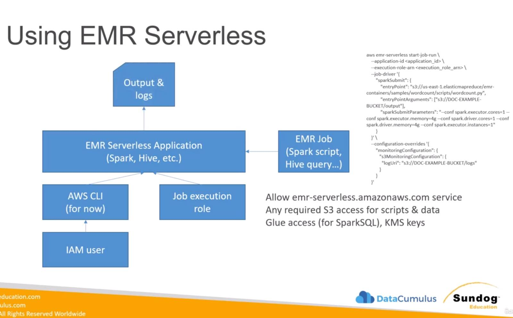
 
  - Security
    - Basically the same as EMR
      - EMRFS (S3 Encryption SSE or CSE at rest, TLS in transient between EMR nodes and S3)
    - Local Disk Encryption (EBS volumes for EMRFS, EBS volumes for HDFS)
    - Spark communication between drivers and executors is encrypted.
    - Hive communication between GLUE Metastore and EMR uses TLS.
    - Force HTTPS (TLS) on S3 policies with `aws:SecureTransport`.

---

## 1. Defining Hadoop

Hadoop is a framework for distributed storage and processing of large datasets. It is traditionally defined by three core pillars:

* **HDFS (Hadoop Distributed File System):** The **Storage Layer**. It breaks large files into blocks (default 128MB) and distributes them across a cluster. It ensures fault tolerance by replicating these blocks across different nodes.
* **YARN (Yet Another Resource Negotiator):** The **Operating System** of Hadoop. It manages cluster resources and schedules jobs. It decides "who gets what" memory and CPU.
* **MapReduce:** The **Processing Layer**. It processes data in two phases: **Map** (filters and sorts data) and **Reduce** (summarizes data). Its main drawback is that it writes intermediate results to disk, making it slow for iterative tasks like Machine Learning.

---

## 2. Why Spark?

Spark was designed to overcome the limitations of MapReduce, specifically for **Machine Learning** and **Iterative Analytics**.

* **Speed:** It uses **In-Memory Processing**, which is up to 100x faster than MapReduce's disk-based approach.
* **Efficiency:** It uses **Lazy Evaluation** (building a plan called a DAG—Directed Acyclic Graph) and only executes when an "action" (like saving or showing data) is called.
* **Unified Engine:** It handles batch, streaming, and ML in one place.

---

## 3. How Spark Works (Architecture)

Spark follows a Master-Slave architecture:

| Component | Role |
| --- | --- |
| **Driver** | The "Brain." It runs the `main()` function, converts code into tasks, and schedules them. It maintains the SparkSession. |
| **Cluster Manager** | The "Orchestrator" (e.g., YARN, Mesos, or Spark Standalone). It allocates resources to the Spark application. |
| **Executor** | The "Workers." These are processes on worker nodes that execute the tasks assigned by the Driver and store data in-memory or on disk. |

---

## 4. Spark Components

Spark is a "Swiss Army Knife" for data:

* **Spark Core:** The foundation (RDDs, memory management, fault recovery).
* **Spark SQL:** For structured data using SQL queries or DataFrames (optimized by the **Catalyst Optimizer**).
* **Spark Streaming:** Processes real-time data in "mini-batches."
* **MLlib:** The Machine Learning library.
* **GraphX:** For graph processing (e.g., social network analysis).

---

## 5. Spark MLlib: Features & Algorithms

In the exam, focus on **Spark ML** (the DataFrame-based API), which is the modern standard over the older RDD-based MLlib.

### Key Features

* **Pipelines:** Allows you to chain multiple stages (Transformers and Estimators) into a single workflow, similar to Scikit-Learn.
* **Featurization:** Tools for Feature Extraction (TF-IDF, Word2Vec), Transformation (Scaling, Normalization), and Selection.
* **Persistence:** Ability to save and load models/pipelines for production.

### Core Algorithms

* **Classification:** Logistic Regression, Random Forest, Naive Bayes, Support Vector Machines (SVM).
* **Regression:** Linear Regression, Generalized Linear Regression.
* **Clustering:** K-Means, Gaussian Mixture Models (GMM).
* **Collaborative Filtering:** Alternating Least Squares (ALS) — **crucial for Recommendation Systems.**
* **Dimensionality Reduction:** PCA (Principal Component Analysis), SVD.

---
Spark Structured Streaming is the modern, high-level API for stream processing built on the Spark SQL engine.

The fundamental idea is to treat a live data stream as a table that is being continuously appended. This allows you to write streaming queries the same way you write batch queries against static DataFrames.

---
### S3
- Max object size is 5 TB, if uploading more than 5GB, must use "multi-part upload"
- Metadata (list of key/value pairs system or user metadata)
- Tags (unicode key/val pair up to 10) - useful for security and lifecycle
- Version ID

- S3 Bucket Policy
  - Grant pub access 
  - Force Objects to be encrypted at upload `aws:SecureTransport: true`
  - Grant access to another account

- Versioning
  -  enabled at bucket level.
  - the same key will change the "version"
  - any file that is not versioned prior to enabling versioning will have "null"
  - suspending versioning will not delete the old versions.

- Replication
  - Versioning must be enabled.
  - CRR, SRR
  - buckets can be at different accounts.
  - Copying is asynchronous.
  - Must give proper IAM permissions to S3
  - Use Cases:
    - CRR - compilamce, lower latency access, replication across accounts
    - SRR - log aggregation, live replication between production and test accounts.
  - after enabling it , only the new objects will be replicated.
    - optionally, you can replicate existing objects using S3 Batch Replication
  - For Delete operations, it can replicate delete markers from the source to target (optional settings)
    - Deletions with version ID are not replicated (to avoid malicious deletes)
  - There is no "chaining" of replication.
    - If bucket 1 has replication into bucket 2, which has replication into bucket 3
    - Then object created in bucket 1 are not replicated to bucket 3.

- S3 Event Notifications with EventBridge
  - Advanced filtertion with JSON rules (metadata, size, name,..)
  - Multiple Destinations –  Step functions, Kinesis Stream/ Firehose
  - EventBridge capabilites - Archieve, Replay Events, Relaible delivery.

- If you spread reads across all four prefixes evenly, you can achieve 22000 request per second for GET and HEAD
- 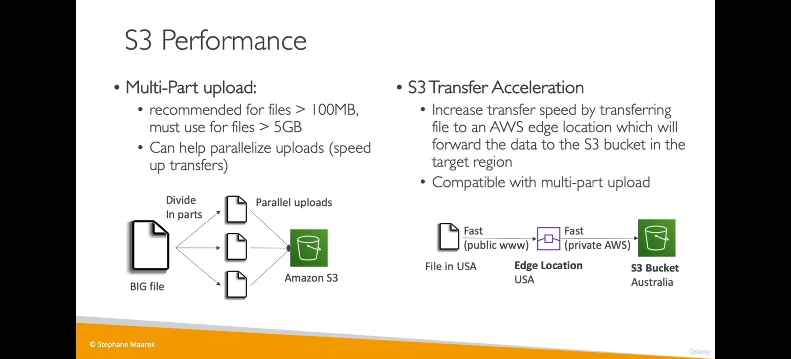
- 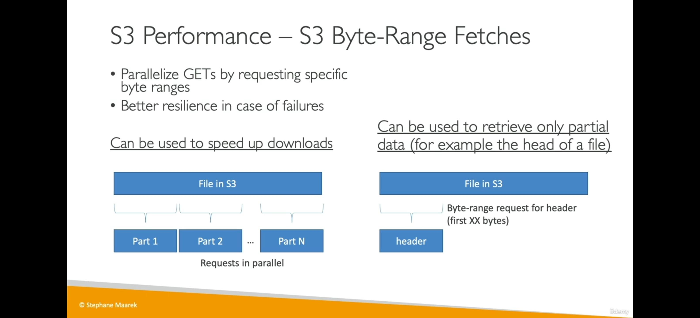
- 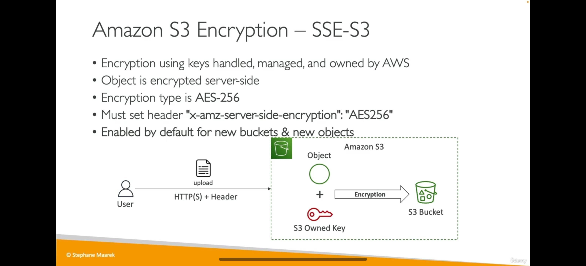
- 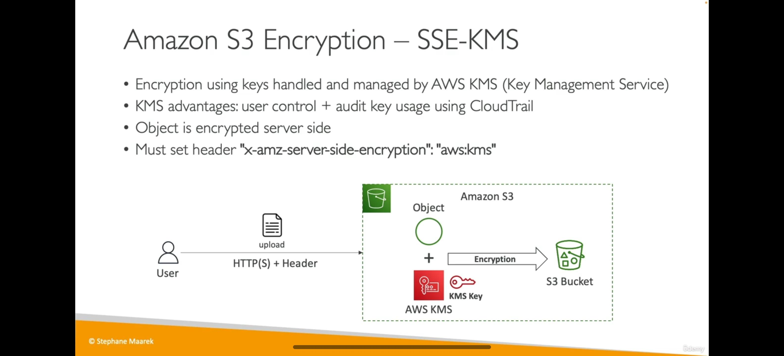
- 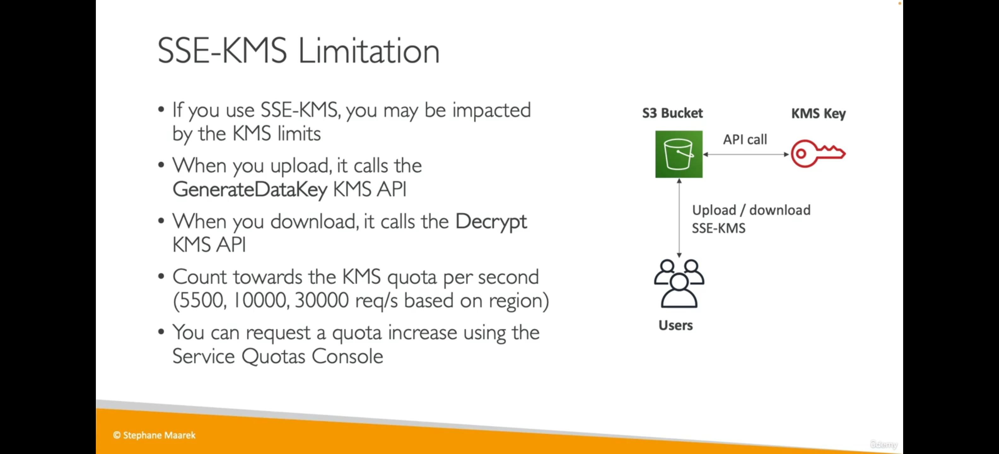
- 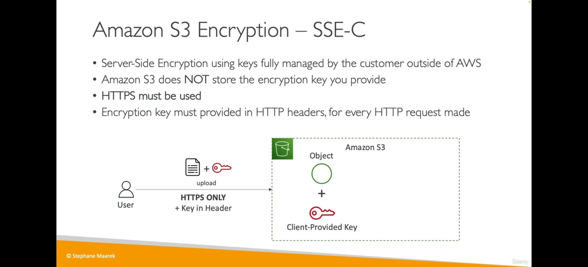
- Bucket policies are evaluated before "Default Encryption"
- 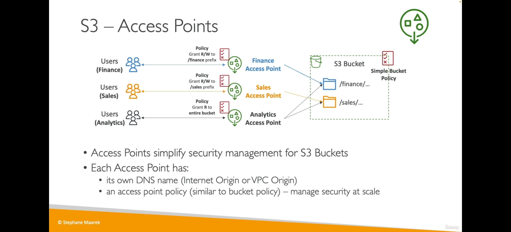
- 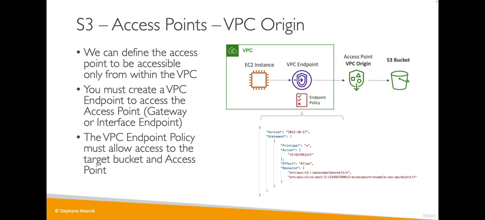
- 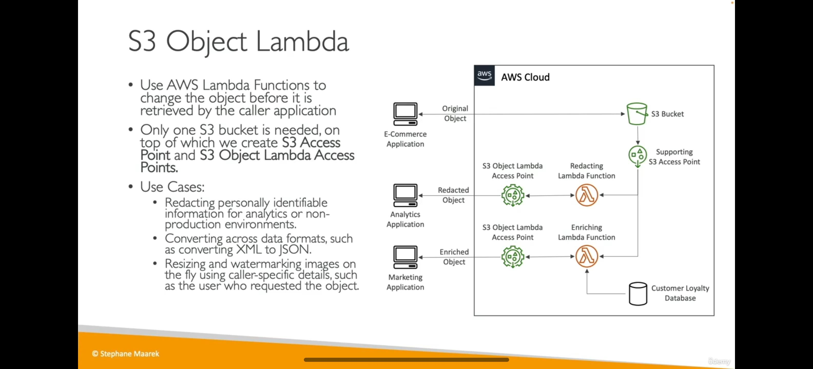

---
### SageMaker
- loop ((Deploy model, evaluate results in production) -> (Fetch, clean, and prepare data) -> (Train and evaluate a model))
- 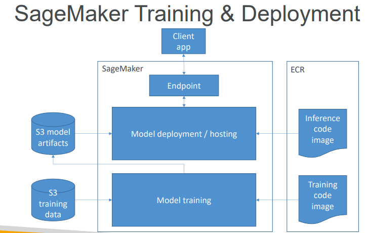
- SageMaker Notebooks(also the console can create training jobs) can direct the process deployed on EC2 from the console.
  - S3 data access, Scikit_learn, Spark, Tensorflow
  - Wide variety of built-in models, ability to spin up training instance
  - Ability to deploy models to production.

#### SageMaker AI Domain
- SageMaker AI Domains
  - Domains organize users, apps, and resources
  - Share an EFS volume
- User profiles own personal apps
  - SageMaker Studio instances
  - Private EFS directory
  - Shared resources across other users
- Shared spaces
  - Shared EFS directory
  - Communal IDE app

#### Dta Prep on SageMaker
- Data usually comes from S3
  - ideal format often `protobuf`, `RecordIO`
- Can also ingest from Athena, EMR, Redshift, and Amazon keyspace DB
- Apache spark integrates with sagemaker
- scikit_learn, numpy, panadas all at your disposal within a notebook.

#### SageMaker Processing
- Processing Jobs
  - copy data from s3
  - spin up a processing container
    - from sagemaker, or user provided.
  - output to s3

#### VPC’s for SageMaker AI Domains
- By default, a domain has two VPC’s
  - One for Internet access
    - Managed by SageMaker AI
  - And your own
    - Encrypted traffic to your EFS volume
    - You specify the VPC, its subnets, and security groups
  - You can change this
    - Send all traffic to your own VPC
    - Select “VPC Only” when creating the domain

#### Training on SageMaker
- Create a training job
  - URL of S3 bucket with training data
  - ML compute resources
  - URL of S3 bucket for output
  - ECR path to training code
- Training options
  - Built-in training algorithms
  - Spark MLLib
  - Custom Python Tensorflow / MXNet code
  - PyTorch, Scikit-Learn, RLEstimator
  - XGBoost, Hugging Face, Chainer
  - Your own Docker image
  - Algorithm purchased from AWS marketplace

#### Deploying Trained Models
- Save your trained model to S3
- Can deploy two ways:
  - Persistent endpoint for making individual predictions on demand
  - SageMaker Batch Transform to get predictions for an entire dataset
- Lots of cool options
  - Inference Pipelines for more complex processing
  - SageMaker Neo for deploying to edge devices
  - Elastic Inference for accelerating deep learning models
  - Automatic scaling (increase # of endpoints as needed)
  - Shadow Testing evaluates new models against currently deployed model to catch errors

#### SageMaker Input Modes
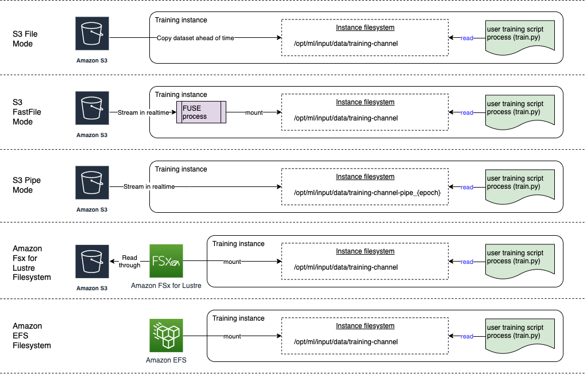
- S3 File Mode
  - Default; copies training data from S3 to local directory in Docker container
- S3 Fast File Mode
  - Akin to “pipe mode”; training can begin without waiting to download data
  - Can do random access, but works best with sequential access
- Pipe Mode
  - Streams data directly from S3
  - Mainly replaced by Fast File
- Amazon S3 Express One Zone
  - High-performance storage class in one AZ
  - Works with file, fast file, and pipe modes
- Amazon FSx for Lustre
  - Scales to 100’s of GB of throughput and millions of IOPS with low latency
  - Single AZ, requires VPC
- Amazon EFS
  - Requires data to be in EFS already, requires VPC