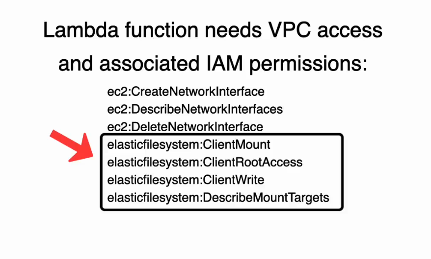
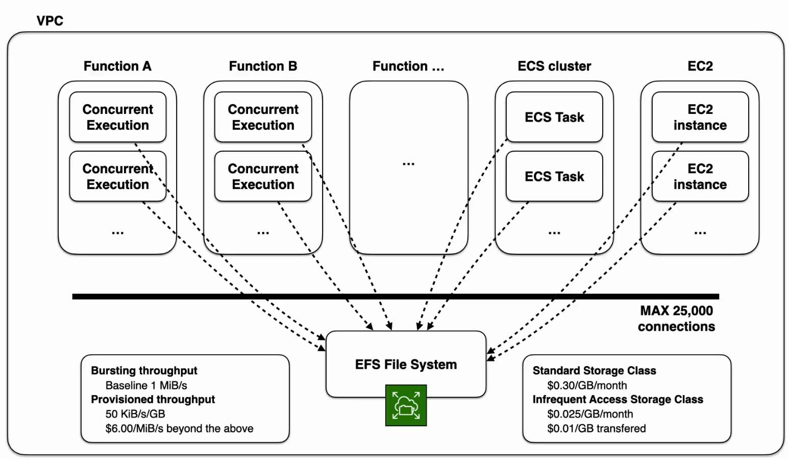
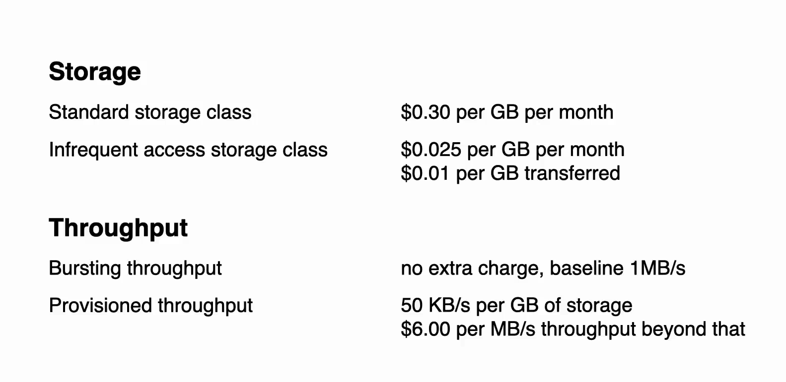
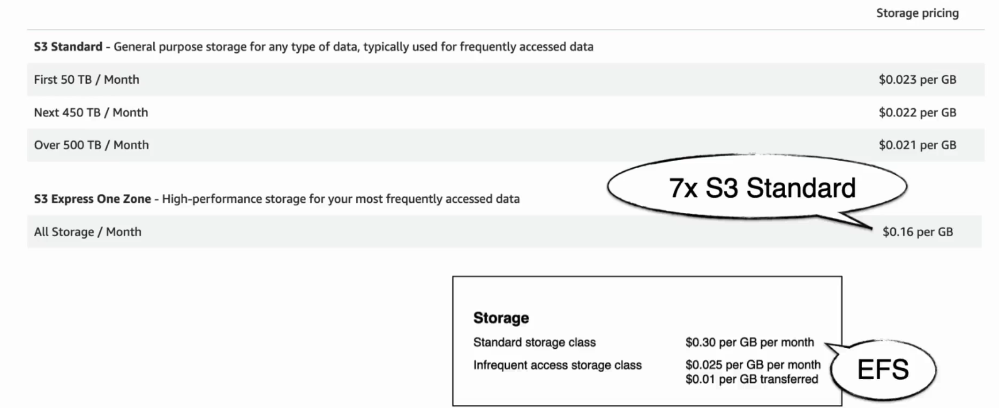
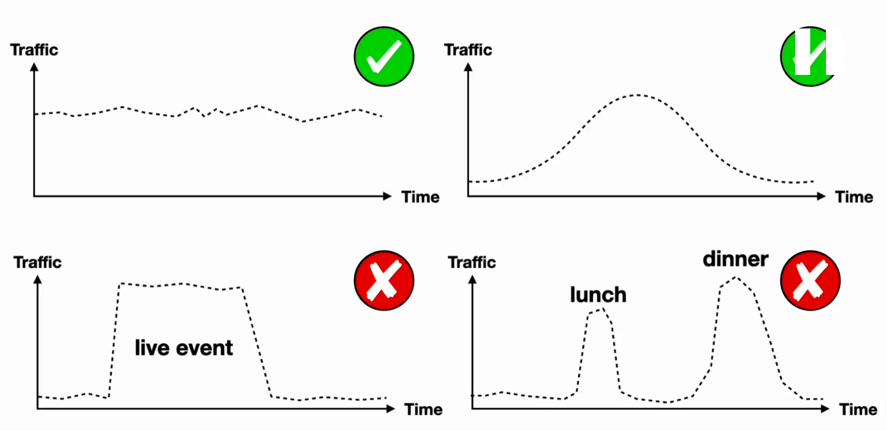
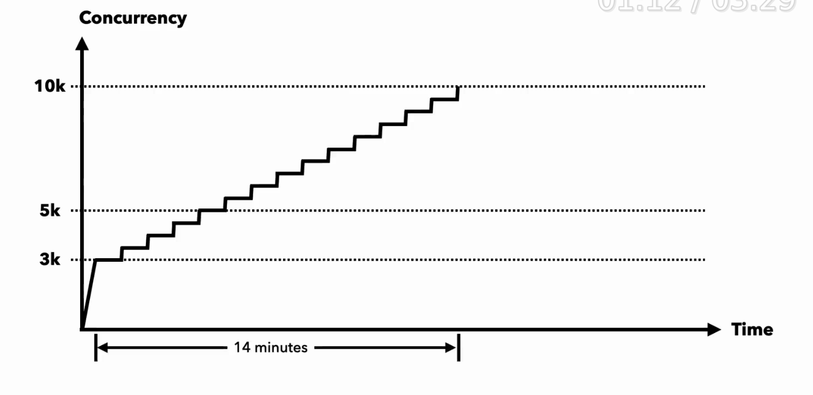
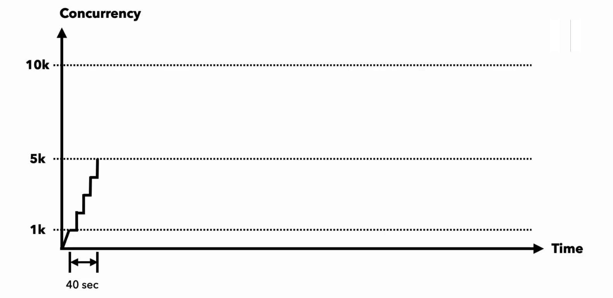

# AWS Serverless Complete Study Guide

## 🎯 Core Serverless Concepts

### What is Serverless?
> "Serverless is the same way WiFi is wireless - even though WiFi has cables, when you connect you don't worry about them. It's not your problem."

**Key Benefits:**
- **No Server Management**: Don't need to provision, manage, or scale servers
- **Pay-per-Use**: Only pay when your code runs (enables ephemeral environments)
- **Automatic Scaling**: Scales based on demand without manual intervention
- **Built-in Resilience**: Multi-AZ redundancy out of the box

## 🚀 AWS Lambda Deep Dive

### FinDev
- you can accurately predict the cost of a single request/transaction
  - this will make us define the critical 3% to optimize. (knuth quote about premature optimization is the root of all evil) 
- Unless you are an infrastructure company, infrastructure is basically overhead.

### Scaling Characteristics
- **Current Scaling**: Each function can scale by **1,000 concurrent executions every 10 seconds**
- **Independent Scaling**: Functions scale independently of each other
- **Improved Performance**: Lambda now scales **12x faster** for high-volume requests
  - https://aws.amazon.com/blogs/aws/new-accelerate-your-lambda-functions-with-lambda-snapstart/
- **Account Limits**: Account-level concurrency limits still apply

### Architecture & Security

**Isolation Model:**
- Functions run on **workers (microVMs)** using **Firecracker** virtualization
- **No shared memory** between executions
- **Failure isolation**: One request failure doesn't affect the system
- **Garbage collection**: Workers recycled every few hours (prevents memory leaks)

**Security Advantages:**
- **Reduced attack surface**: You only manage code and dependencies
- **AWS handles**: Networking, OS, physical infrastructure
- **Built-in isolation**: Each execution is isolated from others

## 💰 Cost Optimization

### Cost Model
- **Pay-per-execution**: Cost closely tracks actual usage
- **Predictable vs Efficient**: Serverful = predictable costs but overpayment during low traffic
- **Infrastructure Overhead**: *"Unless you are an infrastructure company, infrastructure is basically overhead"*

### Provisioned Concurrency
**Purpose**: Eliminates cold starts for predictable workloads

**How it works:**
- Creates function snapshots on deployment
- Caches memory and disk space
- Significantly improves cold start performance
- **Pricing**: Fixed cost + request/duration costs

**Use Cases:**
- Functions with predictable traffic patterns
- Applications requiring consistent low latency
- Special events requiring guaranteed performance

## 🏗️ Architectural Decisions

### Serverless-First Approach
1. **Start with serverless** by default
2. **Move to containers** when:
   - Hitting serverless limits
   - Throughput grows where containers are more cost-effective
3. **Benefit**: Modular serverless code makes container migration easier
4. https://www.wudsn.com/productions/www/site/news/2023/2023-05-08-microservices-01.pdf
5. https://martinfowler.com/articles/evo-arch-forward.html
6. https://aws.amazon.com/blogs/enterprise-strategy/switching-costs-and-lock-in/
7. https://aws.amazon.com/ar/video/watch/4ba04e84b32/
8. https://www.lastweekinaws.com/blog/multi-cloud-is-the-worst-practice/

### Vendor Lock-in Strategy
**Philosophy**: Productivity before portability

**Key Points:**
- Everything has switching costs (architecture, programming language, frameworks)
- **High risk, high reward**: Extract maximum value from cloud partner
- **Mitigation**: Use hexagonal architecture for easier migration
- **Reality check**: If you're not productive (and competitors are), you might not have anything to port

## ⚙️ Lambda Configuration & Limits

### Storage Limits
- **Code storage**: Soft limit per region (can be increased)
- **Temporary storage**: 512MB /tmp directory limit
- **Workaround**: Use container images (up to 10GB)

### Concurrency Management
- **Default limits**: Can be increased via AWS support
- **Provisioned concurrency**: Available on function versions
- **Auto-scaling**: Set up scaling events for special occasions

## 📊 Invocation Types

### RequestResponse (Synchronous)
- **Default behavior**
- **Connection**: Kept open until response or timeout
- **Use cases**: ALB, API Gateway
- **Response**: Immediate result or error

### Event (Asynchronous)
- **Fire-and-forget** pattern
- **Error handling**: Failed events sent to DLQ (if configured)
- **Use cases**: EventBridge, SNS, S3
- **Response**: Status code only

### DryRun
- **Validation only**
- **Checks**: Parameter values and permissions
- **No execution**: Function doesn't actually run

## 🔄 Error Handling & Destinations
- 

### Dead Letter Queues (DLQ)
**Best Practice**: Configure DLQ via **Destinations** (not async configuration)

**Destination Options:**
- SNS topics
- SQS queues
- EventBridge event buses
- Lambda functions

### Destination Configuration
- **Success destinations**: Capture successful execution details
- **Failure destinations**: Include stack traces and error messages
- **Enhanced monitoring**: More detailed than basic DLQ setup

## 💾 Storage Options

### EFS (Elastic File System)
**Characteristics:**
- **Access points**: Can create multiple access points
- **Performance**: Slightly faster and more predictable than S3
- **Caching**: OS-level caching for reads
- **Limits**: Up to 25,000 connections per filesystem
- **permissions**:
  - 
- **cheat sheet**
  - 
- **s3 vs efs**
  - 
  - 

**When to use:**
- Need to load files larger than Lambda's 10GB /tmp limit
- Require shared file system across multiple functions

**Alternative**: S3 Express One Zone (simpler and cheaper for many use cases)

## 🔄 Migration Strategy

### Container Migration Path
1. **Modular design**: Serverless promotes good code modularity
2. **Code reuse**: Significant code reusability when moving to containers
3. **Quick migration**: Well-architected serverless code migrates faster

### Hexagonal Architecture Benefits
- **Decoupled design**: Separates business logic from infrastructure
- **Easy testing**: Mock external dependencies
- **Migration ready**: Swap infrastructure without changing core logic

## 📈 Performance Optimization

### Cold Start Mitigation
1. **Provisioned concurrency**: Pre-warm execution environments
2. **Snapshot optimization**: Memory and disk snapshots reduce initialization time
3. **Runtime selection**: Choose appropriate runtime for your use case

### Scaling Optimization
- **Burst handling**: 14 minutes to reach maximum scale (legacy)
  - 
  - 
- **New scaling**: 1,000 concurrent executions every 10 seconds
  - 
- **Traffic patterns**: Design for expected load patterns
- 
  - Every function can scale by 1000 concurrent executions every 10 seconds. independently of each other.
  - if 1 concurrent execution takes 100ms, in one second, it can handle 10 requests. so it can scale by 10000 TPS every seconds.

## internals:
- AWS Lambda functions run inside Firecracker, an open-source virtualization technology developed by AWS.
- Firecracker is purpose-built for creating and managing secure, multi-tenant container and function-based services at scale.
It uses lightweight microVMs (micro virtual machines) to provide strong isolation, fast startup times, and minimal overhead.
- Each Lambda invocation can be executed in a separate microVM, improving security and resource efficiency.
- Firecracker is designed to optimize for serverless workloads, enabling rapid cold starts and efficient resource utilization.
- https://docs.aws.amazon.com/lambda/latest/api/API_Invoke.html
- https://www.youtube.com/watch?v=AECR8WMHjv0
- https://www.youtube.com/watch?v=Rjq7SKudjpo
- https://www.youtube.com/watch?v=0_jfH6qijVY
## 🎯 Interview Preparation Questions

### Fundamental Concepts
1. How does serverless differ from traditional server management?
2. What are the key benefits and trade-offs of serverless architecture?
3. Explain the Lambda execution model and isolation mechanisms.

### Scaling & Performance
1. How does Lambda handle sudden traffic spikes?
2. What is provisioned concurrency and when should you use it?
  - https://docs.aws.amazon.com/lambda/latest/dg/lambda-concurrency.html
3. How do you optimize for cold starts?

### Architecture & Design
1. When would you choose serverless over containers?
2. How do you handle vendor lock-in concerns?
3. What is hexagonal architecture and how does it help with serverless?

### Cost & Operations
1. How does serverless pricing work and when is it cost-effective?
2. What are the different Lambda invocation types and their use cases?
3. How do you implement proper error handling in serverless applications?

## 🚀 Next Steps for Deeper Learning

1. **Hands-on Practice**: Build serverless applications using different triggers
2. **Performance Testing**: Experiment with different concurrency settings
3. **Cost Analysis**: Compare serverless vs traditional hosting costs
4. **Architecture Patterns**: Study serverless design patterns and anti-patterns
5. **Multi-service Integration**: Practice with EventBridge, Step Functions, and other AWS services

---

*Remember: Serverless is about removing undifferentiated heavy lifting so you can focus on business value. Start serverless-first and migrate when constraints require it.*