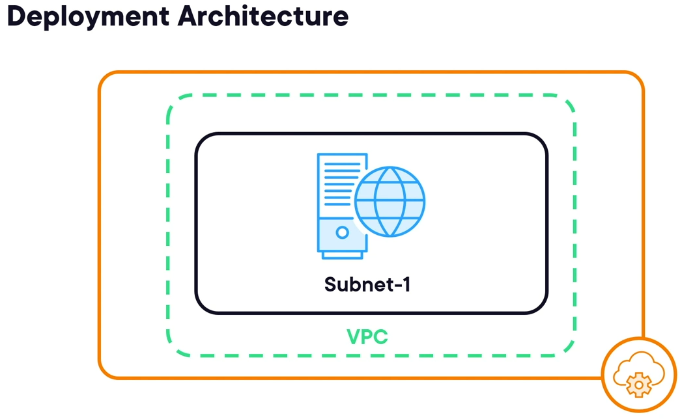

section 1:
1. **Core Concepts of Terraform**:
   - **Declarative Approach**: Define the desired end state of infrastructure without specifying exact steps.
   - **Idempotency**: Ensures applying the same configuration repeatedly results in consistent, unchanged infrastructure.
   - **Push Model**: Terraform pushes configurations to target environments rather than pulling them.

2. **Components of Terraform**:
   - **Variables, Providers, and Resources**: Key building blocks for managing infrastructure.
   - **Modules**: Reusable and abstracted configurations for consistency and repeatability.

3. **Benefits of Infrastructure as Code with Terraform**:
   - Reusability of code, reducing duplication (DRY principle).
   - Version control for infrastructure definitions using tools like Git.
   - Consistent and predictable environments across deployments.
---
## section 2:
### What is Terraform?
  - Terraform is an open-source tool by HashiCorp for automating the deployment and management of infrastructure. Infrastructure here includes networking, virtual machines, containers, and other services developers consume without managing them directly.
  
### Terraform’s main features:
  1. **Vendor-Agnostic**: Supports multiple providers, such as AWS, Azure, GCP, VMware, DigitalOcean, and any service with an API.
  2. **Declarative Syntax**: You describe the desired state of infrastructure, and Terraform figures out how to achieve it.
  3. **Push-Based Model**: Terraform directly communicates with service APIs to create or manage resources, eliminating the need for agents or servers.
  

  
### Core Components of Terraform
  1. **Terraform Binary**: A single executable written in Go, supporting various platforms, including macOS, Windows, Linux, and even Raspberry Pi.
  2. **Configuration Files**: Written in **HashiCorp Configuration Language (HCL)** or JSON, these files define the desired infrastructure state. Terraform reads `.tf` files in a directory to stitch together a configuration.
  3. **Providers**: Plugins that interact with service APIs. For example, the AWS provider manages AWS services, while plugins for other providers are available on the [Terraform Registry](https://registry.terraform.io).
  4. **State File**: Maintains a record of deployed resources, mapping the configuration to actual resources in the environment. Terraform uses this state to detect changes and calculate updates.
  
  
  
### Real-World Example
  - A simple scenario might involve setting up a basic AWS infrastructure:
    - Create an EC2 instance.
    - Attach a security group.
    - Deploy an S3 bucket for storage.
  
    - This exercise demonstrates Terraform’s core capabilities, including writing configuration files, managing state, and deploying resources.
  
### section architecture:
  - 

Here’s a concise summary of the main aspects of Terraform, including its core concepts, the structure of HCL files, and the command lifecycle:


### Concepts 

1. **Provider**:
   - A plugin that allows Terraform to interact with various infrastructure APIs (e.g., AWS, Azure, Google Cloud).
   - Providers define resource types and data sources for the services they manage.
   - Example: The AWS provider is required to create AWS resources.

2. **Data Sources**:
   - Used to fetch read-only information from external systems (e.g., an existing AWS VPC or IP ranges).
   - Allows Terraform to use information without managing the resource itself.
   - Example: `data "aws_ami" {}` retrieves an Amazon Machine Image ID.

3. **Plugins**:
   - Extend Terraform’s functionality and include providers or provisioners.
   - Stored locally in the `.terraform/plugins` directory after initialization.
   - Automatically downloaded during `terraform init`.

### Structure of an HCL File (HashiCorp Configuration Language)

1. **Labels and Blocks**:
   - Terraform uses blocks as the primary configuration unit.
   - Common block structure:
     ```
     <block_type> "<block_label>" "<block_name>" {
       <arguments>
     }
     ```

2. **Components**:
   - **Block Type**: Defines the purpose (e.g., `resource`, `provider`, `data`).
   - **Block Label**: Typically specifies the type or instance (e.g., "aws_instance").
   - **Block Name**: A unique identifier for the block within its type (e.g., "my_instance").
   - **Arguments**: Key-value pairs that configure the block.
      Example:
      ```hcl
      resource "aws_instance" "example" {
        ami           = "ami-12345678"
        instance_type = "t2.micro"
      }
      ```

### Terraform Command Lifecycle

1. **`terraform init`**:
   - Initializes a Terraform configuration directory.
   - Downloads necessary provider plugins and sets up the backend (e.g., for remote state storage).

2. **`terraform plan`**:
   - Creates an execution plan by comparing the current state with the desired configuration.
   - Lists actions Terraform will take without making changes.

3. **`terraform apply`**:
   - Applies the execution plan to provision or update infrastructure.
   - Modifies resources to match the desired configuration and updates the state file.


---
## section 3:
### Summary: Working with Data in Terraform

Terraform leverages **input variables**, **local values**, and **outputs** to make configurations dynamic and reusable. These allow you to pass, compute, and retrieve data, respectively. Below is an overview of each concept with examples.

---

### 1. **Input Variables**
Input variables allow external values to be passed into Terraform configurations at runtime.

#### Key Properties:
- **`type`**: Defines data type (e.g., `string`, `list`).
- **`default`**: Sets a default value if no input is provided.
- **`description`**: Explains the variable's purpose.
- **`sensitive`**: Hides sensitive data in logs (`true` or `false`).

#### Example:
```hcl
variable "aws_region" {
  type        = string
  default     = "us-east-1"
  description = "The AWS region to deploy resources"
}

variable "allowed_ip_addresses" {
  type        = list(string)
  default     = ["192.168.0.1", "192.168.0.2"]
  description = "IP addresses allowed to access the system"
}
```

#### Reference in Config:
```hcl
provider "aws" {
  region = var.aws_region
}

resource "aws_security_group" "example" {
  ingress {
    cidr_blocks = var.allowed_ip_addresses
  }
}
```

---

### 2. **Local Values**
Local values are computed within the configuration and referenced for reuse. They reduce redundancy.

#### Example:
```hcl
locals {
  instance_type = "t2.micro"
  tags = {
    Environment = "production"
    Application = "web"
  }
}

resource "aws_instance" "web" {
  instance_type = local.instance_type
  tags          = local.tags
}
```

---

### 3. **Output Values**
Outputs return values from a configuration after execution.

#### Example:
```hcl
output "instance_id" {
  value       = aws_instance.web.id
  description = "ID of the deployed instance"
}

output "web_url" {
  value = "http://${aws_instance.web.public_ip}"
}
```

#### Retrieve Outputs:
Run the command:
```bash
terraform output
```

---

### 4. **Data Types in Terraform**

#### Primitive Data Types:
- **`string`**: A sequence of characters.
- **`number`**: Integer or decimal.
- **`bool`**: Boolean values (`true` or `false`).

#### Collection Data Types:
- **`list`**: Ordered group (e.g., `["a", "b", "c"]`).
- **`set`**: Unordered unique group (e.g., `["a", "b"]`).
- **`map`**: Key-value pairs (e.g., `{key1 = "value1", key2 = "value2"}`).

#### Example:
```hcl
variable "region_list" {
  type    = list(string)
  default = ["us-east-1", "us-west-2"]
}

variable "app_config" {
  type    = map(string)
  default = {
    app_name   = "myapp"
    app_env    = "production"
  }
}
```


### 5. **Terraform Command Lifecycle**

1. **`terraform init`**:
   - Initializes the working directory.
   - Downloads providers and sets up plugins.

2. **`terraform plan`**:
   - Creates an execution plan.
   - Highlights resources to be created, modified, or destroyed.

3. **`terraform apply`**:
   - Executes the plan.
   - Applies changes to the infrastructure.

#### Example Workflow:
```bash
terraform init
terraform plan -var="aws_region=us-west-2"
terraform apply -var="aws_region=us-west-2"
```

---

# Variable vs Local
In Terraform, **variables** and **locals** serve distinct purposes, though they both play a role in managing and reusing data within your configurations. Here's a breakdown:

---

### **1. Variables**
- **Purpose**: To pass information **into** the Terraform configuration from external sources.
- **Defined with**: The `variable` block.
- **Scope**: Variables are global within the module they are defined in and are meant to be supplied from the command line, files, or the `terraform.tfvars` file.
- **Input**: Values for variables must be provided explicitly or through defaults.
- **Use case**: To make configurations dynamic and flexible to different environments or use cases.
- **Example**:
  ```hcl
  variable "region" {
    description = "The AWS region to deploy resources in"
    type        = string
    default     = "us-east-1"
  }
  
  # Reference the variable
  provider "aws" {
    region = var.region
  }
  ```
  - **Output**:
    - If no value is provided, Terraform will use the default (`us-east-1`).

---

### **2. Locals**
- **Purpose**: To compute and store **internal values** within the configuration for reuse.
- **Defined with**: The `locals` block.
- **Scope**: Locals are local to the module they are defined in.
- **Input**: Typically computed using existing variables, data sources, or expressions.
- **Use case**: To simplify and avoid repetition in configuration files by defining reusable values.
- **Example**:
  ```hcl
  locals {
    bucket_name = "my-app-${var.environment}"
    tags        = {
      environment = var.environment
      owner       = var.owner
    }
  }

  resource "aws_s3_bucket" "example" {
    bucket = local.bucket_name
    tags   = local.tags
  }
  ```
  - **Output**:
    - `local.bucket_name` dynamically computes the S3 bucket name based on the variable `var.environment`.

---

### **Key Differences**

| Aspect                | Variables                               | Locals                                    |
|-----------------------|-----------------------------------------|------------------------------------------|
| **Purpose**           | External inputs to Terraform           | Internal reusable computed values        |
| **Definition Block**  | `variable`                             | `locals`                                 |
| **Scope**             | Global within the module               | Local to the module                      |
| **Input Source**      | Provided at runtime, defaults, or files| Computed using expressions or variables  |
| **Use Case**          | Configurability                        | Simplification and DRY (Don't Repeat Yourself) principle |

---

### **Combined Example**

```hcl
variable "environment" {
  description = "The deployment environment (e.g., dev, prod)"
  type        = string
  default     = "dev"
}

locals {
  bucket_name = "my-app-${var.environment}"
  tags        = {
    environment = var.environment
    owner       = "team-x"
  }
}

resource "aws_s3_bucket" "example" {
  bucket = local.bucket_name
  tags   = local.tags
}
```
- **Variables** allow flexibility when deploying to different environments (`dev`, `prod`).
- **Locals** simplify configuration by computing reusable values (`bucket_name`, `tags`).
