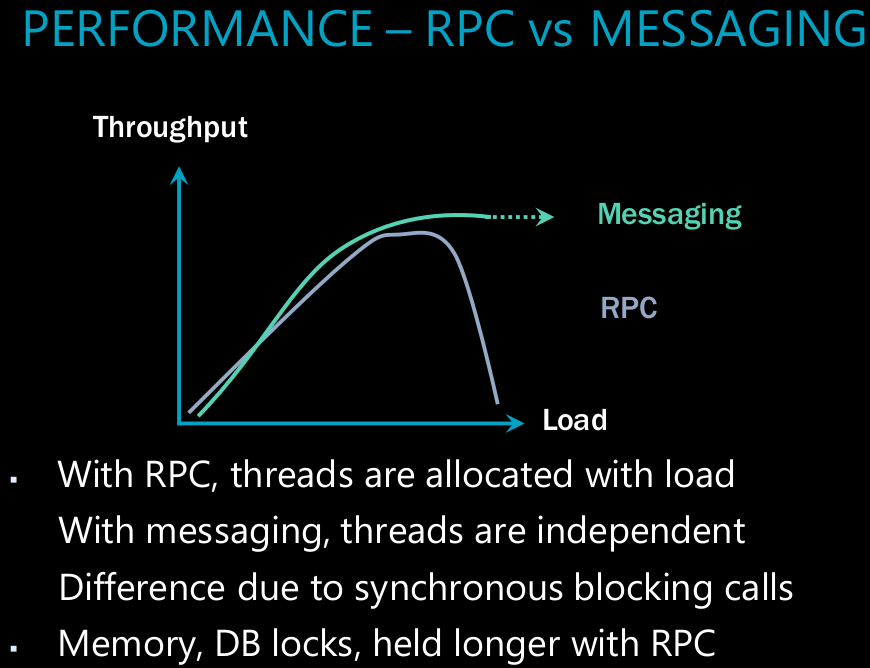

## Messaging vs RPC

- when u start performance test(micro benchmark) u'll notice rpc has lower latency than messaging.
  - part of the reasons of u do store&forward, u have 3 hops, u have to go to the broker, the broker has to go to the consumer,
    the consumer has to go to the broker, the broker has to go to the producer.
- RPC & Threads
  - any memory u had allocated when u make a romte call, the garabage collector needs to hold on those memory until u get the response back.
    - first time gc runs, and u don't get the response back, it will mark those memory as gen1(microseconds). (network call speed is in milliseconds)
      next round when u still don't get the response it mark the memory as gen2. - gc doesn't actively clean up gen2 memory. it only clean up disposable, but regular memory sit in gen2.
    - effectively, u'll have a kind of meemory leak.
    - gc now need to clean up gen2 memory, and it try for it twice and the threads are actively using those memory,
      so gc will have to suspend those threads, and clean up the memory.
      - this where u start to see the throughput drop.
      - as gc starting suspending all the threads all the clients will be
        waiting longer. and domino effect will happen. the whole system will slow down.
      - 
      - at a certain point in time, system start doing house keeping work more than actual work.
        - the web server will notice and recycle the app domain.
          - in this point ur throughput will drop to 0.
        - if the load is high u might reach this point in 10/15 minutes.
      - new client may get connection refused by the remote host. (no memory to accept new connection).
      - in messaging u can store the request on disk, even the server is down, u can still accept new request.
      - usually the asynchronous processing model result in more parallel processing result therefore higher total throughput of ur system than the equavlient synchronous blocking req/resp.
        - u can async call in rpc, but by operation over http we still have the concerns of how we will handle retries, the fault tolerance type of scenarios. a lot of that isn't as available out of the box as it is with messaging{durability: ability to not lose messages under load even when operating in async fashion}.
    - queuing system and most infrastructure services tend to start quckier than any type of our business code.
- we can say that messaging for a single message delivery is usually gone be slower than the equivalant single rpc call - under load and at a scale messaging will perform better and will be more reliable.

## STANDARD SERVICE INTERFACE

- 
- refactoring to messaging api
  - 
  - we can have logically independent routing for each of these messages, u can prioritize them differently, this is going to go over higher priority network, this is going to go over lower priority network...
  - we can separate out the handling logic for each of these messages, we don't neccessarily have the single service implementation like before to handle all of them.
  - don't share classes or types, share schema.
