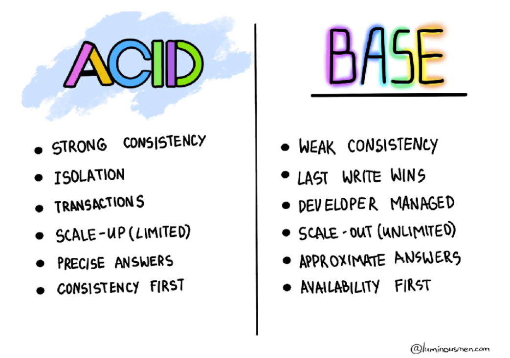
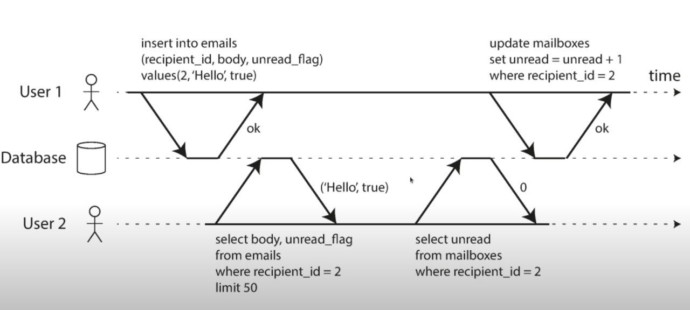

# Database
- What is a time-series DB?
   - Stores records that are part of time-series
   - Aggregate and compress time-stamped data
   - Few time-series DB are written on top of Relational DB
- What kind of database should you choose ?
  - it depends on your use cases and what you good and familiar with. 
  - (if you don't know how your data will be used and grow start with what you know. if you know how your data will be used and grow, choose the DB that fits your use case( the best trade-offs))
    - Relational DB
      - for ex: postgres has good Consistency and high Durability. but you need to maintain its availability(promote a new master, etc.)
    - Cassandra has a cluster architecture if nodes go down, it can still be available. consistency is tunable. 

---
- Anything that can go wrong will go wrong.
---
## Transaction
- a sequence of reads/writes on single/multiple shared object.
- Database guarantees that concurrent transactions have the same effect as if they ran serially (i.e., one
  at a time, without any concurrency).
  - Transactions are **Serializable** 
- ACID vs BASE 
  - 
  - ACID
    - **Atomicity**: All or nothing; The system can only be in the state it was before the operation or after the operation
      , not something in between.
      - Implemented using log for crash recovery
      - failure guarantee
    - **Consistency**
      - Data should make sense (domain-specific: twitter vs bank)
      - Semantic guarantee
    - **Isolation**
      - Transactions should not interfere with each other
      - Implemented using locks
      - concurrency guarantee(2 transactions should not interfere with each other
      -  isolation violation:
        - 
    - **Durability**
      - Any data it has written successfully will not be forgotten,
        even if there is a hardware fault or the database crashes.
      - Implemented using write-ahead log or replication.
      - Reliability guarantee (Perfect durability does not exist) 
    - AID: the DB guarantee to provide that to you, C is up to you depending on your application domain.
  - BASE (Basically Available, Soft state, Eventually consistent)
    - **Basically Available**: The system appears to work most of the time. (hardware failure 1% -> you have 1000 machines, 10 machines will fail)
    - **Soft state**:
      - 
    - Eventually consistent: The system will become consistent over time, given that it is not updated during that time.

---

---

