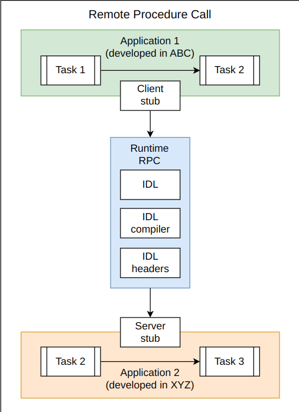

# Remote Procedure Call (RPC)**

---

## ✅ What is RPC?

RPC (Remote Procedure Call) is a **communication model** that lets a client call a function on a remote server **as if it's local**. It **abstracts network communication**, allowing seamless function calls across machines in a **distributed system**.

### 🔁 Simple Analogy:

Think of it like ordering food via a delivery app. You tap “Order Pizza” → the request goes to a remote kitchen → the kitchen makes the pizza → and the pizza is delivered back to you. You don’t care *how* it got there — that’s RPC!

---

## 🧩 Components of RPC (Simplified Table)

| Component                               | Description                                                                                         |
| --------------------------------------- | --------------------------------------------------------------------------------------------------- |
| **Client Stub**                         | Mimics the real function on the client. Prepares the function call and sends to runtime.            |
| **Server Stub**                         | Mimics the real function on the server. Converts received request into a real server function call. |
| **RPC Runtime**                         | The internal engine that handles data transfer, error handling, and communication logic.            |
| **IDL (Interface Definition Language)** | A neutral format to define functions, parameters, and types that both sides understand.             |
| **IDL Compiler**                        | Converts IDL into language-specific client/server stubs.                                            |
| **IDL Header**                          | Lists available remote functions and their signatures.                                              |

---

## 🔨 How RPC Works: 4 Key Steps

### 1. **Request and Response**

* The client sends a request for a function, like `demo("Hi")`.
* The server sends back a response, like `"Hello!"`.

🧪 **Example (JSON-RPC)**:

```http
POST /rpc-demo HTTP/1.1
{
  "jsonrpc": "2.0",
  "method": "demo",
  "params": ["greeting": "Hi"],
  "id": "99"
}
```

Response:

```json
{
  "jsonrpc": "2.0",
  "id": "99",
  "result": "Hello!"
}
```

📝 **Import/Export modules (IDL)**:

* `Import`: List of callable remote functions (used by client).
* `Export`: List of actual functions implemented (used by server).
- 

---

### 2. **Marshalling & Unmarshalling**

* **Marshalling** = packing the function name and parameters into a format for transmission (like JSON or Protocol Buffers).
* **Unmarshalling** = unpacking the data on the server to reconstruct the function call.

🧠 **Why it's important**: Without this, data structures from one language (say Java) couldn't be read in another (like Go).

---

### 3. **Binding Connection**

* **Static Binding**: Client already knows the server’s address (IP + port).
* **Dynamic Binding**: Address is resolved dynamically (e.g., via DNS or service discovery).

📌 Binding helps establish communication between client and server — it's like looking up the correct phone number before making a call.

---

### 4. **Network Protocols**

* RPC frameworks often use **HTTP over TCP**.
* Some modern protocols (like gRPC) use **HTTP/2** or **HTTP/3 with UDP** for better performance.

📊 **Common Transports**:

| Protocol | Transport | Serialization    | Note                      |
| -------- | --------- | ---------------- | ------------------------- |
| gRPC     | HTTP/2    | Protocol Buffers | High-perf, Google-backed  |
| JSON-RPC | HTTP      | JSON             | Simpler, good for browser |
| Thrift   | TCP       | Custom Binary    | Facebook's cross-lang RPC |
| SOAP     | HTTP      | XML/JSON         | Older, very structured    |

---

## 💡 Key Features and Advantages

* ✅ **Language Interoperability**: IDL enables cross-language compatibility.
  - 
* ✅ **Code Generation**: IDL compilers generate boilerplate code — saves time.
* ✅ **Performance**: Efficient binary serialization (e.g., Protobuf in gRPC) can outperform REST.
* ✅ **Clear Contracts**: Functions and parameters are well-defined via IDL.

---

## ⚠️ Drawbacks

* ❌ **Tight Coupling**: Both client and server must be updated when function signatures change.
* ❌ **Tooling Overhead**: Need IDL and compilers. May lack support in some languages.
* ❌ **Harder Debugging**: Compared to REST/HTTP, debugging RPC calls might require more effort due to binary formats or specialized tooling.

---

## ✨ Modern RPC Implementations

| RPC Tool          | Description                                                                                                    |
| ----------------- | -------------------------------------------------------------------------------------------------------------- |
| **gRPC**          | Google’s modern RPC using Protocol Buffers. Async support, HTTP/2, language-agnostic. Ideal for microservices. |
| **Apache Thrift** | Originally from Facebook. Efficient, supports many languages. Used for high-performance services.              |
| **RMI (Java)**    | Java-specific RPC. Allows Java objects to interact across JVMs.                                                |
| **SOAP**          | XML-based legacy protocol. Still used in enterprise. Replaced by REST/gRPC in many new systems.                |

---

## 🚀 When to Use RPC?

* High-performance internal services (like microservices).
* Cross-language service communication.
* When you need strongly typed APIs with auto-generated clients.
* Systems where structured contracts and tooling matter more than human-readability (e.g., REST vs. gRPC).

---

## 🏁 Summary Cheatsheet

| Feature          | RPC                                              |
| ---------------- | ------------------------------------------------ |
| Style            | Operation-oriented                               |
| Ease of Use      | High (due to abstraction)                        |
| Language Support | Wide (via IDL compilers)                         |
| Performance      | High (especially gRPC with binary transport)     |
| Debuggability    | Lower than REST (especially with binary formats) |
| Flexibility      | Good, but tight coupling requires coordination   |
