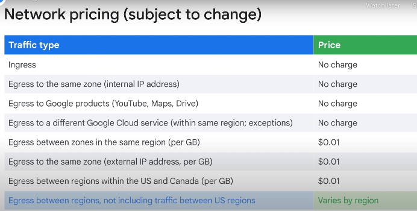
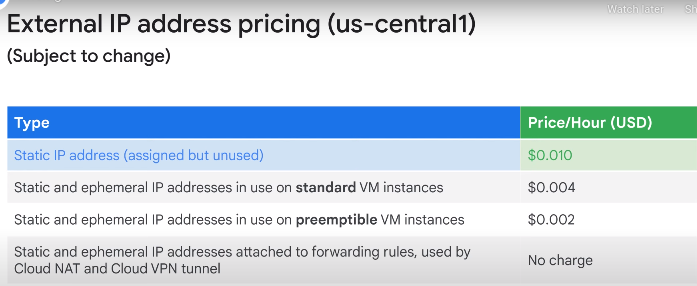

- These requirements determine how you will design the compute, networking, and storage infrastructure for a solution
- migrate infrastructure without modification (often referred to as a “lift and shift” approach).
  - After ensuring that things are working correctly, you can advance to optimization.
  - Each element of the existing environment or infrastructure needs to be either replicated or replaced with equivalent or better functionality in your cloud solution.
  - 
---
- Compute Engine(IaaS)
- Google Kubernetes Engine()
- App Engine(PaaS)
- Cloud Functions(FaaS)
- Cloud Run(Serverless)
  - make you able to run stateless container via web requests or pub/sub events.
  - It is build on Knative, an open API and runtime environment built on kubernetes.
---
### gcloud:
 - default config:  ~/.config/gcloud/configurations/config_default
     - list: `gcloud config list`
 - IAM:
   - Switching between users 
     - gcloud config configurations activate default
   - role binding ex:
     - ` gcloud projects add-iam-policy-binding $PROJECTID2 --member user:$USERID2 --role=projects/$PROJECTID2/roles/devops`
---
- Project
  - the key organizer of infrastructure resources and relate these resources to billing accounts.
  - Resources can only be created and consumed within projects in a way that projects isolate related resources from one another.
  - shutting down a project will schedule the deletion of it after 30 days.
---
- How can you access gcp(4)?
- Web Console
- CLI
- (REST-API) In addition to the Google Cloud CLI, you can also use client libraries that enable you to easily create and manage resources.
  Google Cloud client libraries expose APIs for two main purposes: 
  - App APIs provide access to services, and they are optimized for supported languages, such as Node.js or Python.
  - Admin APIs offer functionality for resource management.
    - For example, you can use admin APIs if you want to build your own automated tools.

- (Mobile App)The Gcp app offers alerts and incident management and allows you to get up-to-date billing information for your projects and get billing alerts for projects that are going over budget.
---
cloud shell
- 5 GB of persistent storage (/home)
- Built-in authorization for access to resources and instances
- Command-line access to a free temporary Compute Engine VM

- when using it, best practice is tor create `a persistent state` for example you can set it up to include the region and zone you want to work in, and the project id you want to use.
    - set the env var in a file the `source path/to/file` in the ~/.profile
---
- Marketplace
  - Deployment Manager is a Google Cloud service that uses templates written in a combination of YAML, python, and Jinja2
    to automate the allocation of Google Cloud resources and perform setup tasks. Behind the scenes a virtual machine has 
    been created. A startup script was used to install and configure software, and network Firewall Rules were created 
    to allow traffic to the service.
---
- Network
  - The PoPs, are where Google's network is connected to the rest of the internet.
    - Google Cloud can bring its traffic closer to its peers, because it operates an extensive global network of interconnection points.
        - This reduces costs and provides users with a better experience.
  - each `project` can have up to 15 `networks` (soft limit)
    - These networks do not have IP ranges but are simply a construct of all of the individual IP addresses and services within that network.
    - you can have one network that literally exists anywhere in the world—Asia, Europe, Americas—all simultaneously.
       - Inside a network, you can segregate your resources with regional subnetworks.
  - vpc types
    - default
      - every project has a default Network
      - One Subnet per region
      - Default firewall rules
      - The default network has pre-configured firewall rules that allow all instances in the network to talk with each other.
          - Manually created networks do not have such rules, so you must create them, as you will experience in the first lab.
    - auto
      - Default Network
      - One Subnet per region
      - Regional ip allocation
      - Fixed /20 Subnetwork per region
      - Expandable to /16
    - custom
      - No default subnets
      - full control of IP ranges.
      - Regional IP allocation
      - Expandable to IP ranges you specify.
  - you can convert an `auto` network to a `custom` network, but you can't convert a `custom` network to an `auto` network.
  - Connections between resources in different networks don't go through the internet, they go through the Google Edge Routers.
  - Overly large subnets are more likely to cause CIDR range collisions when using Multiple Network Interfaces
---
- IP Addresses
  - each VM has 2 IP addresses
    - Internal IP
      - assigned via DHCP internally. 
      - used for communication between instances in the same network.
      - When you create a VM in Google Cloud, its symbolic name is registered with an internal DNS service that translates the name to an internal IP address.
          - The DNS is scoped to the network, so it can translate web URLs and VM names of
            hosts in the same network, but it can't translate host names from VMs in a different network.
    - External IP
      -  this one is optional.
      - the external address is unknown to the OS of the VM.
      - used for communication with the internet.
      - That external IP address can be assigned from a pool, making it ephemeral, or it can be assigned from a reserved external IP address, making it static.
        - You can use your own publicly routable IP address prefixes as Google Cloud external IP addresses and advertise them on the Internet.(BYOIP)
          - In order to be eligible, you must own and bring a /24 block or larger.

  - Google Cloud has two types of internal DNS:
    - Zonal
      - Google strongly recommends using zonal DNS because it offers higher reliability guarantees by isolating failures in the DNS registration to individual zones.
    - Global
---
- Network Pricing
  - 
  - 
  - use gcp pricing calculator to estimate the cost of a collection of resources, because each GCP service has its own pricing model.
---
# IAM
  - Member is also called as `Principal` or `Identity`
  - `Policy TroubleShooter`: helps you understand why a user has access to a resource.
  - 
#### Service Account
- A service account is a special type of Google account that belongs to your application or a virtual machine (VM), instead of to an individual end user.
  - it doesn't have a password and cannot log in via the web or the console.
  - it uses a private key file that you can use to authenticate with Google Cloud.
  - defa
---
### TEMP
- IAM
  - `gcloud compute instances create lab-3 --zone us-central1-c --machine-type=e2-standard-2 --service-account $SA --scopes "https://www.googleapis.com/auth/compute"`
      - Access scopes are the legacy method of specifying permissions for your instance. Access scopes are not a security mechanism. Instead, they define the default OAuth scopes used in requests from the gcloud tool or the client libraries. They have no effect when making requests not authenticated through OAuth, such as gRPC or the SignBlob APIs.
        - A best practice is to set the full cloud-platform access scope on the instance, then securely limit the service account's API access with IAM roles. Access scopes apply on a per-instance basis. You set access scopes when creating an instance and the access scopes persist only for the life of the instance. Access scopes have no effect if you have not enabled the related API on the project that the service account belongs to. For example, granting an access scope for Cloud Storage on a virtual machine instance allows the instance to call the Cloud Storage API only if you have enabled the Cloud Storage API on the project.
