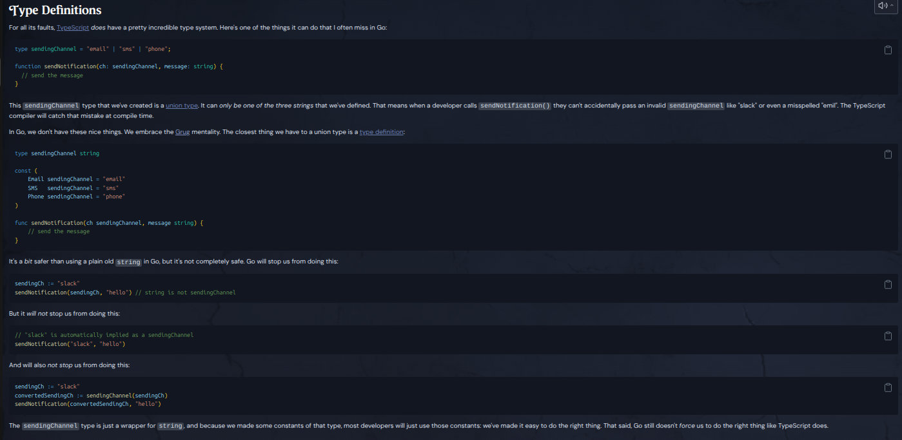
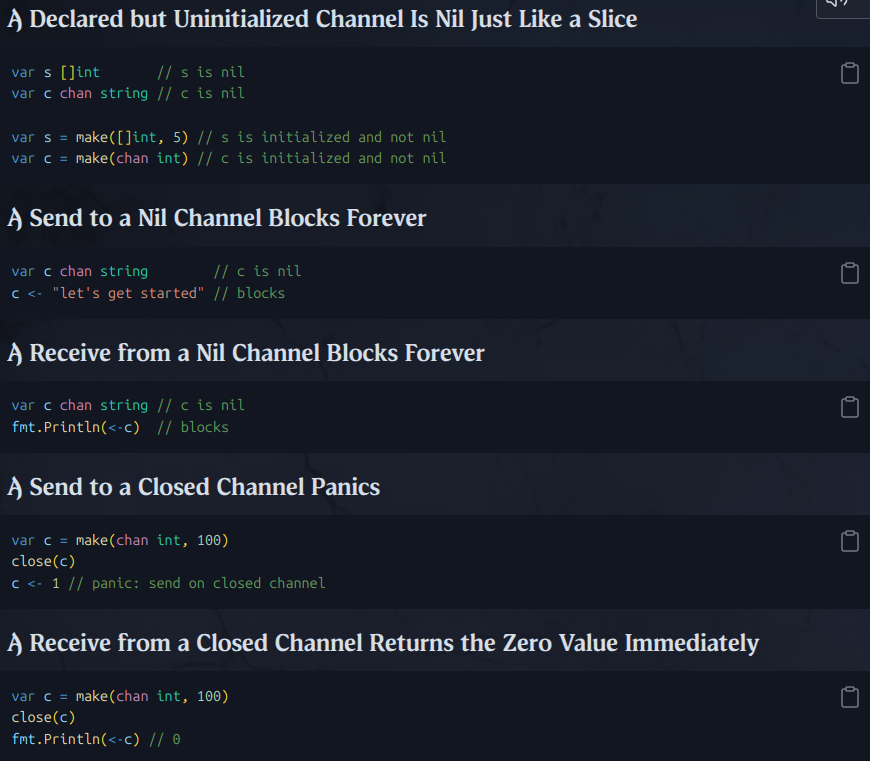

Practical GO:
  - Built for modern times:
    - goroutines, channels, [C10K problem], production Ready HTTP server (TLS, HTTP 2)
  - go use git to fetch external packages.
  - all files in the same folder must have the same package.
  - go env GOARCH GOOS -> architecture & os which the compiler is build the executable for.
     - u can modify it -> `GOOS=darwin go build` <- to build for mac.
  - main function don't accept args as java or C.  
     but there are package os and flag that can be used in building cli app. 
  - `string` is a `struct` `[pointer, len int]` ,  "Strings behave like arrays of bytes
    but are immutable: once created, it is impossible to change the contents of a string".
    - A string is a struct that has a length and a pointer to a byte array. 
      When you pass a string to another function, it copies the length and 
      the pointer. As a consequence, the new copied string points to the 
      same underlying data. (passed by reference)
  - code point = rune(int32) ~= unicode  character.
  - utf-8 var-len encoding - char can be 1~4 bytes.
  - len(str) <- return #of bytes in the str not the length len("G☺") -> 4
    - string in go is a bunch of byte(uint8) and rune 
    - accessing str using [] will deal with it as bytes.
      accessing range str as rune.
    - u have option to decode from utf-16 to utf-8  
    - 
  - in debugging/logging use %#v not %v
  - Go for http Headers don't use a map data structure
     use a special type called Header -> 
       because headers are case-insensitive and can be repeated 
         which can't be work in a regular map.
  - some server depending on User-Agent header in the request
     return a compact[machine] version on the response or uncompact[user]
  - seralization/marshaling : taking a structure in ur pl converting it into seq of bytes. 
  - demarshaling json to go struct by default 
     (number -> float64, array -> []any ([]interface{}), object -> map[string]any| struct)
  - json <---> Go
    - there are a lot of types in go that are not represented in json. 
       for ex: time u have to encode time to int represent num of seconds or a string 
    - JSON -> io.Reader -> Go: json.Decoder
    - JSON -> []bytes -> Go: json.Unmarshal
    - Go -> io.Writer -> JSON: json.Encoder
    - Go -> []byte -> JSON: json.Marshal
  - if u just use a struct in one place don't define it's type as global
    define it as anonymous struct in the scope u use it.
    ex: consuming api, testing.
  - url.PathEscape(str) escape the string to be used safely in url.  
  - defer only happen when the function exit.
    - function level not a scope level.
    - several defer in the same function will be called in reverse order.
    - idiom: acquire a resource, check for error, defer release.
  - string in go cannot be null, for db there is a way to deal with null in db.
  - io.Copy(writer, reader)
  - slice
    - type slice struct { array unsafe.Pointer, len cap int}
    - slicing operation :
      - it works on the same underlying array.
      - the capacity of the new slice will be 
         the cap of original one - the first index we slice from.
      - go panic if the slicing exceed the capacity not the length.
         - accessing element will panic if u exceed the length
      - go copy by value but slice has a pointer inside so 
         u should be careful [specially when u pass it between funcs].   
  - const 
    - in go their type is decided depending on where u use them.
      - `const n = 2`
        - `var f float64 = 5 ; f = f / n` <- n is a float64   
        - `var i int64 = 5 ; i = i / n` <- n is a int64   
  - `copy(dst, src)` int -> copy as much as it can and return the num of copied.    

  - idiom 
    - if there is a possiblity of panic we additionally return an error 
       and check for that in the beginning of the func.
  -  interface in go said what we need not what we provide
  - Rule of thumb : Accept interfaces, return a types[u have no idea what the caller will do with it ].
  - embed struct can b multiple level in case of conflict u should specify the parent when u access.

Ultimate GO:

Code Reviews:
  - Integrity:
    - every allocation, read and write of memory being accurate, consistent and efficient. The type system is critical making sure we have this micro level of integrity.
    - every [data transformation] being accurate, consistent and efficient. Writing less code and error handling is critical to making sure we have this macro level of integrity.
  - Go not hide cost like c++
  - Correctence -> readability ->  Comprehensible Code -> hide complexity without losing readability
  - Latency: external [sys call, network]; - internal [garabe collection, synchronization, orchasteration]; - how we access memory.; - algorithm efficiency. [readability is important than efficiency in most situations]

when we assign var from literal struct to named struct if they have the same memory layout
go will make an implicit conversion and accept it.
but, when we assign 2 var from different nammed struct but with the same memory layout
we must make an explicit conversion to make go compile.
---
Go Use 2 words structure for string:
    one word contains a pointer to the start of the string.
    another contains the length of it.
---
For consistency 
    - when declaring a variable use [var x type] when you don't initalize it,
      and use := if you will initialize with the declaration. 
---
==> go build -gcflags -m=2
    - it shows us the escape analysis of our code
      which value moved to the heap to be accessible
      from upper stack frame after the current stack frame
      removed.
==> write code for readability, don't hide the cost of ur code.
___
each goroutine created initially with 2kb stack size, and when the stack 
need to grows more than 2kb go allocate another stack with double size
and move all frame to the new one. because of that go doesn't allow 
sharing data in the stack between different goroutines so any shared data
moved to the heap memory 
[go compiler use escape analysis to figure out which data need to be sotred in the heap]
https://en.wikipedia.org/wiki/Escape_analysis
---
Go struct:
  - compiler perform alignment
  - in named type compiler don't perform implicit conversion,
    in literal type(in case of compatibility) will do.
  -  
Constants:
  - other lang, constansts are read-only var.
    In go, there are not variable and only available at the compile time.
    constant [kind of [at least 256 bits], type of same as their type]
  - kind of implicitly converted when used in expression. literals are kind of constant
  - iota , constants initially start with zero and each time increment by 1.
  - 
Garabage collector [non-generational, non-compacting, concurrent, sweep]
  memory on the heap is not moving, once allocation happened in the heap it's fixed 
    for the lifetime of the allocation. 
    priorites:
     1- maximize throughputs during collection, 
     2- memory resource usage.
_______________________________________________________________________________-
What is actually involved in a context switch depends on the architectures, operating systems, and the number of resources shared (threads that belong to the same process share many resources compared to unrelated non-cooperating processes). For example, in the Linux kernel, context switching involves switching registers, stack pointer (it's typical stack-pointer register), program counter, flushing the translation lookaside buffer (TLB) and loading the page table of the next process to run (unless the old process shares the memory with the new)s
----------------------------------------------------------------------------------------------
https://en.wikipedia.org/wiki/Green_threads
-----------------------------------------------------------------------------------------
byte alise for uint8, rune -> int32
type declaration vs aliasing:
  declaration copy the fields of the object.
  aliasing copy the fields and the method sets
=====
TESTING
-- 
  - when u run test go take all *_test.go files, build an exectuable and exectue it. then delete it. -> u can see it ps aux | grep go
  ----
  - Naming Convention : file : *_test.go
    - in most normal cases u will see one test file for each src file. oneToOne Relationship.
    - few othe caveats:
      - `export_test.go` to access unexported variables in external tests.
      - `*_internal_test.go` for internal tests
      - `example_*_test.go` for examples in isolated files
        - others: 
          - name the desired value in `want` variable.
          - set result in `got`
          - u can name the args of the called func `arg`
  - Signal:
  - t.Errof("package.func(%v) err = %v; want %v")
  if u pass a struct just log what fields u interest in, because the struct may have many fields.
  writing useful failing message.
    log what make u getting what go wrong in test fast. [and how to repeat it(printing seed if using random)]
  got, want
  - t.Logf t.Log only print ifthe test fail
    - There are 2 basic ways to signal that a test failed:
      - Fail = fail, but keep running.
      - FailNow = fail now stop test.
    these methods called rarely, because most of the time we will combine it with logging:
    - Error = Log + Fail
    - Errorf = Logf + Fail
    - Fatal = Log + FailNow
    - Fatalf = Logf + FailNow
    * if keeping the testing runner will give some useful info. use Error|f.

    - If not using subtests, Fatal will prevent other test in that func from running.
 
 - httptest.NewRecorder() // fake response writer can be passed to the handler and use it to see if the handler work correctly
   - changing header[w.Header.Set(,)] after calling [w].WriteHeader will have no effect.

 - example as a test.
   - godoc use that in generated docs.
   - example for package level name function : Example
   - nameing: 
     - Example[FuncNameUTest]
     - for func that is for a type
        - Example[TypeName_FuncName]
     - to name a specific example for a func use lowercase after _
       ExampleFunc_specificname,
   - output order:
     - in case of testing map or channel, each run will be in different order.
        instead of useing // Output: use // Unordered output:    
----------
concurrency:
  - the whole basis of concurrent progeamming in go is founded on [goroutine],
     but they are not enough to manage a program that's running concurrently - -> [sync package]
  - WaitGroups allow a supervising goroutines to wait on other several other goroutines[coordinate tasks]
  - Mutex [mutal exclusion lock]allow sharing memory between goroutines[protect shared memory]
    - concurrent access to the same memory using different goroutines in the same time will throw an error.
    go run --race .
  - channel : we Generate copy of that memory and passing it - 
    cahnnel semantics:
      - send & recieve will block until opposite operation
      - recieve from a closed channel will return zero value of the channel type without blocking.
      - send to a closed channel will panic.
      - closing a closed channel will panic.
      - send/recieve to nil channel will block forever.
    - to check if the channel has a zero value or it actually closed. use comma ok idiom.
    - time.Tick() is a standard library function that returns a channel that sends a value on a given interval.
    - time.After() sends a value once after the duration has passed.
    - time.Sleep() blocks the current goroutine for the specified duration of time.
    - 
-----
Web:
  http.ResponseWriter is interface not a pointer to struct as http.Request
    ResponseWriter can substituted by multiple implementation, different type of connections
      may allow to different type of responses [some are streamable, other we need to send the entire response].
      http.ResponseRecorder is a fake ResponseWriter for testing.
  
  to render html text without escaping it: use template.HTML type.
----
- same origin policy:
  - browser prevent javascript from making request to different domain.
  - origin = scheme + host + port

  - tplPath := filepath.Join("templates", "home.gohtml") // os separator agnostic.

---]

- panics are reserved for unrecoverable events, like out of memory.
- Must pattern : try to avoid using it randomly, generally if it not inside the main package that could be an indicator that u r using it wrong

---]

- embedding
  - when you want to add non-go file to the binary so you can run the binary from anywhere and it does not have to read from the filesystem to get those files. it can read from the binary itself. 

---]
fullTimeGoDEV:
https://stackoverflow.com/a/40824044/14840351

---]
## security owasp(go)

- section1
  - The Fundamentals of software Security : protecting system from unauthorized access.
    - Confidentiality : sensitive information is not disclosed to unauthorized parties.
    - Integrity : data is not modified or tampered with by unauthorized parties
    - Availability 
    - Authentication
    - Non-repudiation : make it impossible for a user or device to deny that they performed a specific action.
    - Incident response
  - go
    - type confusion and coercion
  - owasp
    - provide tools, guidelines to avoid security risks.
    - it has a dedicated project to improve security in go applications 'owasp go project' 
  - owasp top 10 proactive controls
    - a complementary list to the OWASP top 10.
      - it provides a prioritized set of actionable recommendations .
      - designed to be a strating point for org and devs who are looking to implement a comprehensive security program.  
    - it provide actionable recommendations for reducing the risk of security vulnerabilities in web applications . 
    - it cover a range of security topics including secure coding practices, access control, cryptography and incident response.  
  - ASVS(Application Security Verification Standard)
    - intend to be used as a standard for creating detailed security specifications for web application project
    - it organized into 3 main categories:
      - Verification requirement
        - high level requirements that define the overall security objectives for our web application.
      - Functional Requirements
        - define specific security control and mechanisms that must be implemented in a web application, 
      - Technical Requirements
        - define technical controls and mechanisms that must be implemented to mmet the functional requirements.
    - it divided into 3 level of verifications
      - Level 1: Basic
        - basic security requirements that should be met by all web application regardless of the level of risk.
      - Level 2: Additional
        - focused on additional security requirements that are appropriate for web applications that handle sensitive data or are at a higher risk of attack such as ecommerce web applications
      - Level 3: Advanced
        - appropriate for web applications that handle extremely sensitive data or at are in an extremely high risk of attack. 
        - ex: gov national infra, healthcare web app.
    - it used to map security requirements to web application projects in several way
      - Develop detailed security requirements 
      - Assess security during development Identify and prioritize areas for improvement 
      - Measure security maturity
      - Provide a basis for test plans
      - Compliance with security regulations
        - PCIDSS, HIPA
- Section 2 - Input Validation
  - whitelisting
  - boundary checking
    - prevent buffer overflow, Integer overflow
  - character escaping
    - prevent injection attacks like XSS
- section 3 - output encoding
  - intro
    - OWASP TOP 10 # 3 - Injection .
    - Inject malicious code into input field or URL parameter 
  - XSS
    - reflected
- section 5 - authentication  
  - Oauth is authorization protocol allow user to give a limited access to their data on one site to another site without giving them their password. 
- section 6 - session management
  - Session Management Control
    - Creation, Validation, Termination
  - Secure Session Identifier
    -  ensuring randomness of session identifier and setting the appropriate cookies attributes we can enhance our app security.
  - cookies are used as Client session identifier store. 
    - Cookie attributes
      - Secure
        - only send over HTTPS
      - HttpOnly        
        - resatrict access to cookie to http request only.
          - prevent access to cookie from javascript(client-side script)
      - SameSite
        - prevent CSRF attacks
      - Domain
        - restrict the cookie to a specific domain
      - Path
        - restrict the cookie to a specific path
        - cookie only sent to the server if the request path is equal to or under the cookie path.
      - Expires
        - set the expiration date for the cookie
  - Session Integrity
    - generate a new session for each login and don't reuse the old one.
      - it mitigates session-related vulnerabilities such as session fixation and session hijacking.
    - enforce periodic session termination
  - Concurrent Login Pervenetion
    - maintain a list of logged in users and prevent multiple logins from the same user.
    - session identifier should be transmitted in HTTP cookie header
---
# Testing
- To view test coverage:
    - `go test -coverprofile=coverage.out` && `go tool cover -html=coverage.out`
