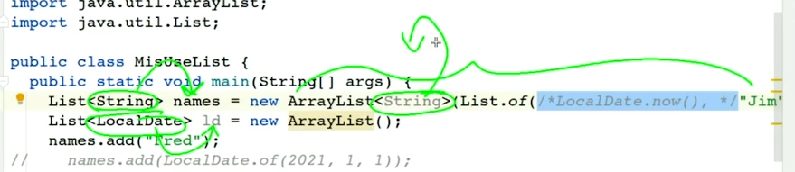
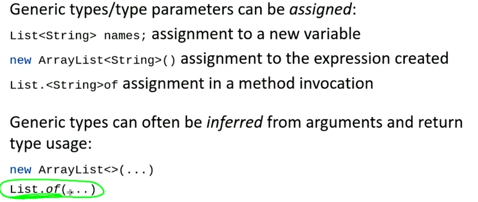

- Java Operators
  - what's make an expression an L-value is assignability
    - 2 + 2 -> expression with no storage. cannot be assigned to
    - arr[0], var -> expression with storage. can be assigned to
  - remainder operator
    - it is not the same as modulo operator
    - the result take the sign of the left operand
  - equals
    - usually mutable types in java don't override equals
    - equals that inherited from object compare the reference
  - short-circut evaluation
    - && and || are short-circut operators
    - & and | are not short-circut operators
  - assignment
    - the result of an assignment is the value of the left operand after the assignment
- Wrapper Class
  - autoboxing
    - it is the automatic conversion that the java compiler makes between the primitive types and their corresponding object wrapper classes
    - Integer i = 10; <- autoboxing
    - int i = new Integer(10); <- unboxing
  - unboxing
  - Float and Double can parse "Infinity" and "-Infinity" and "NaN" and "+Infinity" but other string will throw NumberFormatException
- Date_Time_API
  - absolute moment in history types:
    - Instant
    - ZonedDateTime
  - Points of human reference, not 'absolute'(calender date):
    - LocalDate
    - LocalTime
    - LocalDateTime
  - Elapsed time:
    - Duration - nanoseconds
    - Period  - years, months, days
  - Timezones, by offset, and by "ID"
- ACCESS MODIFIERS
  - default
    - package private
    - accessible within the same package
    - watch out!
      - default in interface is public
      - default for enum constructor is private
  - protected 
    - as default but also accessible to subclasses outside the package   
  - public
    - accessible everywhere in the JVM
    - in the module system, public is accessible within the same  module
- static class inherit
- inner interface is static by default
- Generics
  - provides a flexible compile-time type checking mechanism
  - generic aspect of type does not necessarily persist to the runtime
    - type erasure
    - this is necessary to support backwards compatibility with pre-generics code.
      - but it make it possible to write code that compiles but throws runtime exceptions
  - <b> Generic Type Parameter are associated with an expression, not with a type</b>
    - List<String> s = new ArrayList(List.of(LocalDate.now(), "a")); <- it will compile, you need to specify the type of the the arraylist also.
      - List<String> s = new ArrayList<String>(List.of(LocalDate.now(), "a")); <- it will not compile
      - 
    - generic type can be inferred from the context
      - 
  - Declaration
    - static methods can only declare their own type parameters they cannot use the type parameters of the class
      - because it don't have an access to object to get it from the context. its context is the method itself.
  - generic type can be passed to generic parent type
    - class A<T> extends B<T> {}
  - <E extends T> it say that E is assignable compatible with T
  - the generic type can extends optionally one class and only one class and can implement multiple interfaces
    - <E extends T & I1 & I2> <- this is valid
    - the class must be the first one
  - if you use super in the generic type, you can only use Object as the type
    - method(List<? super String> list) 
      - you can pass any list with type parameter of string or any parent of string
      - you can add String or any child of String to the list
      - super make it modifyable
      - you can read the list as an object
    - method(List<? extends String> list)
      - you can pass any list with type parameter of string or any child of string
      - you can't add anything to the list
      - read only
      - extends make it read only
  - PECS produces uses extends, Consume use super
- List
  - List.copyOf
    - it return an unmodifiable list
    - it will not duplicate the list if it is already unmodifiable, but will do so if it is not
- Array 
  - array is covariant which may lead to runtime exception
    - String[] s = new String[10];
    - Object[] o = s;
    - o[0] = new Object(); <- it will throw ArrayStoreException
  - to copy an array use 
    - Arrays.copyOf
    - System.arraycopy(src, srcPos, dest, destPos, length)
      - you can use System.arraycopy to copy part of an array to the same array.
  - Arrays.asList
    - it return a fixed size list backed by the array
    - you can modify the element of the list but you can't add or remove elements
    - any update to the array will be reflected in the list and vice versa
  - Arrays.compare/Arrays.compareUnsigned
    - compare two arrays lexicographically {5,0,1} > {2,0,0,1}
    - compareUnsigned compare two arrays lexicographically treating them as unsigned
  - Arrays.copyOf(arr, length)
    - create a new array with the specified length and copy the elements of the original array to the new array
  - Arrays.copyOfRange(arr, from, to)
    - create a new array with the specified length and copy the elements of the original array to the new array
  - array cannot be declared from a generic type
    - List<String>[] s = new List<String>[10]; <- it will not compile
    - List<String>[] s = new List[10]; <- it will compile
  

- Database
  - How should we organize and manage data ?
    - Schemas: How should my data be logically organized?
    - Normalization: Should my data have minimal dependency and redundancy? 
    - Views: What joins will be done most often?
    - Access control: Should all users of the data have the same level of access
    - DBMS: How do I pick between all the SQL and noSQL options?
  - OLTP
    - Online Transaction Processing
    - it is a class of systems that facilitate and manage transaction-oriented applications, typically for data entry and retrieval transaction processing
    - it is characterized by a large number of short on-line transactions (INSERT, UPDATE, DELETE)
    - day to day operations
    - application oriented
  - OLAP
    - Online Analytical Processing
    - it is a class of systems that facilitate and manage query-oriented applications, typically for data analysis and the decision support systems
    - it is characterized by relatively low volume of transactions
  - <table>
  <thead>
    <tr>
      <th>Feature</th>
      <th>OLTP</th>
      <th>OLAP</th>
    </tr>
  </thead>
  <tbody>
    <tr>
      <td>Purpose</td>
      <td>Support daily transactions</td>
      <td>Report and analyze data</td>
    </tr>
    <tr>
      <td>Design</td>
      <td>Application-oriented</td>
      <td>Subject-oriented</td>
    </tr>
    <tr>
      <td>Data</td>
      <td>Up-to-date, operational</td>
      <td>Consolidated, historical</td>
    </tr>
    <tr>
      <td>Size</td>
      <td>Snapshot, gigabytes</td>
      <td>Archive, terabytes</td>
    </tr>
    <tr>
      <td>Queries</td>
      <td>Simple transactions & frequent updates</td>
      <td>Complex, aggregate queries & limited updates</td>
    </tr>
    <tr>
      <td>Users</td>
      <td>Thousands</td>
      <td>Hundreds</td>
    </tr>
  </tbody>
</table>

  - structuring data
    - 1- Structured data
      - follows a schema
      - defined data types and relationships

    - 2- Semi-structured data
      - doesnot follow large schema 
      - self-describing structure
      - nosql, json, xml, yaml, cv  
    - 3- Unstructured data
      - no schema
      - text, images, video, audio
      - photos, logs, mp3
  - using data warehouse over data lake
    - To create accessible and isolated data repositories for other analysts.
  - Data Model
    - Process of creating a data model for the data to be stored
    - 1. Conceptual data model: describes entities, relationships, and attributes
      - Tools: data structure diagrams, e.g., entity-relational diagrams and UML diagrams
    - 2. Logical data model: defines tables, columns, relationships
      - Tools: database models and schemas, e.g., relational model and star schema
    - 3. Physical data model: describes physical storage
      - Tools: partitions, CPUs, indexes, backup systems and tablespaces
    -  These three levels of a data model ensure consistency and provide a plan for implementation and use.
  
---
- Design Patterns in Spring
  - Adapter
    - used in spring integration when dealing with channel adapters for communication with different systems.
    - used in internal operation if AspectJ and used during the load.
    - adapter in nutshell is a class that implements an interface and delegates the calls to another class(wrapper class).
  - Proxy
    - The proxy design pattern is useful when you need to defer creating resource intensive objects until needed, control access to specific objects, or when you need something to act as a local representation of a remote system.
    - implement some form of intelligent verification of requests from client code in order to determine if, how, and to whom the requests should be forwarded to
  - Decorator
    - To reduce the number of classes needed to offer a  combination of behaviors.
    -  allows objects to dynamically add behaviors to others by stacking objects with the Decorator design pattern.
    - Aggregation lets us create a stack of objects. Each decorator object in the stack is aggregated in a one-to-one relationship with the object below it in the stack. And, by combining aggregation and polymorphism, we can recursively invoke the same behavior down the stack and have the behavior execute upwards from the concrete component object.
    -  decorator design pattern let you dynamically modify objects but it also reduces the variety of classes you would need to write.
  - MVC
    -  model is self-contained. It has all of the state, methods and other data that it needs to exist on its own.
      - The model should be able to exist on its own with no views or controllers. the model should not rely on a view or controller to exist. Since our view is going to be an observer, we have to make the model an observable object.
    - view:  It gives the user a way to see the model or at least parts of it.  
      -  the view does not directly send requests to the model. Instead, information about the user interaction is passed to a controller which is responsible for interpreting these requests and changing the model. This way, the view is only responsible for the visual appearance of the system and the model focuses solely on managing the information for the system.
      - the view is observer of the model. It is notified when the model changes and it can then update itself accordingly.
    - A controller corresponds with control object that receives events and coordinates action.