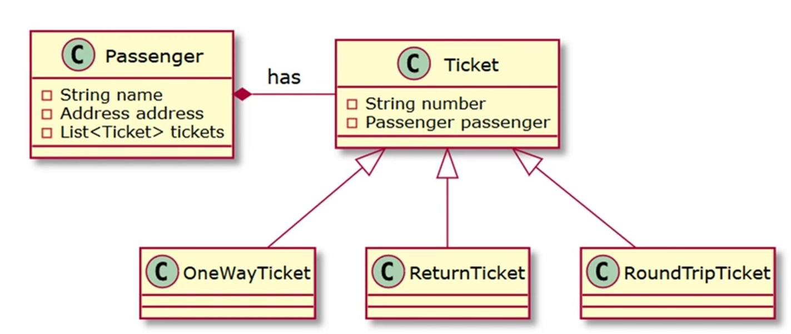

## Section 1

- Granularity Problem : the sizes of the types we are working with are different.
  - we will end up creating different structure in the different sides(ex:address).
- Inheritance is not well represented in the relational model.
  - relational db don't posses a standard way to represent polymorphic associations. one fk can only reference on table u cannot define one for multiples tables.  
      
- Identity Problem:
  - OOP: refrence identity(==), Logical identity(equal method)
  - DB: Primary Key & same table.
    - same row can be mapped to multiple java object.
- Association Problem:
  - DB: FK, can MtO, OtO. MtM will requires new table.
  - OOP: directional reference, can have oneToOne, OtM, MtM.
- Data Navigation:
  - To use join effectively, we have to know the part of the   network we need to access when we retrieve the initial instance   before effectively navigation the object network.  

## Section 2

- Entity is a top level class annotated with @Entity. it has a public or protected no-arg constructor. final classes not   recommended.

  - JPA require entity class not to be final, hibernate allows it.
    - it is not a good practice because it will not allow   hibernate to use proxy pattern for performance optimization.
  - Entity Support inheritance, polymorphic association,   polymorphic query.
  - Persistent State

    - Transient: new object, not associated with any persistence context.
    - Persistent: associated with a persistence context.
    - Detached: previously persistent object, not associated with any persistence context.

  - Mapping the objects
    - Table
    - SecondaryTable
      - secondary table annotation has additional param than Table annotation   which is pkJoinColumns and foreignKey.
    - SecondaryTables
      - used when we need to map entity to multiple tables.
  - Access
    - Field
    - Property
      - use it when u need to add additional logic to the getter and setter.
    - you can set it on class level, and override it on field level.
    - if u don't specify it, it will be determined by where u put the @Id annotation.
  - Key

    - composite key
      - rules:
        - public class, public no-arguments constructor.
        - serializable
        - equals and hashcode
      - @IdClass
      - @EmbeddedId
    - Simple Primary Key
      - GeneratedValue is supported only for a simple primary key.

  - @Embeddable
    - should be implement serializable. this is required, as the ID may be   used as a key at the second level cache @EmbeddedId.
  - @IdClass
    - used to map composite key.
    - u should declare the same field with the same type in the entity class and the id class. and annotate them with @Id.
