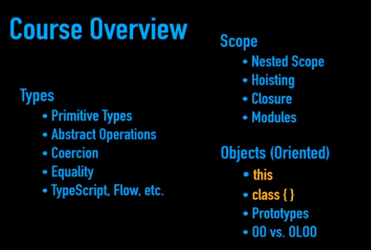
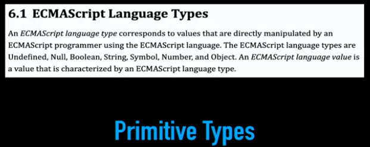
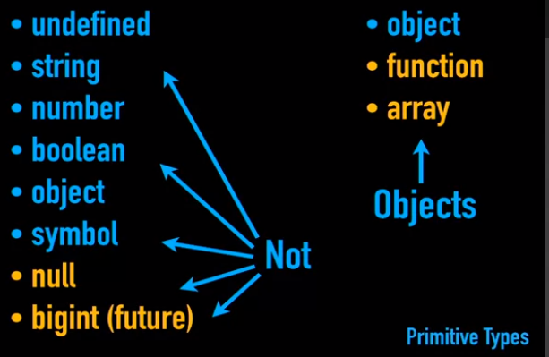
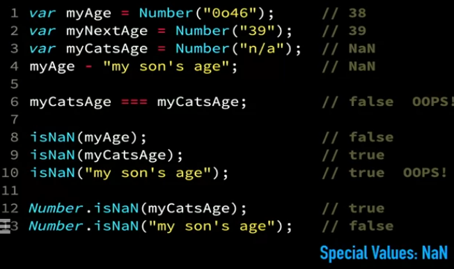
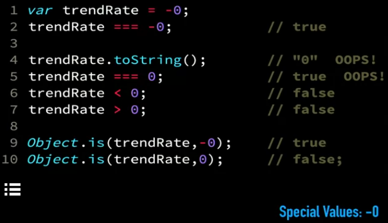
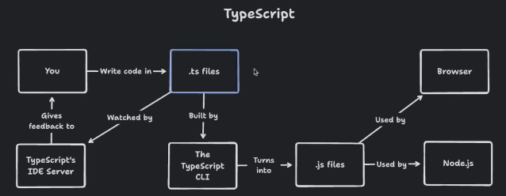
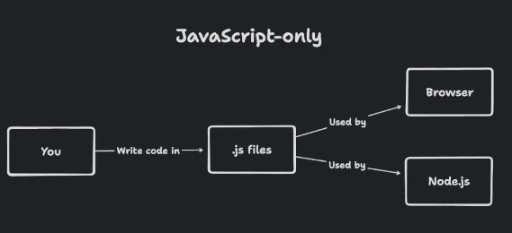

started by netscape 1995, adopted by microsoft jscript.
  ECMAScript fprmed to standardize JS implementation 1996.
   AJAX allowed for js to make server-side requests 1999.
    Node.js released 2009.
     
  
link ur js files in the bottom of body tag:
    If you do this <head>, the browser cannot begin displaying your HTML and CSS until it has finished 
    downloading your JavaScript. It delays your users from viewing your content.
    If you want to add your JavaScript file at the top of your HTML, make sure to use the async 
    attribute which tells browsers to download the file only after it’s done with other tasks.
    <head>
    <title>Title of website</title>
    
    </head>

(``). Strings created with backticks are called template strings.
  recognize  whitespaces we add to the str
 
 primitives. They are:
    String
    Number
    Boolean
    Null
    Undefined
    Symbol
    BigInt
 [] {}
 fn()
 $ async/await fn* Map Set [...]
 
  === equal for val and type
 
 let ob = {key:val} <- object literal notation
 
 iterate over object keys
   for (let key in object) 
    access key's val : object[key]
    
  
 destructuring assignment
   const {key1, key2} = object
 
 object literal enhancemnt.
 
 spreading operator:
    ...
    can used in spreading the nested object fields to be as outer object fields.
    
 
 object to JSON:
   JSON.stringify(object, , )
 JSON to object:
   JSON.parse(json)  
 
    
 function declarations are hoisted, but function declared as a value : let f = func.. is not.
 
 when u need to import json file, require it.
 
 setInterval will run forever to interrupt it after some sec.
 setTimeout(() => clearInterval(interval), sec*1000)
 
 --
  If you declared a parameter, but did not pass an argument to it, your parameter
  would be undefined.

  Function hoisting gets confusing because JavaScript changes the order of your code. 
    I highly recommend you declare your functions before you use them. Don’t rely on hoisting.
    hoisting : js reorder code to move or functions declaration to the top

use brackets over dot notation only when:
    When your property name is an invalid identifier 'First Name'
    When you need to get the value of a property through a variable
        const propertyToGet = 'storage'
        const storageWithDotNotation = macbook.propertyToGet -correct way --> const macbookStorage = macbook[propertyToGet]
        console.log(storageWithDotNotation) // undefined 

Double negation is used to explicitly cast a truthy or falsey value into a boolean (true or false). You’ll almost never need it.

undefined is a value that indicates an absence of a value. We say that something is undefined when it is not explicitly defined.
    let a
    console.log(a) // undefined
    If you have a function that returns nothing, the result of the function will be undefined.

null is a value that is used to indicate “nothingness”.
Developers need to explicitly set a value to be null.

    null === undefined // false

BOM stands for Browser Object Model while DOM stands for Document Object Model.
    BOM refers to the set of JavaScript objects browsers provide you with. It gives you the window object in JavaScript

const element = document.querySelector(selector)
    selector refers to the id, class, tag, or attribute of the element you want to select.
    To select an element with an id, you prepend it with #
            document.querySelector('#master-yoda')
            // => 
Yoda

    To select an element with a class, you prepend it with .
            document.querySelector('.class-of-assassins')
            // => 
Assassin

    To select an element with a tag, you write the tag name directly (ie. button)
            document.querySelector('p')
            // => 
The three little pigs

    To select an element with an attribute, you write the attribute in square ([]) brackets
            document.querySelector('[data-type="rocket"]')
            // => 
🚀

    querySelector returns only one element [the first matched element]
    If you want to select multiple elements, you’ll need to use another method called querySelectorAll
    All elements have the querySelector method too. 

adding class to element
    Note: You don’t need to add - before your classes when you use Element.classList.
    This is a common mistake if you mix up the syntax for querySelector and Element.classList.
        element.classList.toggle('red') <- add if not exist. remove if exist.

  All event listener callbacks accept an argument.
   This argument is the event object. People usually abbreviate it either to evt or e.

  a callback is a function that is passed into another function as an argument 
  to be executed later.
-----

example of promise:
  
  // if click in 5secs win
  const playGame = new Promise((resolve, reject) => {
    document.addEventListener("click", () => {
      resolve("win")
    })
    
    setTimeout(() => {
      reject("lose)
    }, 5000)
  })
  
  playGame().then(executeIfResolveInvoked).catch(executeIfRejectInvoked)
  
  
---
- fetch("dataSOurce").then((data) => if data retrieved successfully).catch(ifCannotFetch)
---
- we assume mental model about the lang, and when the bug happens we blame the language.
	- the source of truth is : JS specification
    - whenever there's a divergence between what your brain thinks is happening. and what the computer does. that's where bugs enter the code.
- 
- the author think `class` shouldn't be used in JS; but you must understand it.
  -  
- In JS, variables don't  have types, values do.  when you define value as string you expect some behavior like accessing each character.
  - 
- undefined -> currently doesn't have a value. (not initialized yet is long; because it can have a value then you set the value to undefined)
- typeof is always return a string value ( "string", "number", ...."undefined") it cannot return undefined.
  - if you want to make sure a value is really an object you must check it's not a null also; because `typeof null` will return "object"
- typeof arr will return "object"; to make sure if it is array `Array.isArray()`

## special values
### Bigint
  - `let x = 42n;` 42n is a bigint.
  - 
### undefined vs. undeclared vs. uninitialized(aka TDZ: Temporal Dead Zone)
  - typeof is only operator that can reference undeclared variable(not exist in the program) without throwing an error.
  - TDZ: block scope variable that is declared but not initialized yet.(they never get set to undefined)
### NaN : invalid number.
  - the number `0` is not the way you indicate the absence of a valid numeric value; it's an important value.
  - 
    - isNaN util coarse check(try to convert the param to Number before check, so it's wrong); Number.isNaN() is the correct way to check.
  - NaN is the only value in JS that is not equal to itself.

### Negative Zero
- 
  - some usecases in the game if the object stop and you want to maintain does it stop in the same direction or the opposite direction.
  
---
## Typescript
- 
- 
- nodejs let you run the typescript cli and install dependencies.
