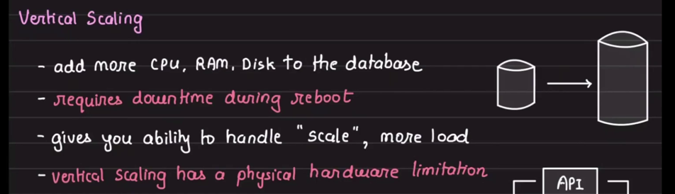
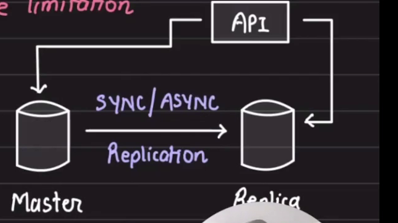
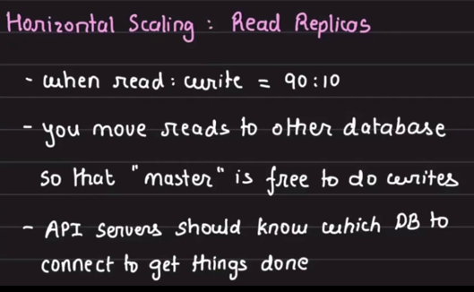
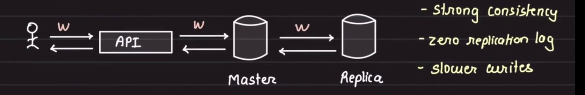
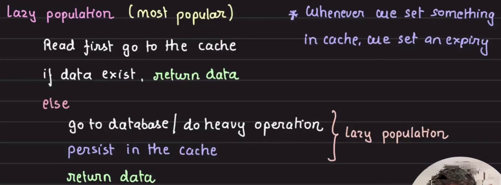
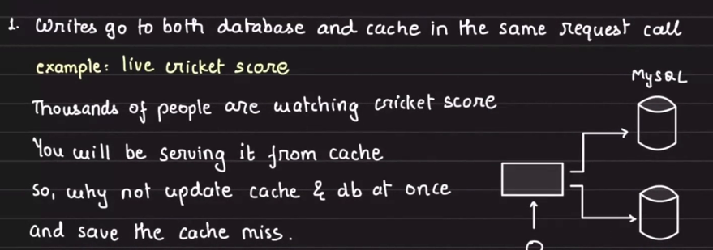
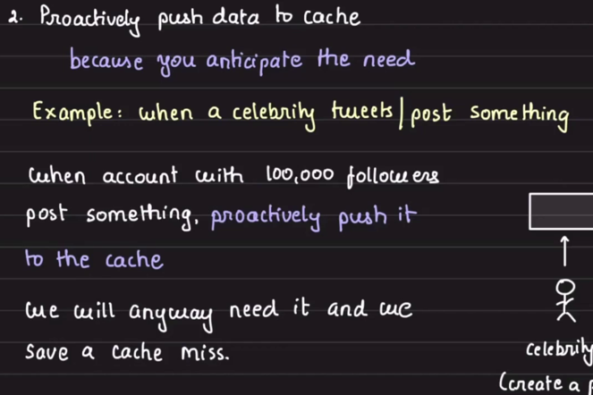
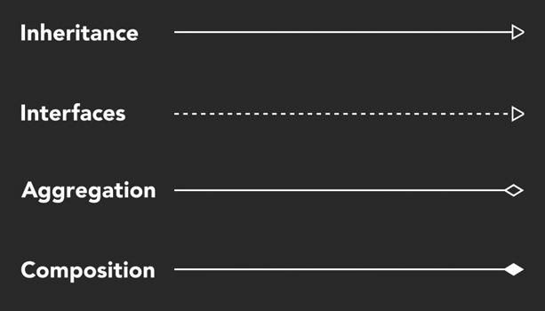

details should depend on high level policy, high level policy should never depend on details.

the source code is the design.
the running program is the product not the src code.

In software it's far cheaper to build the product than design it, even fixing error after release. comparing to other engineering discipline.

"A Big Ball of Mud is a haphazardly structured, sprawling, sloppy, duct-tape-and-baling-wire, spaghetti-code jungle. These systems show unmistakable signs
of unregulated growth, and repeated, expedient repair. Information is shared promiscuously among distant elements of the system, often to the point where
nearly all the important information becomes global or duplicated. The overall structure of the system may never have been well defined. If it was,
it may have eroded beyond recognition. Programmers with a shred of architectural sensibility shun these quagmires. Only those who are unconcerned about architecture,
and, perhaps, are comfortable with the inertia of the day-to-day chore of patching the holes in these failing dikes, are content to work on such systems."

Rigidity: tendency of the system to be hard to change.

- time to build & test is high.
  Fragility:
- high coupling compnents. change in one place break the code in others.
  Imobility:
- when the system internals cannot be extracted and reused in other environment
  Viscosity:
- when necessary operations like testing and building are difcult to perform and taking a long time.
  Needless Compexity:
- try to anticipate all future requirements and add additional and needless complexity. sol : keep ur code focus on current requirements while maintaing a comprehensive suite of test that reduce ur fear of changing the design later.

---

o.f(x) vs f(o, x) :  
 1-caller don't know which impl of f will be called. caller is decoupled from the method he is call. {OO is about passing messages; when u pass a message, u lose control on how that message is going to be interpreted; u only hope the reciver react properly. } invert key dependencies, protecting high level policy from low level details. OO design is about dependencies management.
--

## technical debt: prioritizing fast delivery over code quality for a long period of time.

SOLID is about managing relationship and operation between classes (5)

Component Cohesion Principles[describe forces that cause classes to be grouped into independently deployable compnents ]:

- The Release-Reuse Equivalency principle
- THe Common Closure Principle.
- The Common Reuse Principle.

Compnent Coupling Principles[describe forces that govern dependencies between components]:

- The Acyclic Dependencies Principle
- The Stable Dependencies Principle
- The Stable Abstractions Principle

---

Waterfall downsides:

- late feedback
- lack of responsability
  circle of code:
  idea -> requirements -> code -> ci -> deploy -> feedback. repeat

---

TDD is a discipline , has a rules u must follow. not just writing test when u fell u want it.
Bob Martin's 3 Rules of TDD
1- You are not allowed to write any production code unless it is to make a failing unit test pass.
2- You are not allowed to write any more unit test than is sufficient to fail; and compilation failures are failures.
3- You are not allowed to write any more production code than is sufficient to pass the one failing test.

---

Function:
func should do one thing, it should do it well and it should do it only.
large func hide classes.

Extract till you Drop! to make sure ur func make one thing.

braces {} are opportunite to extract

if we have long function with local vars used by different part in function.
we should convert it to a one or more classes, try to detect duplication logic and give each
on a good descriptive name.

---

characterization test: u write it when u have legacy code try to refactor it. to
make sure u have not broken anything.

---

[about methods]command & query separation: command -> change the state of the system but return nothing; query -> return something but not change the state.

- Don't make coding decisions based on what I think might perform better.
  I must benchmark or profile to know if code is not fast enough. Then
  and only then should I optimize for performance. This can't be done until
  I have something working.
  "Make it correct, make it clear, make it concise, make it fast. In that order." -
  Wes Dyer

---

- Single-tier applications

  - In a single-tier application, the user interface, backend business logic,
    and the database reside in the same machine. no network latency since every
    component is located on the same machine
  - the actual performance of a single-tier app largely depends on the
    application’s hardware requirements and how powerful the machine it
    runs on is.
  - when it comes to data privacy and safety, it is of the highest order in
    single-tier apps since the user’s data always stays in their machine and
    doesn’t need to be transmitted over a network for persistence.

  * Once the software is shipped, no code or feature updates can be made until
    the customer manually updates it by connecting to the remote server or
    downloading and installing a patch.
  * no room for any mistakes.
  * The code in single-tier applications is also vulnerable to being tweaked
    and reversed engineered. The product security for the app publisher is minimal.

  a single-tier applications’ performance and look and feel can be inconsistent as
  the app rendering largely depends on the configuration of the user’s machine.

  ***

- Two-tier application
  - A two-tier application involves a client and a server. The client contains the user
    interface with the business logic in one machine. Meanwhile, the backend server
    includes the database running on a different machine. The database server is hosted
    by the business and has control over it.
  - a good example of two-tier apps is the browser and mobile app-based games. The
    game files are pretty heavy, and they only get downloaded on the client once when
    the user uses the application for the first time. And they make the network calls
    to the backend only to persist the game state.

---

- Three-Tier Applications
  - In a three-tier application, the user interface, business logic, and the database
    all reside on different machines and, thus, have different tiers. They are
    physically separated.

---

- N-tier applications#
  - An n-tier application is an application that has more than three components
    (user interface, backend server, database) involved in its architecture

author opinion about stored procedural:

- Stored procedures enable us to add business logic to the database, which is always
  a big no. What if, in the future, we want to plug in a different database? Where do
  we take the business logic? Do we take it to the new database? Or do we refactor the
  application code and squeeze in the stored procedure logic somewhere?

Tier vs Layer

- Tiers are the logical separation of components in an application or a service. The components
  are the database, backend application server, user interface, messaging, and caching.

- Layers in an application mean the logical separation at the code level. The layers are the
  user interface layer, business layer, service layer, and data access layer.

---

Thin client#

- A thin client is a client that holds just the user interface of the application.
  It contains no business logic of any sort. For every action, the client sends
  a request to the backend server  
  Thick client#
- On the contrary, the thick client holds all or some part of the business logic.
  - The typical examples of fat clients are utility apps, online games, and so on.

---

Server - web server:
The primary task of a web server is to receive the requests from the client and
provide the response after executing the business logic based on the request
parameters received from the client.
Every online service needs a server to run. Servers running web applications
are commonly known as application servers[tomcat, jetty, netty]. - Besides the application servers [Proxy server, Mail server, File server,
Virtual server, Data storage server, Batch job server]

- Server-side rendering# Often the developers use a server to render the user interface
  on the backend and then send the generated data to the client. This technique is
  known as server-side rendering.

---

- HTTP: It’s a stateless protocol, and every process over HTTP is executed independently
  and has no knowledge of previous processes.

---

HTTP PULL#
. for every response, there has to be a request first. The client sends the request
and the server responds with the data. This is the default mode of HTTP communication

HTTP PUSH#
. the client sends the request for certain information to the server just once.
After the first request, the server keeps pushing the new updates to the client
whenever they are available.

Clients use Asynchronous JavaScript & XML (AJAX) to send requests to the server
in both the HTTP PULL and the HTTP PUSH mechanism.

There are multiple technologies involved in the HTTP PUSH-based mechanism, such as:
[Ajax Long polling, Web Sockets, HTML5 Event Source, Message Queues, Streaming over HTTP]

---

HTTP Pull - Polling With AJAX

- AJAX enables us to fetch the updated data from the server by automatically
  sending the requests over and over at stipulated intervals.
- Upon receiving the updates, a particular section of the web page is updated
  dynamically by the callback method.
- AJAX uses an XMLHttpRequest object to send the requests to the server. This object
  is built in the browser and uses JavaScript to update the HTML DOM

* It is important to note here that AJAX polling and AJAX Long polling are
  different techniques. Do not confuse them as one.
  AJAX polling is the HTTP Pull mechanism and AJAX Long polling is a hybrid
  between the HTTP Push and the Pull, based on the BAYEUX protocol.

Time to Live (TTL)#

- In the regular client-server communication, which is HTTP PULL, there is a
  Time to Live (TTL) for every request. It could be 30 secs to 60 secs, varying
  from browser to browser.

Persistent connection

- a network connection between the client and the server that remains open for
  future requests and responses, as opposed to being closed after a single communication.

Heartbeat interceptors#

- The connection between the client and the server stays open with the help of
  Heartbeat Interceptors.
- These are just blank request responses between the client and the server to
  prevent the browser from killing the connection.

* Persistent connections consume a lot of resources compared to the HTTP PULL behavior.
  However, there are use cases where establishing a persistent connection is vital to
  an application’s feature. For instance, a browser-based multiplayer game.

---

Web Sockets#

- A Web Socket connection is preferred when we need a persistent bi-directional low
  latency data flow from the client to the server and back.

- Typical use-cases of web sockets are messaging, chat applications, real-time social
  streams, browser-based massive multiplayer games, etc. These are apps with quite
  a significant number of read writes compared to a regular web app.

---

AJAX – Long polling#

- Long polling lies somewhere between AJAX and Web Sockets. In this technique, instead
  of immediately returning the empty response, the server holds the response until it
  finds an update to be sent to the client.

- The connection in long polling stays open a bit longer compared to polling. The server
  doesn’t return an empty response. If the connection breaks, the client has to re-establish
  the connection to the server.
  --
  HTML5 Event-Source API and Server-Sent Events#
- Instead of the client polling for data, the server automatically pushes the data
  to the client whenever the updates are available. The incoming messages from the
  server are treated as events.
- the servers can initiate data transmission towards the client once the client has
  established the connection with an initial request.
- once the client establishes a connection with the server, the data flow is in
  one direction only, from the server to the client.

- SSE is ideal for scenarios like a real-time Twitter feed, displaying stock quotes
  on the UI, real-time notifications, etc.  
  --
  Streaming over HTTP#
- Streaming over HTTP is ideal for cases where we need to stream extensive data over
  HTTP by breaking it into smaller chunks. This is made possible with HTML5 and
  a JavaScript Stream API.
- The technique is primarily used for streaming multimedia content, like large
  images, videos, etc., over HTTP. Empowered by this technique

---

However, modern websites are highly dependent on AJAX. On such websites, content for
a particular module or a page section has to be fetched and rendered on the fly.
In this use case, the server-side rendering doesn’t help much.

If we render the UI on the server for AJAX-based websites, for every AJAX request,
the approach will generate the entire page on the server as opposed to just sending
the updated content to the client in response.

---

Incremental OO software:
ch 01: - Incremental development builds a system feature by feature, instead of building
all the layers and components and integrating them at the end. Each feature is
implemented as an end-to-end “slice” through all the relevant parts of the system.
The system is always integrated and ready for deployment.

      Iterative development progressively refines the implementation of features in
      response to feedback until they are good enough.

    - test first -> detects errors while the context is fresh in our mind (implementation);
    - Never write new functionality without a failing test.

    - We use the term integration tests to refer to the tests that check how some of
      our code works with code from outside the team that we can’t change. It might
      be a public framework, such as a persistence mapper, or a library from another
      team within our organization. The distinction is that integration tests make sure
      that any abstractions we build over third-party code work as we expect.
    - In most professional development, however, we’ll want integration tests
      to help tease out configuration issues with the external packages, and to give
      quicker feedback than the (inevitably) slower acceptance tests.

    - external and internal quality: External quality
      is how well the system meets the needs of its customers and users (is it functional,
      reliable, available, responsive, etc.), and internal quality is how well it meets the
      needs of its developers and administrators (is it easy to understand, easy to change, etc.).
      Internal quality is what lets us cope with continual and unanticipated change.
      The point of maintaining internal quality is to allow us to modify the system’s behavior safely and predictably,
      because it minimizes the risk that a change will force major rework.

ch 02: - When designing a system, it’s important to distinguish between values that
model unchanging quantities or measurements, and objects that have an identity,
might change state over time, and model computational processes.

      In practice, this means that we split our system into two “worlds”: values,
      which are treated functionally, and objects, which implement the stateful behavior
      of the system.

    - the mismatch between static classification and dynamic communication means that we’re
      unlikely to come up with a tidy class hierarchy for the game objects that will
      also suit the needs of the engine.

      At best, a class hierarchy represents one dimension of an application, providing
      a mechanism for sharing implementation details between objects; for example,
      we might have a base class to implement the common features of frame-based
      animation. At worst, we’ve seen too many codebases (including our own) that
      suffer complexity and duplication from using one mechanism to represent multiple
      concepts.

    - We try to think about objects in terms of roles, responsibilities, and collaborators.
      a role is a set of related responsibilities;
      and a responsibility is an obligation to perform a task or know information. A
      collaboration is an interaction of objects or roles (or both).

    - We try to be sparing with queries on objects (as opposed to values) because
      they can allow information to “leak” out of the object, making the system a little
      bit more rigid. At a minimum, we make a point of writing queries that describe
      the intention of the calling object, not just the implementation.
    - The important point is to make clear the intention of every test,
      distinguishing between the tested functionality, the supporting infrastructure,
      and the object structure.

----NeetCode----
simple view:
dev -> build&deploy code ->> server -> storage.
.servers -> 3rd-svc and logging & metrices svc.
.dev access logging svc to see how requests go on the server
.dev access metrices svc to see the health of the resources on the server
.metrices is a timeseries chart so we can feed that data to Alerts svc
to notify us when the metrices exceed some threshold.
user -> LB -> one of our servers.

    DNS:

---

in order to perfectly conform to Open-Closed-Principle. to make a system perfectly extensible u have to perfectly predict the future.

LSP: governs inheritence, poly and subtype

https://users.ece.utexas.edu/~perry/education/SE-Intro/fakeit.pdf

---

1980s:1990s web from static pages -----> microservice + restful APIs
First Trajectory: - Intellectual: - dev stopped thinking about the web as a collection of pages  
 delivered to a universial viewer and started thinking about it
as a collection of programs that can be invoked remotely to return
any kind of data, not just a viewable web page. - infrastructure of the web came to be viewed as a possible medium
for rpc in which a web client essentially calls a func executed on
other computer then ret a result. - issues we may face [other computer crash, is call reach ] addressed
by paper [1984] Implementing Remote Procedure Calls.
https://web.eecs.umich.edu/~mosharaf/Readings/RPC.pdf
Second Trajectory: - Standard Adoption - HTTP was never designed to support rpc. it wasn't designed to support
a concept of a web session, by the time going byond web static content,
HTTP and other related web standards were already entrenched, so instead,
the standards had to be evolved and adapted to the new needs, such as by
inventing new HTTP headers for cookies to remember if u logged in or for
a caching to speed up delivery of frequently requested content. - HTTP was simple enough that it spread very quickly and good enough
that it would be diffcult to displace. - Similarly, RESTFUL APIs have become de facto standard for communication between
web svcs, but rather than being created as a prespective standard, REST codifies
some of the best practices that were learned the hard way over 2 decades during
which the web evolved. - WINNER: simple solution for devs to understand and work with, works well with
existing deployed swf, and don't require individual devs to make licensing
arrangements to use it.

---
# DB

- 

- Replication
  - db-read-replica-api
    - 

  - 
  - replica modes:
    - 1-Synchronous
      - 
    - 2-asynchronous
      - write to master and return to client. and then async write to replica.
      - replica preiodically sync with master.
        - replica pull from master.
        - replica lag : time between master write and replica sync.
- Sharding
  - Because one node cannot handle the data/load we split it into multiple exclusive subsets .
  - write on a particular row/document will go to one particular shard.
  - some db has a proxy that take care of routing
  - each shard can have its own replcia
  help me to write a review for an interview. after applying. I got email on 
8 Jun that i passed the screening phase and got an assessment it was mcqs divide into 4 sections: ruby, ror, golang focused on currency, and some db questions mostly focused on indexing.  with time limit 3 hours.
on 16 Jun I received an email tells that I haved passed phase one in the technical challenge. with link to a second round of MCQs  time limit was 1 hours the questions were about some concurrency concepts in OS; difference between concurrency and parallelism, critical path, scenario with shared resources and #threads with question about deadlocks.   

# Cache
-  cache helps u to avoid an expensive operations {network, db, cpu, etc}
  - API call to get profile info of a user.
  - doing multiple table join
- cache are not restricted to RAM based storage.
  - any storagem that is <b> nearer </b> and help u to avoid expensive operations.
- examples:
  - caching last 10 mins of livestream on CDN.
  - Auth token
  - most recent posts on a social media feed.

- population
  - lazy 
    - 
    - set expiration time on cache. to avoid stale data and memory leak.
  - egar
    - 1 write go through db and cache.
      - 
      - 
    - 2 proactively populate cache.
      - 

### Scaling Cache
  - cache is just like a database. hence scaling cache is similar to scaling database.
    - Vertical Scaling
      - increase the size of the cache server.
    - Horizontal Scaling

------
# OOD

- Conceptual Design
  - Represent important objects and the relationships between them.
- to identify objects we go through all our use cases and user stories to pick out the nouns.
  - now we have a list of candidate objects, we can start to indicate the main relationships between them.
  - to identifies responsabilities we go through all our use cases and user stories to pick out the verbs.
    - it's orientied about who is initiating the action.
    - an object should be responsible for itself.
      - if obj A will initate an action on obj B, then obj A should ask obj B to do it.
  - in oo the object who knows too much or does too much is  called the god object.
  - focus on what object should do rather than viewing them as data containers/structure.

### UML
  - static members are underlined.
  - aggregation <>
    - lifetime of objects with aggregation relationship are independent.
  - composition ♦
    - specific form of aggregation but it implies ownership. part has no meaning without the whole.
  - 