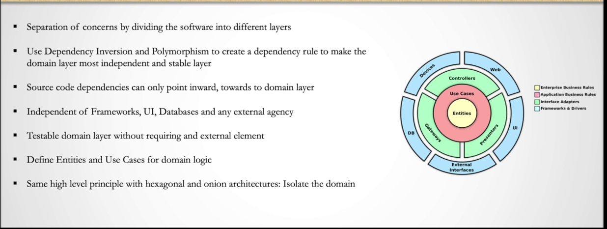
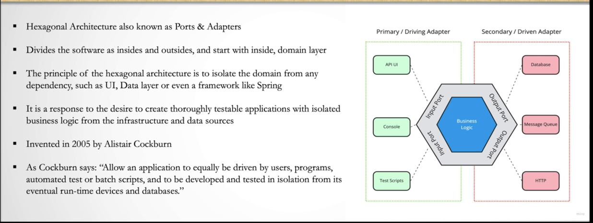
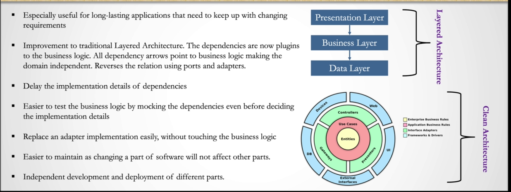
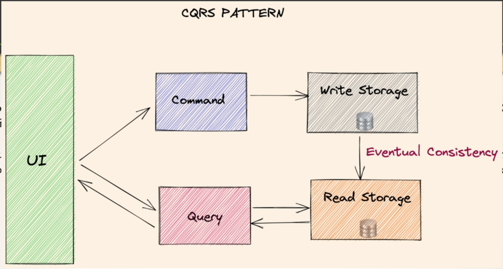
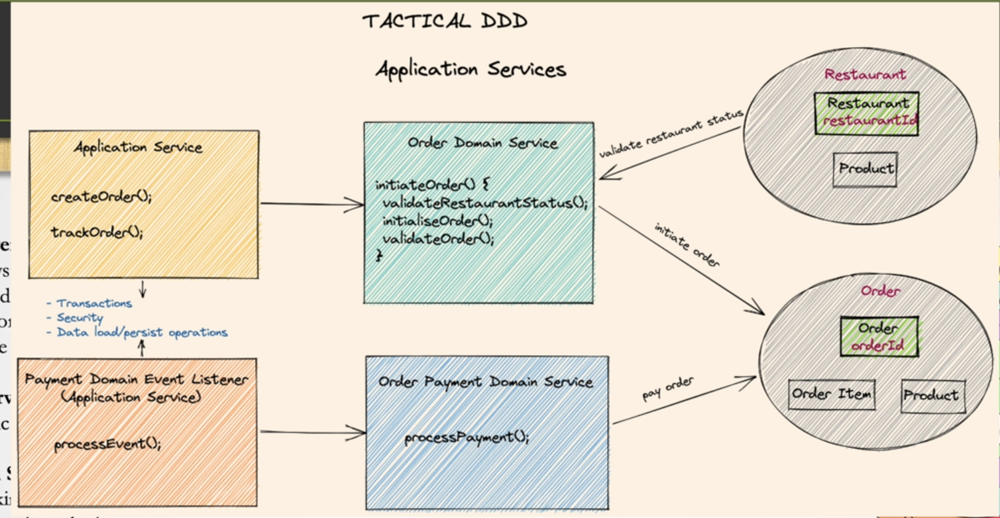

# Clean Architecure

- develop and test the business logic independently of the infrastructure. {db, mq} or any runtime tool.
- all dependencies arrow point to business layer, making it independent and stable.
- the clean architecture proposed by Robert C. Martin (Uncle Bob) in 2012.
  - including cocepts of hexagonal architecture and onion architecture.
  - but also adding the detaild definition on the implementation of the domain layer.
- 

## Hexagonal Architecture

- also known as Ports and Adapters
- separate domain logic from external infrastructure
- any infrastructure should be behaved as plugin to ur swf .
- adapters are implementation of ports.
  - primary adapters are the ones that are implemented in the core logic in business layer.
    - implement the input ports to execute the use cases.
  - secondary adapters are the ones that are implemented in the external modules.
    - Implement the output ports and called by business logic to complete external operations.
  - user input is processed by one or more primary adapters and passed to the Core logic and the core logic interacts with this secondary adopters only.
  - then output of Core logic will return to the answer users using primary adapters again.
- 

## advantages

- 

## disadvantages

- u will have to write more code.
  - even u may need to duplicate some code. {dto for different layers}
  - but it will be fully maintainable and testable.

## Business Logic in Clean Architecture

- Entities: core business logic is implemented here.
  - ex: prior to creating an order,
    - checking if the order in stock..
    - ritical rules that need to run before placing an order.
- Use Cases: Coordinate Entities and includes application-specific business rules.
  - ex: having a discount on an item temporarily or checking if a user doesn't exceed the daily purchase limit.

--

## clean architecture and DDD

- both has a domain layer isloated in the core of the system and attaching the lower level dependencies into it.

## Business Logic in Clean Architecture

- Use Cases

  - Coordinate Entities and includes application-specific business rules.
    - having a discount on an item temporarily or checking if a user doesn't exceed the daily purchase limit.

- relativePath is used to search local file system for parent maven project,
  but since we have external maven project we will set it to empty.
  used only for local parent maven project.

- order-domain:
  to separate core domain from applciation services:

  - application services : expose domain methods to outside.
  - core domain : contains domain services and entities.

- SAGA - with Choreography
  - BASED on events: Local Transaction -publish-> Domain Event -> Event Handler --trigger-> Local Transaction in other services.
- SAGA - with orchestration
  -
- Outbox Pattern
  - help use of local transactions to let consistent (eventual) distributed transactions. it will complete SAGA in safe and consistent way.
  - CDC: change data capture
    - listens to transaction logs of the outbox table and publish the events to the message broker.
  - Pulling Outbox Pattern
    - pull the events from the outbox table with a scheduler .
- CQRS
  - Command Query Responsibility Segregation
  - separate the read and write operations.
  - write operations are handled by the domain model.
  - read operations are handled by the query model.
  - 
  - u need to use outbox pattern to be sure ur local transaction and publishing the event are consistent.

# DDD [Domain Driven Design](https://youtu.be/8IX0Bhujhak)

- challenges in the begining of web application development:
  - how to build appealing UI and forget about how to tackle the complexity of the sfotware {business logic}.
- this is the context where eric evans introduced DDD.

## building the right thing vs building the thing right

- derive the design from the business.
  - modeling the business domain.
    -
  - divide the domain into subdomains.
    - core subdomain : the most important part of the business.
      - the part that makes the business unique.
    - generic subdomain : the part of the business that is not the core.
      - out of the shelf solutions can be used for this part.
    - supporting subdomain : the part of the business that is not the core.
      - important but not in the main focus of the business.
      - can be outsourced.

## Ubiquitous Language

- the language that is used by all the team members.
  - glossary of terms.
  - continuously evolving.

## Bounded Context

- a boundary around a subdomain.
- no conflicts between bounded contexts.
- each term has a unique meaning in each bounded context.

- context map
  - show the relationship between bounded contexts.
  - how to integrate between them.
    - how to translate the terms between them.

## distinguish between essential and accidental complexity

- essential complexity : the complexity that is related to the business.
- accedental complexity : the complexity that is related to the technology.

  - the technology that is used to implement the business.

- what eric evan did is making the implicit explicit.

  - strategic patterns.
    - subdomain.
    - bounded context.
    - context map.
  - tactical patterns -> applied in complex systems.

    - aggregate: a group of business objects which always need to be consistent
      - OrderProcessing:
        - Order
        - Product
        - Order Item
    - Aggregate Root is responsible for maintaining the consistency of the aggregate.
        - all altering state operations should be done through the aggregate root, even if the state changing operation is related to other entities in the aggregate.
        - entities other than aggregate root can not be referenced by outside objects.
        - before persisting the data us should enforce strict validations each time to keep the aggregate consistent.

    - entity : the core business logic will be handles in aggrregate through entities objects.

      - two entities with the same identifier are considered to be the same object, even if all other properties are different.
      - u don't have to create setters for each property as it will run some business logic and update the property based on that
        using a well-defined named method using the correct verbs.

    - value object: define simple immutable obj. don't have identifier. always has value. bringing context to the value. ex: Money
      - OrderId:
         - UUID id;
      - Money:
          - BigDecimal amount;
          - Currency currency;
          + Money add(Money money);

    - Domain service: used to handle business logic that spins multiple aggregates root and their logic cannot fit into any entity by nature.
        it contain the core busineess logic and it shouldn't deal with gathering, mapping and validating data.
      - domain services can communicate with other domain services if necessary.
      - it's still from the core of the domain layer, so it cannot be reached from outside the domain layer.
        - to communicate with domain service from outside the domain layer, we need to use application service.
      
      - some say use case in clean architecture. 

    - application services: point of contact with outside the domain, any other layer that wants to communicate with domain layer needs to use application service. we can also have the data mappings, validations and transaction management and security in the application service.
      - load/save the domain state from/to the repository, and pass it to the domain service or entity to perform the business logic.
      - application service should not contain any business logic.
      - domain event listener: can be considered as a special type of application service.
        - receives the domain events and call the related domain service to perform the business logic.
      - 

    - domain events: used to send notification to other services taht run in different bounded context.
      - if u want to run business logic based on other service domain event u can use domain event listener.
  - Recommandations:
    - anti corruption layer
    - Shared Kernel 
    - Repository
    - Factory
    
- event storming -> rich domain model
- simple cqrs & Transaction Script -refactor-> rich domain model
  - https://youtu.be/f64tZ90Dntg
- Patterns, Principles, and Practices of Domain-Driven Design
  by Scott Millett (Author), Nick Tune (Author)

-https://altarek.notion.site/What-Is-Domain-Driven-Design-Introduction-e06a66dd6bfa458ea038742479e789fa

- https://altarek.notion.site/Discovering-Domain-knowledge-And-Bounded-Context-9b3efaec630a45d1be0be4f4272460eb
- https://altarek.notion.site/Bounded-Context-And-Domain-Modeling-38e0786016274c408e151f9df66ccd0f
- https://altarek.notion.site/Context-Mapping-05b8ccf8d1324879845ad691a27b101e

----
## notes 
- we create event in the domainService and the firing responsibility is on the applicationService.
  - domain created in domain core to make sure that the underlying business operation should be persisted in the database. before firing the event.
- naturally domain entities are responsible for creating the domain events.
  - in DDD using domain service is not mandatory. it's required when u have access to multiple aggregate in business logic or have a complex business logic that cannot be handled by  aggregate root. 
- author follow a personalized approach : always integrate a domain service infront of the domain. so app service will never talk to entities directly.
- domain service can match use cases in clean architecture because use case def is driving the business entities and domain service is similar to use case.
  - app service is not because it has no business logic, and it's exposed to outside through interface, while use cases are not exposed.

------
### DDD & REST - Domain Driven APIs for the web - Oliver Gierke
  - value object is better than using primitive type.
    - need custom serializers.
    - using string for everything may cause issues like miss the order of the parameters and how u can validate the data.
      - use EmailAddress type instead of String. 
  - aggregate : is one in a set of entity which control business and consistency rules over the set of entity
    - the key thing to refer to.
  - don't get trapped by datastore thinking.  don't think the model is meant to be persisted in database as a first place.
    - the model is meant to be used to implement the business logic.
  - Bound context : is a boundary around a subdomain.
    - no conflicts between bounded contexts.
    - each term has a unique meaning in each bounded context.
    - some actor will be spread across multiple bounded context. ex: customer.
    - some data will be duplicated across multiple bounded context. ex: customer name.
      - ex: description of the product will be duplicated in the order bounded context. because we don't want it to change when it's updated in the catalog bounded context.
  - Domain Event
    - domain events as state transition.
    - as a maturity levels:
      - Level 0: No events at all
      - Level 1: Explicit Operation
      - Level 2: Some operations as events
      - Level 3: Event Sourcing
        - storing the events that happened in the system instead of the current state.
        - With CQRS, the write side can generate events that represent changes to the application's state. These events are then stored in an event store as part of the Event Sourcing pattern. The read side can subscribe to these events and build optimized read models for different query needs.
  - if u're calling two setters in a row, u're probably missing a concept.
    - set address fields -> move()
    - make the ops explicit and give it a name.
  - REST != CRUD via HTTP
    - Representation design matters.
      - 1to1 mapping between ur entities and db tables and u don't think about aggregate at all is not a good idea.