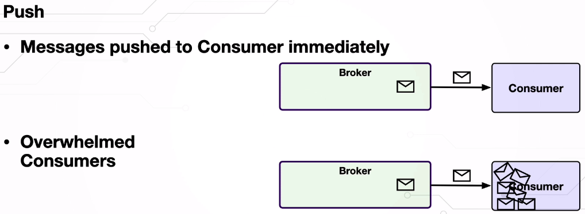
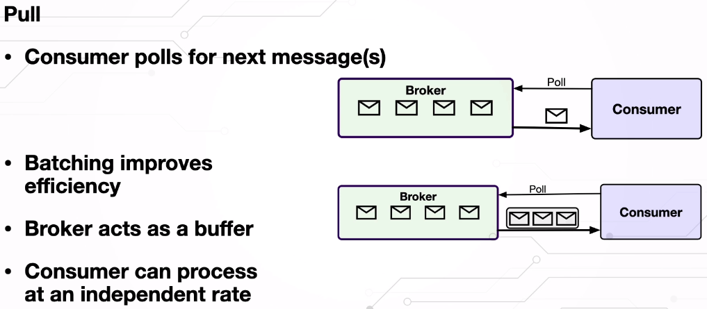
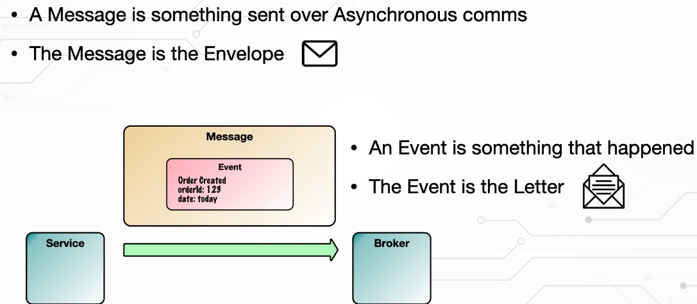

pluralsight

Spring Integration: Getting Started.
1

- how to connect ur internally compnents in ur spring app with
  external systems using asynchronous messaging. without needing
  of writing plumbing code [downloading file from FTP server:
  - u will need to establish connection.
  - authenticate
  - navigating files...
    ]sping-integration[
  - configure FTP inbound Channel Adapter that downloads file on
    regular schedule and put a message on a channel
    whenever the file is downloaded , then.
  - configure Service Activator that call our business logic
    when it recieves a message on the channel.
    ].
- separate integration code from business logic.
- basis of other spring projects [cloud stream
  for building highly scalably event-driven microservice]
- integrate different system have challenges such as :
  - 1- each system may produce different data format.
  - asynchronous adv. 
    - 1- . More responsive system because sender does not have to wait. 
    - 2- Messages buffering makes the system resilient to failure:
    after the receiver recover from failure, the receiver will find msgs in the Q 
    - 3- Receiver processes messages at its own rate.  
  - 2- a typical spring integration app will has a multiple MessageChannel,
    so when we inject it. we may need to use @Qualifier("beanName") to
    explicitly specify what we want.

- use classes from org.springframework.messaging over org.springframework.integration:\

  - historical they were in integration package, people find them so useful    so they add them to spring core. for backward competability they don't remove    it from ..integration

### dsl
- give us a set of builders to configure spring integration flo   IntegrationFlow initializ set of spring integration compnents and wire   them together. 
  - IntegrationFlow.from(startingPoint).handle([class and method want service activator to call])

## Channels
  ### subscribable channel:
  - implement event-driven consumer pattern, push msgs to rec, Non-buffering
    - Implementation:
      - Unicasting dispatcher[DirectChannel, ExectuorChannel] (pattern: p2p)
      - broadcasting dispatcher[PublishSubscribeChannel] (pattern (pub-sub))
      - DirectChannel: 
        - call one of its subscriber when the msg is sent on the same thread.
      - ExectuorChannel: 
        - p2p that delegates to an instance of TaskExecutor to perform msg dispatching,   shouldn't be used for transactions that span channel calls doesn't need to block the sender.

  ### Pollabl Channel: 
    - Polling Consumer create a separate thread and periodically poll the channel for msgs, Pull, Buffering. 
    - QueueChannel
    - default: use linked blocking queue with unbounded capacity. [u can configure type or capacity]    if q is empty thee receiver block until the sender send msg or timeout.
  ### RendezvousChannel
    - ZeroCapacity Queue channel, Block until sender and receiver meet. 
      - Backed by SynchronizeQueue 
      - p2p, synchronize sender and receiver[check availability of something], best use for the request-reply pattern. 
      - PriorityQueue
         - Default oredering by "priority" header, can be overrided[by definig ur own Comparator] 
- pollable and buffered - stored message in PriorityBlockingQueue - Potential to starve message with low priority.
- DirectChannel 
  - p2p subscribable that enables a single thread to perform operations on both sides of the channel. 
  - when the pub invokes its send method, it forwards the msg in that same thread to its msg dispatcher,   which invokes the subscriber's handleMsg method. when sub completes, the the response is   returned to the pub. -> supporting transaction. 
  - Motivation: Transaction Integrity: 
    - support transactions that must span across the channel while still benefiting from the abstraction   and loose coupling that channel provides. 
    - sender block on the send() until receiver complete msg processing  
    - best choice for transactional calls that span across a channel, while retaining loose coupling.

3

- to send msg to mq we need to convert it to suitable format 
  - java serialization drawbacks:
    - 1-a serialized java obj is a binary blob of data which is not easily human readable.
    - 2-tightly coupled with a specific version of java class.
      - if u make change to the class, then u might get an incompatible class change error when u read = > an obj that was serialized with an older version.
  - json: need to use object-to-json-transformer [need input-channel, output-channel, ]
  - Message Broker : 
    - an intermediary computer program module that translates a message from the formal messaging  protocol of the sender to the formal messaging protocol of the receiver. 
    - decouple sender from the receiver.
    - ex: [to configure in spring]
      - [sender(input-channel, output-channer, transformer, adapter)]
        - adapter: a glue between spring integration msg channels and other components and systems. 
          - spring has many impl to it, allowing spring to connect easily with different systems.
  
---
# Errors in Asynchronous Applications: 
  - an error occurred in the receiver, what does receiver do with the msg? 
    - in request-reply pattern > standards exception handling. 
    - Direct channel - RendezvousChannel 
      - execute gateway in try-block. spring make it easy: u can handle error gracefully. 
      - in directChannel u don't have to define return type for gateway. because directChannel use 1 thread to    handle sending/receiving u can just wrap gateway execution with try-catch even if it's void.

---

Message Design

- Command Message.
  - app1 invoke functionality provided by another app.
  -
- Request-Reply Message.
  facilitates a two-way conversation between apps
- Document Message.
  - transfer data to another app.
  - when sending a group of msg, we may add to headers:
    - SequenceNum, SequenceSize
- Event Message.
  allow app to pub event when an internal state change.
- the code-level impl differences between them are minimal ,
  the decision on when to use or the order is significant.
  Easiest way in spring integration to publish msg to a channel is by using
  @MessagingGateway and provide the default request message channel.

## @MessageEndpoint is to define that svc is able to serve/accept/receive a msg, has a @ServiceActivator on a method.

- Request-Reply Message [equiavlent to making a rpc ]

  - A Request-Reply Message is used to facilitate a two-way
    conversation via messaging.
  - sender send through channel , spring integration automatically
    a temp reply channel and adds it to the msg header.
    and create errorChannel if the svcActivator method throws an exception,
    then the service activator publishes the exception to the error channel.
    receiver reply through a reply channel.
  - advantages over normal rpc:
    - > Receiver can change over time without requiring
      > a change to the sender. - we send/receive from a broker. no need to know about the other system.

  I think : it's sysnchronized/blocking

---

- Event Messages:
  An app publishes events when its internal state has changed.
  other applications can integrate with that application
  by listening to its events.

. High scalable : a system can integrate with other systems asynchronously
. Loosely Coupled : A system need to know about the other systems with which it is integerating.

. cons: data is eventually consistent, take some times until all components have
the same representation of the data.

---

Heavyweight and lightweight event:
Heavyweight : contains a full payload with all the info about the event.
lightweight: contains the ID of the record that changed, as well as any other
info needed to make a callback[observer need to call the subject].

- Expiration Date header is a good way to tell
  consumers how long a message is good for.

---

RabbitMQ:

- producer send msg land inside exchange -based on routing pattern forward to a paradigm q [binding]
  =>
- Exchange Type -- -- -- Default pre-declared names:
  .Direct (empty string) and amq.direct
  .Fanout amq.fanout
  .Topic amq.topic
  .Header exchange amq.match(and amq.headers in RabbitMQ)
  .Default: nameless routing key = q name

---

docs
#Overview
Spring Integration’s primary goal is to provide a simple model for building
enterprise integration solutions while maintaining the separation of concerns
that is essential for producing maintainable, testable code.

dependency injection relieves the components of the responsibility of locating
or creating their dependencies.

aspect-oriented programming relieves business components of generic cross-cutting
concerns by modularizing them into reusable aspects.

supports message-driven architectures where inversion of control applies to
runtime concerns, such as when certain business logic should run and where the
response should be sent. It supports routing and transformation of messages so
that different transports and different data formats can be integrated without
impacting testability. In other words, the messaging and integration concerns
are handled by the framework.

Spring Integration goals: - enforcing separation of concerns between business logic and integration logic. - components should be loosely coupled. - Extension points should be abstract in nature (but within well-defined
boundaries) to promote reuse and portability.

Components:
messaging systems typically follow the similarly abstract “pipes-and-filters”
model. The “filters” represent any components capable of producing or consuming
messages, and the “pipes” transport the messages between filters so that the
components themselves remain loosely-coupled.

The underlying messaging infrastructure that supports the “pipes” should still
be encapsulated in a layer whose contracts are defined as interfaces. Likewise,
the “filters” themselves should be managed within [a layer that is logically above
the application’s service layer], interacting with those services through
interfaces in much the same way that a web tier would.

Message[Headers(unique id,timestamp,correlation id,ret addr)+Payload(app-specific content)]:
a generic wrapper for any java object combined with metadata used by the framework
while handling that object.
The payload can be of any type, and the headers hold commonly required information
such as ID, timestamp, correlation ID, and return address.
Headers contains required data for handling the message properly: - if a message’s content is ultimately going to be sent by an outbound
mail adapter, the various properties (to, from, cc, subject, and others)
may be configured as message header values by an upstream component. - Developers can also store any arbitrary key-value pairs in the headers.

Message Channel(“pipe” of a pipes-and-filters architecture): - The message channel therefore decouples the messaging components and also
provides a convenient point for interception and monitoring of messages. - A message channel may follow either 1. point-to-point[ex: Queue]
[no more than one consumer can receive each message sent to the channel.] - default to a blocking queue. - receiver[poller]:
trigger: fixedDelay[delay + processingTime], fixedRate [count processing from waiting time],
cronJob defines when channel is polled. @ServiceActivator(inputChannel, poller = @Poller())
allows consumer to throttle incoming messages. 2. publish-subscribe semantics[ex: Event notifications]
[attempt to broadcast each message to all active subscribers on the channel.] - if subscribers come and go and want access to historical msgs,
integrate with broker and configure persistence there; - another important consideration: Should the channel buffer messages? - pollable channels are capable of buffering Messages within a queue.
The advantage of buffering is that it allows for throttling the inbound
messages and thereby prevents overloading a consumer.
adds some complexity, since a consumer can only receive the messages from
such a channel if a poller is configured.  
 On the other hand, a consumer connected to a subscribable channel is simply
message-driven (Message Channel Implementations: https://docs.spring.io/spring-integration/reference/html/channel.html#channel-implementations)

Message Endpoint:
you should not have to implement consumers and producers directly, and you should not
even have to build messages and invoke send or receive operations on a message channel.
by providing declarative configuration, you can “connect” your domain-specific code to
the messaging infrastructure provided by Spring Integration.

- The components responsible for these connections are message endpoints.

  - part of code where the sender/receiver connect to the messaging system.

- Message Transformation:
  - responsible for converting a message’s content or structure and returning the modified message.
- Message filter:

  - requires a boolean test method that may check for a particular payload content type, a property value,
    the presence of a header, or other conditions.

  - often used in conjunction with a publish-subscribe channel, where multiple consumers may receive the same
    message and use the criteria of the filter to narrow down the set of messages to be processed.

- Message Routing.
  - when receiver is not fixed or u chose from many, the Message-Router component
    will make the decision based on criteria we define(Message-Filter)[some-header..], or decide
    to drop it.
- Splitter
  - responsibility is to accept a message from its input channel, split that message into multiple
    messages, and send each of those to its output channel. This is typically used for dividing a
    “composite” payload object into a group of messages containing the subdivided payloads.

you should be able to focus on your specific domain model with an implementation based on
plain objects. Then, by providing declarative configuration, you can “connect” your
domain-specific code to the messaging infrastructure provided by Spring Integration.
The components responsible for these connections are message endpoints.
This does not mean that you should necessarily connect your existing application code directly.
Any real-world enterprise integration solution requires some amount of code focused upon
integration concerns such as routing and transformation. The important thing is to achieve
separation of concerns between the integration logic and the business logic. In other words,
as with the Model-View-Controller (MVC) paradigm for web applications, the goal should be to
provide a thin but dedicated layer that translates inbound requests into service layer invocations
and then translates service layer return values into outbound replies

---Josh long--

IntegrationFlow. from([]) u can originate from an inbounded adapter or GW,
which is something that take real event from real world and turn it into a spring boot message,
or you can originate it from a channel[pipe between components(an implicit connection)].

in spring integration flow when u have a component that return null,
that also terminate the pipline/flow,.

conceptually every compnent has another channel that can connect to another things.

----events---

# Events:

- Coupling refers to a degree of knowledge that one object has about the other object that it interacts with.
  - Coupling refers to a degree of knowledge that one object has about the other object that it interacts with.
- Event driven are architecture also follows an open-closed principle. Which means open for extension, but closed for modification.
- Event system allows invoking logic on multiple components at the same time.

# components

- Events
  - An ApplicationEvent is a simple POJO class that holds data and is exchanged between publisher and listener.
  - we don't need to extend ApplicationEvent class.
- Publisher
- Listeners.
  - limitation of ApplicationListener
    - ApplicationListener interface only supports void return type.
    - It can only be used for objects that extend ApplicationEvent class.
    - Listener can only process one event type.
  - there are different flavors of implementing listeners to an event. It can be implemented within notations or by implementing Application Listener.
     Listeners, The neat thing is that Spring does all the heavy lifting for us and registered all listeners.
    -   
  - Async listener
    - add @Async annotation to the listener method. @EnableAsync annotation to the configuration class.
    - limitations:
      -   
  - Unlike ApplicationListener interface, which only supports void return type, annotated methods may have a nonvoid return type. When they do, the result of the method in vocation is send as a new event. If the return type is either an array or a collection, each element is send as a new individual event. It is also possible to define the order in which listeners for the same event are to be invoked. To do so, we can use SpringCommon @order annotation, alongside EventListener annotation
    -   

# processing

    - Synchronous By defaults. meaning the publisher thread blocks until all listeners have finished processing the event.
    - Asynchronous, meaning that it went as published in a new thread and release execution of publisher independently from the listener.
    - Transection Bound Events, Spring allows us to bind an Event Listener to phase of the current transaction. This allows events to be used with more flexibility when the outcome of the current transaction matters to the listener.

-   
- Filtering Events, Spring Events gives us an option to find tune conditions under which circumstances our Event Listener will be triggered.
  -   
- if we have a use case where we want our listener to be triggered before Application Context is created(for predefined events), we need to register those listeners manually. SpringApplication#addListeners() method allows us to do that.
- imagine adding promotion for a new customer or updating some external systems. We not only need to provide an email service, but also all other functionalities that are coming up and centered around customer registration. We might argue, why should the customer registration process need to know about all those first functionalities that are centered around it? This creates more cyclic dependencies, and violates the single responsibility principle. Testing becomes much harder as we might need to mock all different dependencies.

---

rabbitmq:

- LPC vs RPC
- RPC is not LPC with a longer wire
  - there many many things can go wrong with RPC, that couldn't go wrong with LPC.
  - RPC is a distributed system, and distributed system are hard.
  - remember fallacies of distributed computing.
  - if client make a request with a side effect and didn't receive the response because of any server error or network issues. it's not safe if the client replay that request again.
    - in LPC, There's no scenario where the function we call would never return back to us. {return the result, throw exception, or return a failure}
- Messaging

  - client send message to a queue, and we can gurentee that we will know the message will be delivered or not.
  - server asynchronosly process the message and send the result to another queue.
    - if the server take a message and blow up and hasn't yet acknowledged , the message will be requeued and another server will pick it up.
  - we have different type of processing {fire and forget, request and reply, publish and subscribe}
  - typically messaging is used for one way communication, but we can use it for RPC(two way communication).
  - retry on consumer side, if the consumer fail to process the message, it will be requeued and another consumer will pick it up. be aware of poison message.
    - poison message is a message that cause the consumer to fail, and it will be requeued again and again. rabbitmq has a feature called dead letter exchange, which allow us to send the message to another queue after a number of retries.
  - Messaging dealing with disconnected systems, and it's a good fit for microservices.
  - no way for producer to know if the message has been processed or not.
    - we can use correlation id to correlate the request and the response.

- JMS a common API
  - no common protocol, if u choose two different JMS provider, there is no guarantee that these things will be able to talk to each other.
  - standard impl: ActiveMQ, IBM MQ, RabbitMQ, WebSphere MQ, JBoss.
- other option : AMQP
  - AMQP is a protocol, and RabbitMQ is an implementation of that protocol.
  - any broker that implements a AMQP implements the same protocol, and we can use any client to talk to any broker.

---
---

# Introduction to Kafka with Spring Boot
- 12. Synchronous & Asynchronous Communication
  - in request/response blocking
    - latency subject to chaining, it's very diffcult to determine the latency you will be exposed to  unless you have an insight into the internals of other services
  - in asynchronous non-blocking 
    - the client can continue to do other things while waiting for the response.
    - it comes with complexity:
      - error handling
      - matching response to request
  - Event Driven
    - Asynchronous
    - No Response
      - service fire the event and forget about it.
    - Loosly Coupled
      - service don't need to know about each other.
    - Kafka doesn't need to know that you want to get data.
---
- 13. Kafka vs ActiveMQ (JMS) vs Rabbit (AMQP)
  - JMS
    - Java Message Service
    - API
    - Push mechanism for distributing messages and provide transactionality for inter-process communication.
    - ActiveMQ, IBM MQ, RabbitMQ, WebSphere MQ, JBoss
    - no common protocol
      - you could have JMW implementation with AMQP
    - Queus & Topic
      - Queue - p2p, message is delivered to one consumer, queue can retain message until consumer is ready to process it.
      - Topic - pub/sub, message is delivered to all consumers, topic doesn't retain message, if consumer is not ready to process it, it will be lost.
      - ActiveMQ has another messaging model called Virtual Topic, which is a combination of Queue and Topic.
        - it's a queue that has multiple consumers, and each consumer will receive a copy of the message.
        - it's a good fit for microservices, because it's a queue, and it's a good fit for event driven architecture, because it's a topic.
  - AMQP
    - based around push notifications
    - RabbitMQ is a message broker that associated with AMQP
      - uses the concept of exchanges for messages distribution using rules called bindings. It is exchange type and the binding rules that determine the routing behavior of messages.
        - Direct Exchange
          - routing key is used to determine which queue the message will be delivered to.
        - Fanout Exchange
          - message is delivered to all queues that are bound to the exchange. 
    - AMQP RabbitMQ has been seen to be more performant than JMS due to features such as batching messages, binary message format, and advanced routing exchanges.
  - Kafka
  ### PUSH vs PULL
  - Push
    - 
    - there is some backoff pattern that can help the consumer being overwhelmed, but these can be quite complicated.
  - Pull
    - 
    - kafka implement long polling, which means that the consumer will hold the connection open for a period of time, and if there is no message, it will return empty response.
  ### Retention
    - JMS message retention
      - JMS topics drop messages if there is no active consumer. In this case, we should use the term "queue" instead of "topic".
    - Kafka message retention
      - Kafka uses an append-only log to record messages and consumer maintain a consumer read position in the log using a pointer called an offset. This means that all messages can be retained for as long as configured, even if there is no active consumer.

    ##### Benefits of Kafka message retention

    - Retaining messages opens up the possibility of message replay. Message replay means that you can process some or all of the previous messages. This leads to being able to recreate system states based on past events.

    ##### Scenarios where message replay is useful
    - Creating a new service instance
    - Replaying data to help diagnose system issues
    - Examples:

      - A company wants to create a new service instance to handle increased traffic. The new instance can be created with the same state as the existing instance by replaying the latest messages.
      - A company is experiencing system issues and wants to diagnose the problem. They can replay the messages that were processed around the time of the issue to see what went wrong.
    

    - Kafka's message retention feature is a powerful tool that can be used to improve the resilience and scalability of distributed systems.
  ### Ordered messaging in distributed systems

  - It is sometimes important to process messages in the order in which they were produced, especially in distributed systems. This can be challenging, as multiple consumers may be reading from the same message queue.

  - Ordering in JMS, RabbitMQ, and Kafka

    - In JMS, ActiveMQ will preserve the order of messages sent by a single producer to all consumers on a topic. If there is a single consumer on a queue then the order of messages sent by a single producer will be preserved as well.
    - In RabbitMQ, ordering is guaranteed only when a message is published to a single channel, passes through a single exchange, and is routed to a single queue. This is also possible, but not when involving multiple consumers.
    - In Kafka, ordering is guaranteed within partitions. Partitions are immutable logs of messages, and each message is assigned to a single partition based on its key. Messages on the same partition are always processed in order. Kafka can have multiple consumers for a topic, but each consumer will only read from a single partition. This means that order is maintained within partitions, even though multiple consumers are reading from the same topic.
  - Benefits of using Kafka for ordered messaging:
    - Kafka can combine ordering with scaling, which is not possible with other distributed messaging systems.
    - Kafka is highly reliable and fault-tolerant.
    - Kafka has a high throughput and low latency.
  - Conclusion:
    - Kafka's support for ordered messaging is a powerful feature that can be used to ensure that data is processed correctly, even in distributed systems with multiple consumers.

  - Examples of where Kafka's ordered messaging feature is used:
    - Stock trading
    - Website analytics
    - Fraud detection
    - Order processing
    - Event sourcing
---
- 14. What is Kafka?
  - partitions is how we parallelize the topic, if topic have huge data, you partitions it to put it on multiple machines to get more resources.
  - inside a partition each message will has offset id. so  if the consume fail it can rejoin from the last message it received
  - The message which partition event is written to is down to a specified partition strategy or the message key.
    - The same key on multiple messages will mean that that so same messages are placed on the same partition.

  - kafka preserve order per partition

  - kafka has a retention policy determine for how much the message will remain in the partition

  - partitions are replicated all W go to the leader
    - the followers have to call the leader back to say it got it.
    - Consumers can read from the lead or any follower partition. Producers only write to the lead partition

  - the producer can talk to any partition

  - consumers can be part of 1 consumer group, cg can contain any #consumers. 
    - each consumer get a part of the data with no duplicate for ex: cg contain c1, c2 and topic with 4 partitiions. c1 listen to p1,p4 and c2 to p2,p3

  - each consumer get different set of the data
    - this allow for scaling, if consumer can not catch up u can add additional one to listen to this p

    - if u have #c > #p some c will be idle

---
- 15. Message vs Event
  - Message: An asynchronous communication sent over a channel, containing a request or event.
    - Event: A message that describes something that has happened. a fact.
    - Kafka record: Synonymous with message.
    - 
  - Request and Command
    - Requests and commands are messages that instruct a service to do something, such as dispatch a payment. They are interchangeable, but it is best to choose one term and stick with it.
    - The request may not be carried out due to a failure in the service or because no one is listening.
---
- 16. What is a Kafka Message?
  - We should remember that messages are always written in batches and that batch has data associated with it, such as a producer ID timestamps and a CRC value, which is used to verify the integrity of the messages within the batch.
  - Kafka Message/Record
    - value/payload
      - The payload of a Kafka record can be in any format that can be represented as an array of bytes, such as string, JSON, or Avro. The default maximum size for a payload is 1 MB, which is sufficient in most cases.

      - Considerations for payload size
        - When designing Kafka payloads, there are a few things to keep in mind:
        - Performance: Larger payloads can impact system performance, as they need to be transmitted over the network, persisted, and replicated across brokers and partitions.
        - Security: Sensitive data, such as PII or PCI data, should not be included in payloads unless necessary. If sensitive data must be included, it should be encrypted.
        - Use case and design: Before increasing the maximum payload size, it is important to question the use case and design. Is it really necessary to send such large messages? How often are these messages sent?
      - Alternatives to large payloads
        - If you find that you need to send a payload larger than 1 MB, there are a few alternatives:

          - Use a file: Instead of sending the entire file as a payload, you can send a reference to the location of the file for reading.
          - Break the payload into multiple messages: If the payload can be broken into multiple smaller messages, you can send each message separately.
          - Use a streaming platform: If you need to send large amounts of data in real time, you can consider using a streaming platform such as Apache Kafka Streams.
      - Conclusion
        - It is important to carefully consider the size and content of Kafka record payloads before sending them. Large payloads can have a negative impact on system performance, security, and use case and design. If you find that you need to send a payload larger than 1 MB, there are alternatives available.
    - headers 
      - key-value pairs that allow you to add metadata to messages without changing the payload. This decoupling makes messages more flexible and informative.
        - source of the record
        - content type
    - key
      -  optional, but they:
        - Guarantee ordering of events within a partition.
        - Improve performance by allowing consumers to process messages in parallel.
        - Simplify event processing logic.
        - example :
          - Imagine you have a Kafka topic that is used to publish stock trades. You can use the stock symbol as the key for each trade. This will ensure that all trades for the same stock are processed in order, even if there are multiple consumers reading from the topic.

---
- 17. KRaft & Zookeeper
  - What is ZooKeeper and how was Kafka dependent on it?

    - ZooKeeper is an open-source tool that maintains synchronization of configuration in distributed systems. It managed the metadata required to run a Kafka cluster, such as identifying brokers, monitoring their status, and managing topics.

  - Why leave ZooKeeper behind?
    - Running ZooKeeper to manage Kafka metadata requires a cluster of at least three nodes, which can be a lot of additional Java processes to manage. Additionally, storing the metadata outside of the Kafka cluster is duplicative and can introduce latency.
  - Kafka Raft is a consensus protocol that simplifies Kafka's architecture, eliminates ZooKeeper, and improves performance and scalability. It uses an event-based log, similar to Kafka, for efficient metadata management.
    - KRaft is not responsible for replicating messages (data) between Kafka broker nodes. That is managed by in-sync replicas.

---
Installation:
- the first thing we need to set up is the Kafka cluster ID environment variable, which is a unique identifier for our cluster.Conveniently, Kafka has provided a utility to generate it for us.
  - KAFKA_CLUSTER_ID=$(bin/kafka-storage.sh random-uuid)
- next, we need to format the log directory location.
  - This is a directory on the disk that will be used for the persistent store of the message topics and all the metadata for Kafka.
  - bin/kafka-storage.sh format -t $KAFKA_CLUSTER_ID -c config/kraft/server.properties
- a __consumer_offsets topic, which is an internal topic used for storing information about committed offsets for each topic and partition.
- cli examples:
  - kafka-topics.sh --bootstrap-server localhost:9092 --delete --topic my.first.topic
  - kafka-topics.sh --bootstrap-server localhost:9092 --describe --topic my.first.topic
  - kafka-topics.sh --bootstrap-server localhost:9092 --create --topic my.first.topic
  - kafka-topics.sh --bootstrap-server localhost:9092 --alter --topic my.first.topic --partitions 3
  - kafka-console-consumer.sh --bootstrap-server localhost:9092 --topic my.first.topic --group cg.new.group
  - kafka-consumer-groups.sh --bootstrap-server localhost:9092 --list
  - kafka-consumer-groups.sh --bootstrap-server localhost:9092 --describe --group cg.new.group --members
- Current Offset: The current offset is the offset of the next message that will be read by the consumer. It is the offset of the last message read plus one.
- LOG-END-OFFSET: The log-end-offset is the offset of the next message that will be written to the partition. It is the offset of the last message written plus one.
- LAG: The lag is the difference between the log-end-offset and the current offset. It is the number of messages that are available to be read by the consumer.
- rebalancing happen when consumer is added or removed from the consumer group. or #partitions changed.