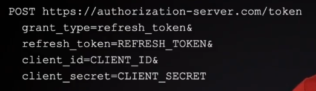

- Giving your password to 3rd party app is a bad idea. you cannot control what they do with it, even if it's not a third party app, and another app from the same company, if you have an API that takes a
  username and password and returns some sort of session ID or token, and you let all your app developers use that to log users in, well, you can't really tell the difference between
  which apps are using the API. That request looks the same from every app, but even worse, how do you know that it's actually your app at all?; Adding multi-factor authentication ? you have to add it to every app.
  what OAuth does at a high level is requires that every application sends the user out to the OAuth server to log in there, and then redirects them back to the app so the app
  can get tokens. And the key thing here is this redirect step. It means the user actually leaves the application and they go type in their password at
  the OAuth server instead of ever giving their password to the application. So as soon as we avoid the application ever  seeing the user's password, it solves all of
  these worries and uncertainties we have before. It provides security against untrusted third party apps and also makes first party apps much more flexible.
  This way, if you wanted to add MFA, you don't need to make any changes to the apps at all, since you just turn it on at your OAuth  server and it would immediately be enabled across all of your applications.
--------
# BCP -> best current practice.
- in OAuth 1.0 api server and authorization server were sharing a lot of information.
- in oauth 2.0 we separate them to make the app easier to scale.

- oauth 1.0 require use of api key which is not safe on mobilephone.

- oauth vs openid
  - oauth itself is designed for apps to get access to API, all they need the ability to access the API   
    The application doesn't need to know who the user is that's using that application. analog[hotel & card].
    The door(resource server) does not need to know who is using the card(access token), it just needs to know that the card is valid,
    The person on the front desk(Authorization server) needs to know who you are, check your ID to give you the card.
    No need for encoding the person data who use the card in the card itself. you may need to encode the list of doors that the card can open and expiration date.
  - there's nothing in oauth that communiactes user information, that's all added externally. Now, the main   way that 
    is using OpenID Connect. So OpenID connect takes OAuth as a foundation, and it adds in user identity information on top.
      So u can imagine the same framework we're going to learn about of how data moves around and who the players are in 
    the OAuth transaction  that's all the same with OpenID connect. we just added the concept of user information into the flow as well.
    - So OpenID connect is an extension of OAuth and that extension provides a mechanism where the OAuth server   can actually communicate data about the user back to the application. and the main way it does that is with a new kind of token.
    - SO OAuth issues access tokens to apps, OpenID Connect issues (ID token)[statement about the user] to apps.

  - briefly, <b>OAuth is about accessing the app, Open ID is about identifying user</b>

---

## Roles:
  - 1. client(app) -> the application that wants to access the user's data from the resource server.
     - client need to authenticate with the authorization server by its credentials.
       - based on the client's ability to be deployed with a client secret  
         or some sort of credentials that it can then use as authentication during the  
         OAuth exchange.:
         - public
           - In mobile app or SPA, we don't have the ability to include secret in the app,   because users can see the secrets. 
               - [SPA (view-source in browser), there are tools can extract strings from app binaries]. Essentially, the difference is any time the application will be running code on a device that the user controls, we cannot include secret in the application.[Apple TV, IoT ...]
         - credentialed client
           - app has credentials but whose identity has not been confirmed by authorization server.
           - The simplest example of this would be a mobile app where the first time it launches, it uses dynamic client registration to
             get a client secret. That first request can't contain any authentication because there would be no way to deploy that authentication into 
             the app, so anybody can mimic that first registration step to get a client secret.
             - so the auth server can use policies of an unconfirmed, unidentified client when deciding token lifetimes. 
               But it can know that refresh tokens are always being redeemed by the same client instance. (the first request the auth server can't be sure who is making it, but after that, it can be sure that the same client is making the next request)
         - confidential
           - can be deployed with a client secret where that secret won't be visible to anybody using the app. [normal for apps running on server, (API keys can be put in the app config or ENV VAR) and expecting them remain secret].
         - the authorization server might have different policies that make it act differently depending on the type of client making
            the request. For example, a confidential client that is also a first party app might have the consent screen skipped when it starts a flow because the authorization server can be sure that only the real application can actually complete that flow and end up with an access token.  
         - However, for a first party public client, an attacker could mimic that application by copying its client ID and starting a flow.
              And if they can control the redirect URL they could end up with access tokens of the authorization server thought were being delivered to the real application.
            So in that case, you may want to still include the consent screen to get the user involved in that flow. Some of the other things the authorization server might do differently, depending on the client type, is things like whether to
            include refresh tokens or changing the token lifetimes to mitigate risk. All of these things are reasons to use client authentication when possible. 
  - 2. Resource server (API)
  - 3. Authorization Server
    - instead of giving the client the user's password:
      - the user authenticate with the auth server, and the auth server gives the client a token that represents the user's permission to access the resource.
  - 4. Resource owner (user)
  - 5. user agent [the device the resource owner use: running the app(mobile) or accessing the app(browser)]

- in smaller system, the auth server and the resource server can be the same server. but, it has 2 different roles.
- Remember, never put a client secret into a mobile app or a single page app.
---

# User Consent:
- the screen that interrupt the authorization flow.

- what happen if we don't have it ?
  - using password grant, also known as resource owner password flow.
  - user enter the password to the client. the client store it and communicate with the auth server to get access to resources
    - POST url grant_type=password& username=USERNAME& password=PASSWORD& client_id=CLIENT_ID 

- what can happen ?
  - auth server can not detect if the owner who is issuing the request now, the client may store it and issue the token 
    or may ask for more permission with the password grant.

  - we need to make sure that the owner who is sitting now and issuing the requst right now.
    - the client first directs the user to the auth server. the owner authenticate himself, approves the request after 
      he see the consent screen and the owner directed to the client app.

     another problem with password grant if we want to add multifactor authentications
     we need to build that in all our app from scratch. -> by redirecting the user to auth server
     we can add a new multifactor method at any time by adding it to the auth server. so any
     app use that server will benefit from it.

     with confidential client in first party app we can have the user redirected back without a consent prompt.
      with public client we still need a consent screen with our first party app.

---

#### Back channel vs Front channel(using address bar to send info between two other computer) ] describe how data transfer between systems.

- Back channel is the "normal" way or secure way over https.
    so the server is authenticated [we know what server we're talking to by validating the certificate]

- Front Channel: no direct link between client & server.
  - [we talk now about the connection between client-app & authorization server]
  with password grant we can use back channel but there's no way to confirm the user
  actually consented that request. so we use the front channel, it's a way to insert
  the user into the negotiation between the client and the authorization server. that way,
  the auth server knows the user is actually present and has given their permission[user consent above].

implicit flow(not recommended) : 
  - client-app needs to first tell the auth server what is trying to do. [CLIENT_ID, SCOPE, RESOURCES TO ACCESS] 
  - the client-app redirects the user to the auth server with all info in the first request in the query string of the url because no of these info is sensitive.
  - user logs in and approves the request, the auth server is ready to send an access token back to the client-app and
    send the user back to the client-app. if it were to send the access token back in the redirect, that would be like 
    sending an access token in the mail.
  - the auth server wouldn't really have any guarantee that it was actually delivered back to the app and the app would not 
    really have any guarantee that the access token is really from the auth server. but this is method is actually described 
    in the core of OAuth spec, but it is not recommended any more because of lack of security of this flow. [Implicit flow]
  - it works by using front channel for both req the app makes, and delivering the access token.
    - implicit flow was included in OAuth because it used to be the case that browsers had
      no other option. the solution is to deliver the access token in the back channel instead
      but remember that the back channel is an HTTPS req from client to a server. [POST req to
      OAuth server]. why was it not possible to do that in the past?
        - it used to be the case that cross-origin requests weren't possible until browsers
        built in support for Cross Origin Resource Sharing or CORS.
  - back channel means a client to a server https connection.
---

#### Application Identity:
- each client-app has its own identifier [client-id].
- app uses it to identify itself throughout the OAuth flow.
- without app secret[password] there isn't really ever the assurance
that the application using the client ID really is that application.

-- 
- Instead of sending the access token in the front-channel like `the implicit flow`,
  the auth server send a coupon `authorization code` with a short expiration date. and that coupon could be exchanged 
  for an access token `with client secret to identify the client`, but only once and only within a short time period.
  - using the `authorization code` will require the client-app to go to use the back channel to redeem it.

- possibly, the authorization code can be stolen or copied, which means the server can't really ever be sure whoever 
  is redeeming that code is the real app. to verify it we need a client-secret.
  - But with public client(mobile-app, spa) we cannot store client secret.
    solution: PKC-E[proof key for code exchange] extension, before client send the first
    request to start the flow, it actually makes a unique secret for each request. and it uses that secret to
    start flow, and again when it redeems the authorization code. and that let the auth server
    know that the thing redeeming the code is who started the flow preventing authorization codes
    from being redeeming by other app if it has stolen. *But* that don't prove the app identity, some attack 
    may impersonate the client-app and get the access token.

    - Without a client secret, The OAuth flow is performed with information that's entirely public.
      - So if someone really wanted to, they could start an OAuth flow with the public client of some other app. and then can exchange auth code with access token.
        - we need another aspect of identity, REDIRECT URI.

- REDIRECT URI: the location of the client where the authorization server is going to send the user back to after they log in. and that's where authorization code
     will be delivered in the front channel.
  - the only hint of confirming app identity if we can have a client secret is the redirect URI, so they are registered with the auth server.

    - a custom url scheme can't be used as any form of application identity. [not unique], ex: `myapp://callback`
      - because there is no global registry of url schemes, so there's no way to know if the app that registered the url scheme is the same app that's using it.
      - HTTPS urls are considered to be globally unique. in recent years, mobile platforms have also started to allow native apps to take
        over handling URL patterns for URLs. app developer does have to prove they control the real domain. Apple and Google won't let u publish an app into their stores using
        domain not own to u. [this is the best we have for public client]. (ios: Universal Links , android: App Links)
        that ensures that the auth server will only redirect to registered URLs for a given client id.

---

### Registering an Application:

- register app identity to the authorization server
- if you will service with a public api, u can do it yourself.
  if u use a company or enterprise OAuth server, then the registration step might not be self-service like that. and u 'll need to get an administrator
  to go register the app for u.

- u enter some info[name, logo, redirect urls]
  [may ask about the type of the app. depending on ur choice, it may
  decide different policies around whether refresh token are issued or might enable CORS
  header for JS apps] about ur app and then get a client_id[public u can put it in src code], and u may or may not get back to
  a client_secret as well.

- Entering redirect url is the most important steps, some server allow multiple one,
  but it's important that u always register at least one.
  -  with redirect urls u ensure that attackers can't start flow with ur client-id and then have users sent back to attackers website.
  - server prevent u from registers urls with wildcard, because that's another factor that attackers have to try to trick users into getting sent
  to the attacker's website. <-> wildcard or partial matching of redirect urls is a great way to open yourself up to open redirect attack.

- if the registration step asked u type of app and u choose a [mobile app|native app|js app]
  then chances are the registration process gave u back only a client ID and no client_secret.
  because this type of app cannot protect a client secret.

---

### Authorization Code flow for web application:

- user want to use the client-app
- client-app: generate a new random secret `PKCE Code Verifier` and hash it`Code challenge`.
- `client-app use a front channel to ask authorization server through the client not
  directly`; client-app redirect the user to the authorization server to grant client-app
  access, with the code challenge.
- user login `do multi factor auth if required` and then server ask them to confirm; if he really is trying to log into the client-app.
- if user confirm, server will respond to the user with the authorization code.
  `take the app's redirect url, adds the authorization code in the query string and
  and send the user's browser there to deliver that back to the client-app`.
- authorization code sent in front channel so the server don't sure if it will be received
  by client-app. so its expiration under 1min and one time used.
- client-app can now using back channel ask for access_token using the authorization code
  , client-id and client secret, as well as the plaintext PKCE secret that  the client-app generated at start.
- authorization server verify the request and if hashing of PKCE code generate the
  same code challenge -> server respond to the client-app server with the access_token.
  - 

* PKCE was first used by the public client app, but it's now recommended to used even for
  confidential app-client because u can swap the auth codes and end up logged into
  somebody else account with the real application, app and auth server wouldn't know
  an attack was happened. [Authorization code Injection]

  ---

  - PKCE Code Verifier -> string 43-128 characters long
  - Code challenge -> base64url(sha256(code_verifier))

- Auth url
  - `https://server.com/auth? 
  response_type=`code` <- tell server you're doing authorization code flow. 
  &client_id=CLIENT_ID  
  &redirect_uri=REDIRECT_URI <- REDIRECT_URI has to match one of u entered in registration. 
  &scope=photos 
  &state=XXXXX <- originally used for CSRF protection, but PKCE provide that protection as  well. so u can use it in soring app specific state.  like which page to redirect after they log in, like cart or checkout. this is only safe if you're sure that OAuth server support PCKE. 
  &code_challenge=XXXXXXXXXXXX 
  &code_challenge_method=S256 
  - 

  - client won't see user until the user confirm the access and redirected to the client-app.

  - if error happened:
      - 
    - else
      - 
      - for `csrf` u should check the state value == the state u generate when u redirect user to authorization server

  - The back channel request for exchanging the authorization code with the access toke.
    - client-app send a POST request with some parameters, different server may expect this either in the body or as a http basic auth header.

    - 

    - if successes, server response with access token and refresh token.
      - 
      - exchanging the refresh token:
        -  

        - if it fails, u should attempt a new authorization flow.
  - using `PKCE` to protect against authorization code injection attacks, is considered a best
    practice in OAuth 2.1. if the server not support it u can normally send the code_verifier
    parameters and server will ignore it. and when server support that. now u don't need to
    modify ur code. so u make sure using random state value to protect against csrf attack.

---

### Flow for native app:

- we cannot use client_secret because, the app will run on the user agent.
  so he can use tool to decompile the src code and extract the client_secret
  from it.

- one of the things unique to mobile apps in terms of the security of the OAuth flow is
  how the mobile platform like IOS and Android handle redirect URLS[where auth server will
  send the user to after login].

- in mobile apps, we lose a lot of protections that are built into the browser. so
  in a mobile app, 
  - 1 - u start in the app. 
  - 2 - the app launched an in-app browser to the authorization server, which is fine, but then the auth server sends a redirect to
    the app. But in that case, there's a chance that redirect could be intercepted depending on how it works.

    - option one : Custom URL scheme : start with app name example://.. but there is no registry for that so anyone can pick any url and that cannot be used as identity of the client-app.
    - option two : Claim URL Pattern [deep linking(universal link, app link)] : the mobile app can claim url pattern, including a full domain name or even path. once that's registered, 
          anytime the url visited from another app or browser. your app will launch instead. [when u click on fb link, android open facebook app]
  - what make option 2 more secure is that in order for an application to claim an url pattern, the app developer has to actually prove that they control that domain name.
    - there are way this can fail. so we still don't trust the redirect URLs in mobile apps quite as much as we do in a browser environment. ---> so we use PKCE

#### browser security for native app:

- How the mobile app launches the browser to the  OAuth server to start the flow is one of the most important parts about security of doing OAuth in a mobile env.
- mobile app now would embed a web view into the apps that the user never left that app[open a browser switch to it then back to app (the old way)].
- problem with web view:
  - Not a real browser so the user doesn't see an address bar. just see web page framed into the app. [the user cannot verify if that is the actual auth server]
  - No shared cookies with the system. the app has full control over web view, and if it did share cookie with the system browser or other apps, data would link between
  apps. -> if u logged in auth server in safari and launch the app and got web view to  auth server, u wouldn't be logged in the app because it does not share cookies with
  the system. [UX now worse because user is going to type their pass every time that open up]
  - App has full control over web view so it can extract the credentials. we don't app to touch user passwords.
- Now, we have APIs which are able to launch a browser in a secure way within the app, which means the user never actually leaves the app.
  -  IOS (class SFSafariViewController), Android (chrome: Chrome Custom tabs)
  - benefits:
    - user never leaves the app
    - app doesn't have access to that browser so it cannot inspect the content. (sniffing the password)
    - benefits of using cookies
    

#### native app flow:

- remember u cannot ship the app with any credential.

- user want to use the client-app
- client-app: generate a new random secret[PKCE Code Verifier] and hash it[Code challenge].
- [client-app use a front channel to ask authorization server through the client not
  directly]client-app istead of redirect, the app launches a new in-app browser
  to get the user to the to the authorization server with all that stuff in the query
  string, code challenge, client-id, redirect-url, scope. --> user sent to the OAuth server
  via front channel.
- user log in using in-app browser[take advantage of cookies].
- user confirm access of the client-app tp OAuth server.
- OAuth send user to the app, with the temporary Authorization code[front channel].
- client-app in the back channel send auth code and code verifier to OAuth server.
- server verify[hash the code and compare it with code challenge] and send access token.

Refresh Token in Native app:

- we need to use it without interrupting the user
- in some cases app must ask for it and some OAuth server sent it by default
- if the app does have to request one, there's convention
  of using in initial access request scope=offline_access
- there's useful API on mobile to better keep the refresh token safe,
  [Secure storage] on the device. this API is so secure that even the app's code
  can't access it anymore.
- when access token near to be expired. the app see that refresh_token is stored
  in secure storage. app prompt user for [biometrics unlock/ [authentication method]]  
   to make the refresh_token available to the app.
  ===OpenID Connect===================

- communicate information about users to applications.
  OAuth is always about applications access APIs, OpenID Connect is about
  application learning information about users.

- THe main thing OpenId Connect adds into the picture is an [ID Token].

- ID Token: is the way that the authorization server communicates information about the
  user who logged in to the applciation.
  ID Token is always a
  [JWT [is a format of token that is used for ID Tokens and sometimes OAuth server use it
  for access token]]
  \*\*Access Token is not has any format in the specs it could be anything.

ID Token
[JWT: header(about token).payload(info about user).signature(how to validate the token)]
these 3 parts are base64 encoded [header[kid: identifier of the key that sign the token,
alg: signing algorithm used]  
 & payload[info + "iss" issuer is identifier of the server that issued the token] are base64-encoded
JSoN + "aud" audience: identity to who this token if for {CLIENT_ID} +
"iat": timestamp: issued at + "exp": expired] depending on server u may see more or less properties.
the main one that we care about, is "sub" subject -> the user's identifier[up to server how to format
it++ guarantee to be unique and stable for each user.]

---

client-app must not understand what access_token means. <- it's a design principle
of OAuth that access tokens are opaque to client-app.
"aud": "the api url"

id*tokens \_are* meant to be read by the client-app. the client-app is meant to look inside the
Id_token, validate the signatue, validate the claims, and then learn about the user.
"aud": "client_id"
--
to get id_token, in authorization code flow add to "scope" [openid]
then when app exchange the authorization code, it will get in the response [id_token]
in this flow u get in back_channel and u trust the server so u can forget it's an jwt.
and u don't need to validate the signature. we can extract the parts in the middle that
we care about[payload] and just use the data directly.
--
another way is to set response_type to "id_token" instead of "code"
this way the OAuth server return the id_token in the redirect instead of authoeization code.
https://app/redirect#id_token=**&state=** <- look like implicit flow.

## in this scenario u must validate the signature.

if we only include openid in "scope" in id_token request, then the ID token we recieve  
 will have a little information in it. metadata + user_id

- to get additional information openid defines scopes that talk about different parts of
  a User's profile that client_id can request. \* not all OpenID connect servers include that information in id_token,
  sometimes the additional profile information needs to be requested from
  a userinfo endpoint using an access_token[depending on the SERVER]
  --
  Hybrid flow
  response_type=code
  response_type=id_token
  hybrid
  response_type=code+id_token <- send id_token in frontChannel and access_token in back
  response_type=token+id_token <- legacy
  -ignoring all response_code combination that include token
  we get:
  code id_token code+id_token
  -when using code+id_token it's also going to include another claim in the id_token named
  c_hash to validate the authrization code
  -to avoid authorization code injection. the server doesn't confirm if the client-app validate
  the auth_code using the c_hash, so to prevent app from dealing with auth code injection,
  it's best practice to include PKCE to not relying on the security of every app developer.
  --
  Validating the ID_TOKEN:
- validate the signature:
  - u need to know which key to use. some server hard coded it in its docs.
  - if server support multiple keys or rotating keys, then the headerr of the ID TOKEN
  will contain an identifier that signed the token.
- "iss" to make sure the token come from the intended authorization server.
- "aud" should match the client-id
- "iat" "exp" make sure current timestamp in those bound
- "nonce" should match the value u send in the request. to prevent injection attack
  **if we get the token in the back_channel we don't need to validate any of these**
  ---this is the base line to trust any info in the id_token--
  "amr" authentication methods,
  "auth_time" timestamp for when the user authenticated.

when to re-validate?
. if the app store the id_token for example, in a client side cookie,
when browser may bringing it back to u at that point, it's now coming
from untrusted lication and now u need to validate it all again.
. similarly, if ur app takes id_token and passes it to a different part of the app,
such as we broke the app into frontend and backend compnent, then the app will need
to perform the ful steps of validating the signature and claims every time it uses that.
===

# NOW, the point of view of the Authorization server.

Reference Access Token vs Self-Encoded Tokens:

- Reference Token: long random string of chars, that doesn't actually mean anything,
  it's a pointer to something
  - can be implemented using DB where u have a table for tokens as a unique - key to retrieve
    [user_id, expires at, scopes]
  - or using a caching layer like Memcache or Redis.
    - advantages:
    - simple
    - doesn't mean anything. doesn't contain any data inside it. [issuing server only can read it]
    - disadvantage:
    - have to be stored, very time u want to validate it, the API go back into central DB to
    query that. storage start to become more concerning. if we don't have central storage,
    there is actually another extension called TOken Introspection that talks about an API
    for resource servers, or APIs to validate access token over HTTP.
    - if u plan on running multiple copies of ur APIs or scaling them to multiple
    datacenters, then reference token may not be the best option. because we are
    pretty limited in the ways that they can be validated.
- self-Encoded: contains data in some sort of format
  take [User, application_id, expiration, time_created, scopes, auth server, last login]
  and encrypte & sign them. so the server after that can validate it and decrypt it to
  extract the information from it. no need for storing them. for example JWT.
  - it does come with some drawbacks, but oftentimes the advantages outweight the downside
  - advantages:
    - [scalable ]no need to be stored(storage is cheap),
    no need to be looked up and revalidate.
    - resource server gets a request, it can inspect the token, check the signature
    itself, validate everything inside of it and decide without looking at external
    storage
    - if u build an API and use other product as an OAuth server. then it make a lot of
    sense to not have to have any sort of shared storage between those two systems since
    they operate independently
  - drawback payload is visible, need extra work to mark it unvalid token before its expiration
- OAuth is designed for app to just treat access tokens as an opaque string.
- Only the API read the access token.

---

JWT as an access token:
header & signature can base64 decode these parts and we'll see plain JSON string.
[many oauth server don't encrypt them]
--
EXTENSION[JSON Web Token profile for OAuth 2.0 Access Token] formalize the use of
JSON Web Tokens for access tokens.
defines a few claims that are required to be in the token(many are reserved from core JWT):
it is possible for server to add custom ones on top of the required.
. iss -> issuer [OAuth server's base url]
. exp -> expiration [unix timestamp]
. iat -> issued at[timestamp]
. aud -> "audience" --> indenting party for reading and validating the token ,
identifier of the resource server
. sub -> "subject" identifier for who the token represents. if user involved,
that's going to be a user identifier. usually an opaque string rather than email. - with client credentials grant, then this should be the client-id of the app.
. client_id  
 - jti jwt id -> unqiue to make resource server able to see if it is being used more than
once.
. scope
. auth_time for ex: for sensitive ops require authentication to be happened not more
than hour
. acr authentication context class reference: if access token was issued when
the user was already logged in at the server instead of confirming the password,
this would be 0. and it shouldn't be allowed to do any operation that have monetary
value like purchasing.
. amr authentication message refrence.

---

only the apis should validate access tokens:
. api can post request to the authorization server + token and the server can reply back
whether the token is valid or not.(slow way using network)
. api can use remote [Token Introspection RFC7662] either to make double sure the token
is really still valid or as just an easier way to avoid bringing in a JWT library.
. there is a new endpoint to find called the token introspection endpoint.
. it add latency to every api call to validate the access_token.
. this is the only way to validate in case of the token is opaque string.
. Local Validation:
. when we are reading data out of this header before verifying the signature. at this point
we have to treat this all as untrusted data. we should accept signing algorithms that we
know to expect from the OAuth server.

- kid will not be found if OAuth server has one signing key, JWT access spec recommands
  that OAuth servers publish their public keys and issuer identifier at a URL that can be
  found from the servers metadata url. that metadata url can be usually found either in the
  docs for the OAuth server or u can build it by tracking on .well-known path
  https://OAuth-server.com/.well-known/oauth-auth-server <- it will ret data decribe the
  server -? "jwks_uri" <-- the url where we can find the keys.
  after validating the signature we should validate the claims[iss,aud,..] because someone
  can use access_token for some other API at our API.

  - this local validation tell us that the token is valid at the time it was issued, and
  threr are plenty of ways an access token might become invalid after it was issued,
  but before the token was scheduled to expire.
  the longer u make ur access token lifetime, the longer u risk making an authorization
  decision on out-of-date information

- - Best of both worlds
  1 - API Gateway[first line of defense] using local validation to reject invalid tokens
  [expired/malformed/attacker]. however, this local validation step doesn't have any
  way to be aware of user being revoked. so those revoked token still look valid
  because they haven't expired yet.
  - [EXTRA CONFIRMATION]api call that will do a sensitive operation should
  post request to the TOKEN INTROSPECTION endpoint to ask whether is token is still
  valid. now OAuth can reject the revoked token.

----spring------

- with username & password authentication. when the organization grows and
  the #of its service grows, we need to maintain authentication flow for
  each services[may be in different technology stack]. keep them updated
  with latest best practices. the single user will tend to use the same password
  for all services. so our system will be strong as the weakest link in our services.

- SSO; user sign on to an Identity provider. get a token to be able to access all
  services they trust the Identity Provider.

- single line o f defence ; expose only the authentication service and make the other
  behind the firewall unsecured. [CONS] if attacker can enter my private network or
  anyone working in the organization will be able to access everything.

. if we send the credentials in each request header, each request will be sent to
IDentity Provider to authenticate. this approach will not be able to scale.
. we can do the same but instead of sending credentials in the header, user first
authenticate with identity provider -> get a token. use it to access the services.
services with each request will validate the token with the IDP. if token is leaked
user will be in trouble, because token cannot be changes like the password. but it
has an expiration date. <- this type of token is called (by refrence - token) reference.
to a resource.

- by-refrence can be invalided by the IDP, because each request require verification by
  the IDP
- (by value token) include a state information within it. [username, email, scope, expiry
  time..] which will eliminate the need to talk to the identity provider to verify it.
  these tokens are signed by the provider. hence other services will be able to use the
  provider public key to verify the token.
  - content of by-value token will be visible to anyone has access to it. which
  might give some insights about the roles & authorization in ur app. can be solved
  by encryption or use opaque token.
  
- because the access token is by-value some client tend to use the info in it
  to authenticate the resource owner [user]. and when the resource server 
  change the info in the token, the client code break and start complaining.
  but, in oauth the token is for server to use not for the client. the client
  may use it to ask for owner personal information to authenticate him.  
  
  a malicious client can use the same provider and when the user sign in use
  the token to access the user identity in another client use the same provider.
  OIDC try to solve it.
  
  
  
---

# JWT
- eyJ -decode64-> "{ 
- standardized security token allows you to create a json payload that you can send to another party without fear that anyone changing it because of the digital signature(temperproof).
