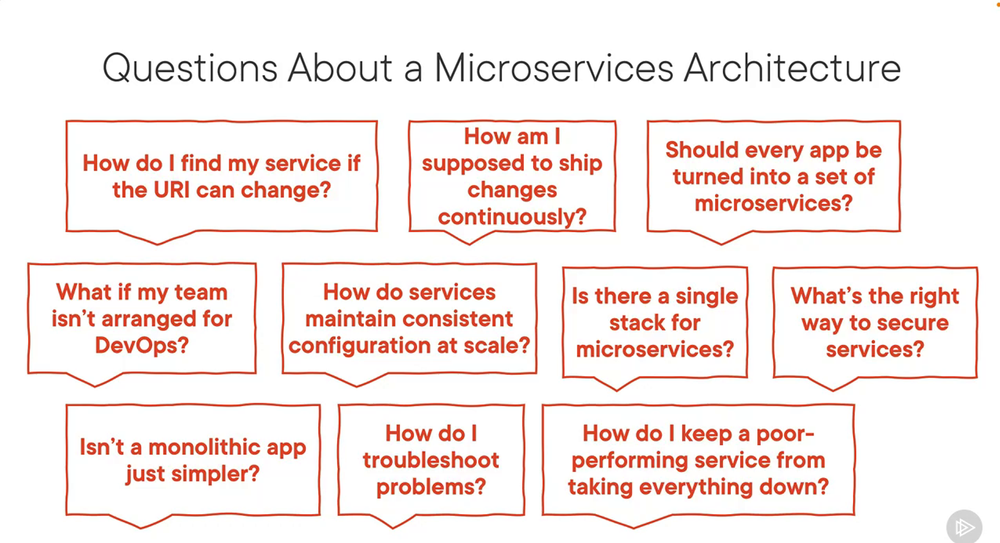

# Java Microservices with Spring Cloud: Developing Services

- microservices : 
	- loosely coupled service oriented architecture with bounded context.

	- why ?
		- Desire for faster changes. easier to evolve small services than a large monolith.
		- Need for greater availability. if one service goes down, the others can still function. u can tolerate failure better.
		- Looking for fine-grained scaling. u can scale the services that need it, instead of scaling the entire application.
	- core characteristics 
		- components exposed as services
		- tied to a specific domain
		- loosely coupled
		- Built to tolerate failure
		  - u assume failure will happen, and u design for it.
		- delivered continuously via automation
		- built and run by independent teams

		- 
			
