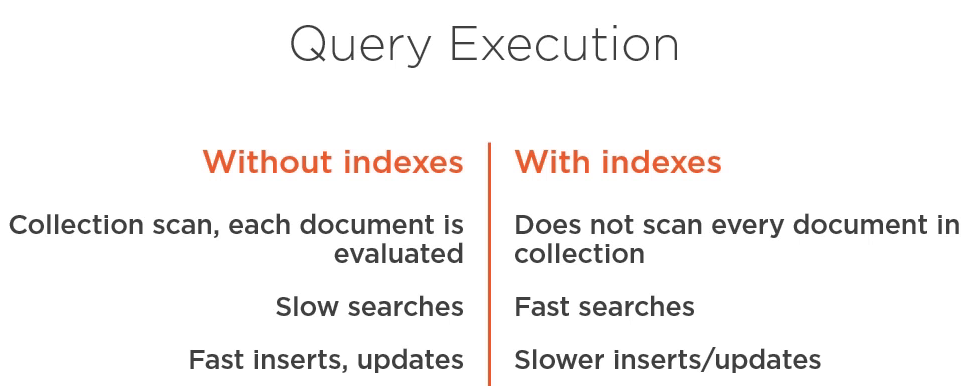

<artifact>spring-boot-starter-data-mongodb</artifact> brings in the following dependencies:
  - mongodb-driver
    - mongodb-driver:bson
    - mongodb-driver:driver-core
  - spring-data-mongodb
    - spring-data-commons

### data annotations
- 
  - @Document(collection = "users")
  - @Id
    - when serializing and deserializing obj from mongodb, the id field will probably be a GUIDs.
  - @Indexed
    - (direction = IndexDirection.DESCENDING|ASCENDING, unqiue = true|false, sparse = true|false)
  - @Field("first_name")
    - if u want to use a diffrent name for the field in the db.
  - @Transient
  - @DBRef
    - reference to another document in another collection.
  - @CompoundIndex
    - class level annotation, multiple fields index.
    - @CompoundIndexe(def = "{'name' : 1, 'age' : -1}")
  - @Query("{ 'name' : ?0 }")
  - @TextIndexed
    - if u want to include field in full text search.

- 

- Query object provide criteria to filter data, sort, paginate, etc.
  - Query query = Query
  - .query.addCriteria(Criteria.where("name").is("Joe")) ==> (left operand -> data field) + (operator) + (right operand -> value)
  - .with(new Sort(Sort.Direction.ASC, "age"))
  - .with(PageRequest,of(0, 2));
  - List<User> users = mongoTemplate.find(query, User.class);

- fetching data from MongoTemplate
  - 1- dfine query
  - 2- decide the outcome of the query
    - count, retrieve one, retrieve all, etc.
  - 3- class type
    - which allow  the template to know the name of the collection to query, how to serialize and deserialize the fields, etc. 